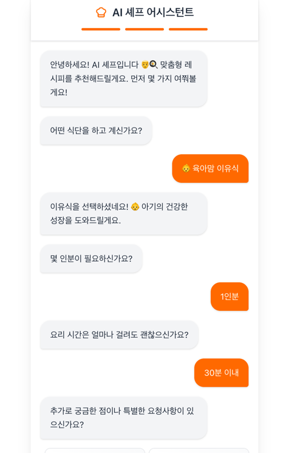
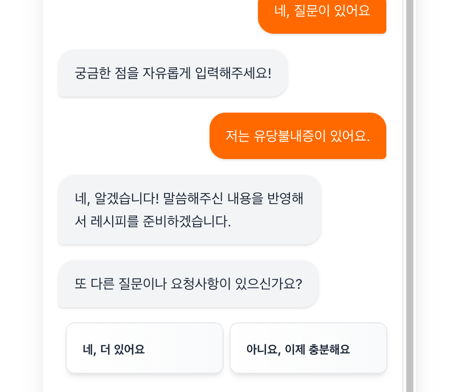
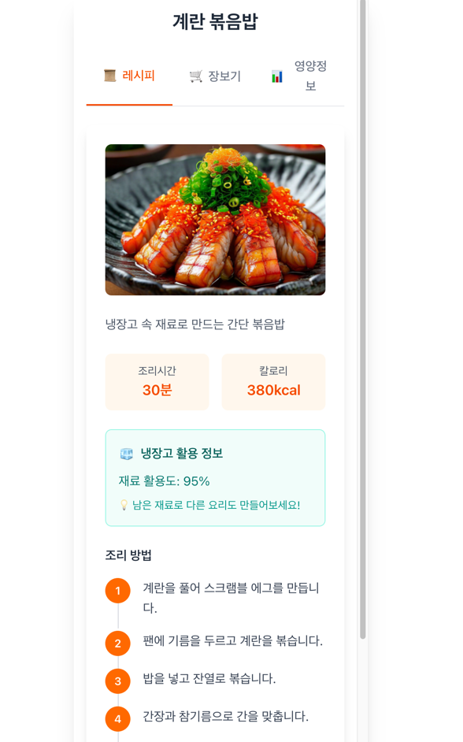
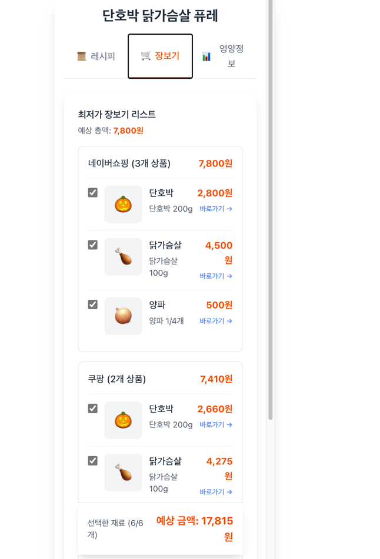
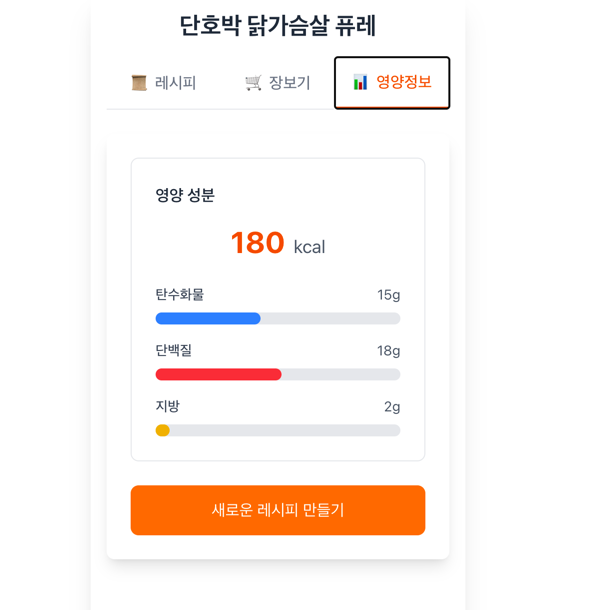
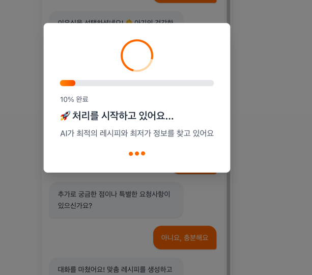
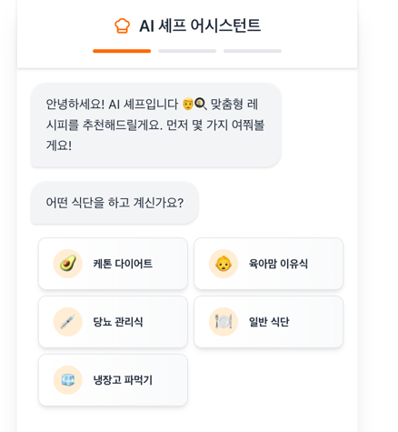

# [팀이름] : [아이디어 이름]

Amazon Q Developer Hackathon으로 구현하고자 하는 아이디어를 설명합니다.

## 어플리케이션 개요

**AI Chef**는 사용자의 건강 목표와 개인 선호도를 기반으로 맞춤형 레시피를 생성하는 AI 기반 요리 도우미 애플리케이션입니다. 

사용자가 다이어트, 근육 증가, 건강 관리 등의 목표를 선택하면, 대화형 인터페이스를 통해 자연스럽게 예산, 알레르기, 선호 식재료 등의 정보를 수집합니다. 수집된 정보를 바탕으로 AWS Bedrock의 Claude AI가 개인 맞춤형 레시피를 생성하며, 실시간으로 식재료 가격 정보와 영양 분석 데이터를 함께 제공합니다. 

서버리스 아키텍처를 기반으로 구축되어 높은 확장성과 비용 효율성을 보장하며, Step Functions를 활용한 병렬 처리로 빠른 응답 속도를 제공합니다.

## 주요 기능

### 1. 🎯 목표 기반 맞춤 설정
사용자의 건강 목표(다이어트, 근육 증가, 건강 관리)를 선택하고 각 목표에 최적화된 레시피를 추천받을 수 있습니다.

### 2. 💬 대화형 정보 수집
챗봇 형태의 친근한 대화를 통해 예산, 인원수, 알레르기 정보, 선호/비선호 식재료 등을 자연스럽게 입력할 수 있습니다.

### 3. 🤖 AI 기반 레시피 생성
입력된 정보를 바탕으로 Claude AI가 개인 맞춤형 레시피를 실시간으로 생성합니다. 재료 목록, 조리 순서, 예상 조리 시간이 포함됩니다.

### 4. 💰 실시간 가격 정보
네이버 쇼핑 API와 연동하여 레시피에 필요한 식재료의 실시간 가격 정보와 구매 링크를 제공합니다.

### 5. 📊 영양 성분 분석
생성된 레시피의 칼로리, 단백질, 탄수화물, 지방 등 상세한 영양 정보를 시각적으로 제공하여 건강 목표 달성을 돕습니다.

### 6. ⏳ 실시간 진행 상태 표시
레시피 생성 과정을 실시간으로 확인할 수 있는 진행률 표시 기능으로 사용자 경험을 향상시킵니다.

### 7. 🥑 특수 식이 지원
케톤, 비건, 글루텐프리 등 특수 식단을 실천하는 사용자를 위한 전문 필터링 기능을 제공합니다. 각 식단별 영양 기준을 자동으로 적용하여 안전하고 효과적인 레시피를 추천합니다.

### 8. 🥫 냉장고 파헤치기 (개발 예정)
보유하고 있는 재료를 입력하면 해당 재료들을 우선 활용하는 레시피를 추천합니다. 유통기한이 임박한 재료를 우선 소진하도록 도와 음식물 쓰레기를 줄이고 경제적인 요리가 가능합니다.

### 9. 📅 주간 식단 플래너 (개발 예정)
일주일 단위로 균형 잡힌 식단을 자동으로 구성하고, 통합 장보기 리스트를 제공합니다. 예산과 영양 목표를 동시에 만족시키는 최적화된 주간 계획을 수립할 수 있습니다.

## 동영상 데모

Amazon Q Developer로 구현한 어플리케이션의 데모 영상을 입력합니다.
**Git의 Readme에는 GIF 형식으로 업로드하며, 원본 동영상은 발표 Presentation에 제출합니다.**

## 리소스 배포하기

해당 코드를 AWS 상에 배포하기 위한 방법을 설명합니다. 인프라를 배포했을 경우 출력되는 AWS 아키텍처도 함께 포함하며, 리소스를 삭제하는 방안도 함께 작성합니다.

## 프로젝트 기대 효과 및 예상 사용 사례

### 기대 효과

1. **개인 맞춤형 건강 관리 지원**: 사용자의 건강 목표와 신체 조건에 맞는 식단 구성으로 효과적인 건강 관리 가능

2. **식비 절감 및 계획적 소비**: 예산에 맞는 레시피 추천과 실시간 가격 비교로 경제적인 장보기 지원

3. **요리 접근성 향상**: AI 기반 레시피 생성으로 요리 초보자도 쉽게 다양한 요리에 도전 가능

4. **시간 절약**: 메뉴 고민 시간 단축 및 효율적인 장보기 리스트 제공으로 일상의 편의성 증대

5. **음식물 쓰레기 감소**: 냉장고 파헤치기 기능으로 보유 재료 활용도를 높여 버려지는 식재료 최소화

6. **특수 식이 접근성 향상**: 전문 지식이 필요한 케톤, 비건 등의 식단을 누구나 쉽게 실천 가능

7. **의료/헬스케어 연계 가능성**: 향후 병원 영양 상담 서비스와 연계하여 의학적 근거 기반의 식단 관리 플랫폼으로 발전 가능

8. **지속 가능한 식생활 문화 조성**: 커뮤니티 기능을 통해 건강한 식습관을 공유하고 서로 동기부여하는 생태계 구축

### 예상 사용 사례

1. **다이어트 중인 직장인**: 칼로리와 영양 균형을 고려한 도시락 메뉴 추천받아 체중 관리

2. **헬스 트레이너/운동 선수**: 근육 증가를 위한 고단백 식단을 예산 내에서 효율적으로 구성

3. **1인 가구**: 소량 구매가 가능한 레시피와 예산 맞춤형 메뉴로 식비 절감

4. **알레르기 보유자**: 특정 식재료를 제외한 안전한 레시피 추천으로 건강한 식생활 유지

5. **육아맘/주부**: 가족 구성원의 영양 균형을 고려한 주간 식단 계획 수립

6. **요리 초보자**: 단계별 조리법과 필요 재료를 한 번에 확인하여 쉽게 요리 시작

7. **케톤 다이어터**: 탄수화물 5% 이하 자동 필터링과 매크로 영양소 비율 계산으로 정확한 케톤식 실천

8. **비건/채식주의자**: 동물성 재료를 완전히 배제하면서도 영양 균형을 맞춘 다양한 레시피 제공

9. **냉장고 정리가 필요한 주부**: 남은 재료들을 효율적으로 활용하여 새로운 요리로 변신시켜 가계 경제 절약

10. **병원 영양 상담 환자**: 의료진이 권장하는 식단 가이드라인에 맞춰 일상에서 실천 가능한 레시피 구성

## 🚀 향후 개발 계획

### 단기 계획 (3개월 내)
- 특수 식이 필터 고도화 (케톤, 비건, 글루텐프리)
- 냉장고 파헤치기 기능 베타 출시
- 주간 식단 플래너 MVP 개발
- 사용자 피드백 기반 레시피 개선

### 중기 계획 (6개월 내)
- 사용자 커뮤니티 기능 오픈
- 레시피 평가 및 리뷰 시스템
- 의료기관 파트너십 구축
- 다국어 지원 (영어, 일본어)

### 장기 비전
- AI 기반 개인 영양사 서비스로 진화
- 헬스케어 플랫폼과의 데이터 연동
- 지속 가능한 식생활 생태계 구축
- 글로벌 서비스 확장