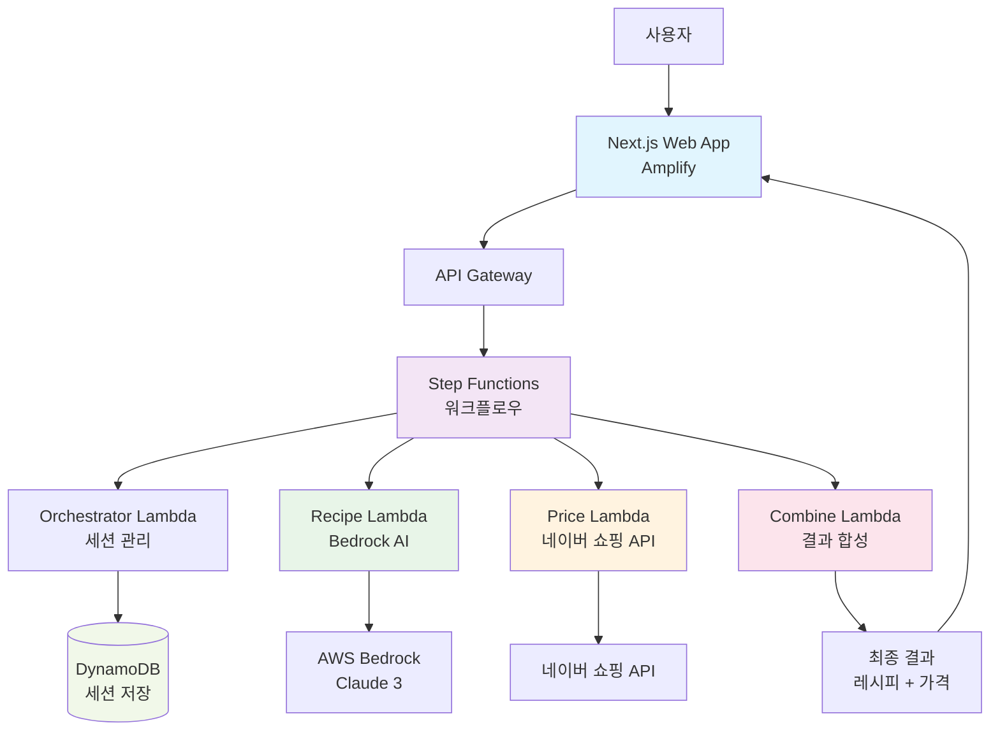

# Team21 : AI 셰프 - 맞춤형 레시피 추천 서비스

Amazon Q Developer Hackathon으로 구현한 개인 맞춤형 AI 레시피 추천 및 가격 비교 서비스입니다.

## 어플리케이션 개요

개인의 건강 목표와 예산에 맞춘 맞춤형 레시피를 실시간 최저가 정보와 함께 제공하는 AI 기반 식단 관리 서비스입니다.

### 핵심 가치 제안
- **맞춤형 건강 레시피**: 5가지 타겟별 특화 레시피 (케토, 이유식, 당뇨, 일반 다이어트, 냉장고 털기)
- **실시간 가격 최적화**: 네이버 쇼핑 API를 통한 실시간 최저가 정보
- **대화형 UX**: 친근한 챗봇 인터페이스로 쉬운 프로필 입력
- **즉각적 피드백**: SESSION 기반 비동기 처리로 빠른 응답

### 타겟 사용자
1. **케토 다이어터**: 정확한 식단 계산이 필요한 사용자
2. **육아맘**: 월령별 안전한 이유식 레시피가 필요한 부모
3. **당뇨 환자**: 혈당 관리가 필수적인 환자
4. **일반 다이어터**: 건강한 식단 관리를 원하는 사용자
5. **1인 가구**: 냉장고 재료 활용과 절약이 필요한 사용자 

**핵심 기능:**
- 🤖 **대화형 온보딩**: 자연스러운 대화를 통한 사용자 프로필 수집
- 🍳 **AI 레시피 생성**: AWS Bedrock을 활용한 개인 맞춤형 레시피 추천
- 💰 **실시간 가격 조회**: 네이버 쇼핑 API 연동으로 식재료 최저가 정보 제공
- 📱 **반응형 웹**: Next.js 기반의 모던한 사용자 인터페이스

**기술 스택:**
- Frontend: Next.js 14, TypeScript, Tailwind CSS
- Backend: AWS Lambda, Step Functions, DynamoDB
- AI: AWS Bedrock (Claude 3)
- API: 네이버 쇼핑 API
- Infrastructure: AWS CloudFormation

## 주요 기능

### 1. 스마트 온보딩 시스템
- **타겟별 맞춤 질문**: 케톤 다이어트, 육아/이유식, 당뇨 관리, 냉장고 파먹기 등
- **대화형 인터페이스**: 자연스러운 질문-답변 형태의 프로필 수집
- **세션 관리**: 중단된 대화 이어가기 기능

### 2. AI 기반 레시피 추천
- **개인화된 추천**: 건강 상태, 식단 제한사항, 선호도 반영
- **영양 정보 제공**: 칼로리, 탄수화물, 단백질, 지방 등 상세 영양 성분
- **조리 난이도 조절**: 사용자 요리 실력에 맞는 레시피 제안

### 3. 실시간 가격 비교
- **최저가 검색**: 네이버 쇼핑 API를 통한 식재료별 최저가 정보
- **가격 트렌드**: 식재료 가격 변동 추이 제공
- **구매 링크**: 직접 구매 가능한 쇼핑몰 연결

### 4. 사용자 경험 최적화
- **반응형 디자인**: 모바일, 태블릿, 데스크톱 최적화
- **로딩 상태 관리**: 비동기 처리 중 실시간 상태 표시
- **에러 핸들링**: 사용자 친화적인 오류 메시지 및 재시도 기능

## 동영상 데모

**TODO**: Amazon Q Developer로 구현한 어플리케이션의 데모 영상을 추가 예정
- Git의 Readme에는 GIF 형식으로 업로드
- 원본 동영상은 발표 Presentation에 제출

## 리소스 배포하기

**TODO**: 배포 방법 및 인프라 구성 가이드 작성 예정
- 백엔드 CloudFormation 배포 스크립트
- 프론트엔드 빌드 및 배포 방법
- 환경변수 설정 가이드
- 리소스 정리 방법

### AWS 아키텍처



### 리소스 정리

```bash
# CloudFormation 스택 삭제
cd backend/infrastructure/
./cleanup.sh

# 수동으로 생성된 리소스 확인 및 삭제
aws s3 ls | grep ai-chef  # S3 버킷 확인
aws logs describe-log-groups --log-group-name-prefix "/aws/lambda/ai-chef"  # 로그 그룹 확인
```

## 프로젝트 기대 효과 및 예상 사용 사례

### 기대 효과

**1. 개인화된 건강 관리**
- 개인의 건강 상태와 목표에 맞는 맞춤형 식단 제공
- 영양 균형을 고려한 과학적 레시피 추천
- 식단 관리의 접근성 향상

**2. 경제적 효율성**
- 실시간 가격 비교를 통한 식재료 구매 비용 절약
- 냉장고 파먹기 기능으로 음식물 쓰레기 감소
- 합리적인 장보기 계획 수립 지원

**3. 요리 문화 개선**
- AI 기반 레시피로 요리 초보자도 쉽게 접근
- 다양한 식단 목표에 맞는 레시피 발굴
- 건강한 식습관 형성 촉진

### 예상 사용 사례

**🏥 의료/건강 관리 분야**
- 당뇨병 환자의 혈당 관리 식단 계획
- 다이어트 목표 달성을 위한 맞춤 레시피
- 임산부, 수유부 영양 관리

**👶 육아 및 가족 건강**
- 이유식 단계별 맞춤 레시피 제공
- 아이 알레르기 고려한 안전한 식단
- 가족 구성원별 다른 식단 요구사항 충족

**💰 가계 경제 관리**
- 예산 내에서 영양가 있는 식단 구성
- 할인 정보 활용한 장보기 계획
- 식재료 가격 변동에 따른 대체 레시피 제안

**🌱 지속가능한 생활**
- 냉장고 잔여 식재료 활용 레시피
- 음식물 쓰레기 최소화
- 계절 식재료 활용 권장

**👨‍🍳 요리 교육 및 취미**
- 요리 초보자를 위한 단계별 가이드
- 새로운 요리 도전을 위한 레시피 발굴
- 요리 실력 향상을 위한 맞춤 추천
