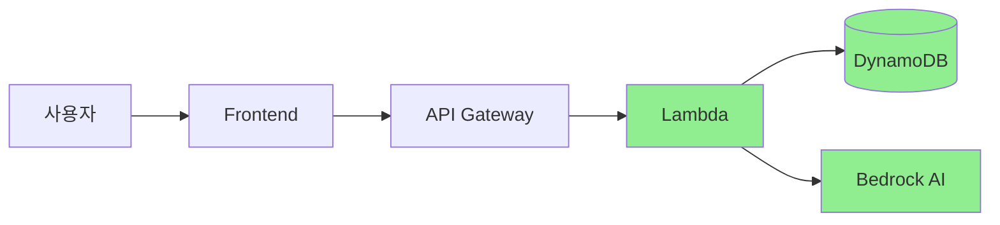

# 보안 고려사항: Frontend 데이터 위조 방지

## 개요
웹 애플리케이션에서 Frontend는 본질적으로 신뢰할 수 없는 환경입니다. 사용자는 브라우저 개발자 도구를 통해 데이터를 조작할 수 있으며, 이는 심각한 보안 및 비즈니스 로직 문제를 야기할 수 있습니다.

## 위협 모델

### 현재 시스템의 취약점

#### 1. localStorage 조작
```javascript
// 사용자가 콘솔에서 실행 가능한 코드
localStorage.setItem('profile', JSON.stringify({
    target: 'keto',
    servings: '2',
    cookingTime: '30',
    allergies: []  // 실제로는 견과류 알러지가 있음
}));
```

#### 2. API 요청 변조
```javascript
// 개발자 도구에서 네트워크 요청 가로채기
fetch('/session/update', {
    method: 'POST',
    body: JSON.stringify({
        sessionId: 'sess-123',
        profile: {
            allergies: []  // 알러지 정보 제거
        }
    })
});
```

#### 3. Bedrock 응답 위조
Frontend가 AI 대화 내용을 중계하는 경우, 응답을 조작할 수 있음

## 현재 해결책

### 서버 중심 아키텍처


**핵심 원칙**: Backend가 모든 비즈니스 로직과 데이터 검증을 담당

### 구현된 보안 조치

#### 1. 즉시 서버 동기화
```javascript
// Frontend - 단순 UI 역할만 수행
async function handleSelection(field, value) {
    // 서버가 검증하고 저장
    const response = await fetch('/session/update', {
        method: 'POST',
        body: JSON.stringify({
            sessionId: getSessionId(),
            profile: { [field]: value }
        })
    });
    
    // 서버 응답을 신뢰
    if (response.ok) {
        updateUI(await response.json());
    }
}
```

#### 2. Backend 데이터 검증
```python
# Lambda - session-update-profile
def validate_profile_data(profile):
    """모든 입력 데이터 검증"""
    
    # 타입 검증
    if not isinstance(profile.get('target'), str):
        raise ValidationError("Invalid target type")
    
    # 값 범위 검증
    valid_targets = ['keto', 'baby', 'diabetes', 'general', 'fridge']
    if profile.get('target') not in valid_targets:
        raise ValidationError("Invalid target value")
    
    # 비즈니스 규칙 검증
    if profile.get('target') == 'baby' and not profile.get('babyAge'):
        raise ValidationError("Baby age required for baby food")
    
    return True
```

#### 3. Bedrock 직접 통신
```python
# Backend에서만 Bedrock 호출
def process_user_message(message, current_profile):
    """Frontend를 거치지 않고 직접 AI 처리"""
    
    # Bedrock 호출
    response = bedrock.invoke_model(
        modelId='claude-3',
        body={
            'prompt': f"사용자 메시지: {message}\n현재 프로필: {current_profile}",
            'instructions': "정보 추출만 수행, 질문 생성 금지"
        }
    )
    
    # 서버에서 정보 추출 및 검증
    extracted_info = extract_and_validate(response)
    
    # DB에 직접 저장
    save_to_dynamodb(extracted_info)
    
    return extracted_info
```

## 현재 한계점

### 1. 완전한 방어 불가능
- Frontend 조작 자체는 막을 수 없음
- 사용자가 잘못된 데이터를 "정상적으로" 입력하는 것과 구분 어려움

### 2. 성능 트레이드오프
- 매 단계 서버 검증으로 인한 지연
- 네트워크 의존성 증가

### 3. 비용 증가
- API 호출 횟수 증가
- Lambda 실행 시간 증가

## 향후 보안 강화 계획

### Level 1: 입력 검증 강화 (현재)
```python
class ProfileValidator:
    def validate(self, data):
        # 화이트리스트 기반 검증
        # 타입 체크
        # 범위 체크
        # 필수 필드 체크
        pass
```

### Level 2: 세션 무결성 (다음 단계)
```python
class SecureSession:
    def __init__(self):
        self.session_token = generate_secure_token()
        self.hmac_key = generate_hmac_key()
    
    def verify_request(self, request):
        # HMAC 검증
        # 타임스탬프 검증
        # Rate limiting
        pass
```

### Level 3: 행동 분석 (미래)
```python
class AnomalyDetector:
    def analyze_user_behavior(self, session_id):
        # 비정상적인 패턴 감지
        # - 너무 빠른 입력
        # - 불가능한 순서
        # - 의심스러운 값 조합
        pass
```

### Level 4: Zero Trust Architecture
```yaml
# 모든 요청을 의심하고 검증
policies:
  - verify_identity
  - validate_context
  - enforce_least_privilege
  - inspect_and_log_all
```

## 보안 체크리스트

### 현재 구현됨 ✅
- [x] 서버 측 데이터 검증
- [x] Backend가 Single Source of Truth
- [x] Bedrock 직접 통신
- [x] 입력 값 화이트리스트

### 구현 예정 🔄
- [ ] Rate Limiting
- [ ] HMAC 요청 서명
- [ ] 세션 타임아웃
- [ ] 감사 로깅

### 장기 계획 📅
- [ ] WAF 규칙 적용
- [ ] DDoS 방어
- [ ] 머신러닝 기반 이상 탐지
- [ ] E2E 암호화

## 결론
현재 구조는 MVP 단계에서 충분한 보안을 제공하며, 향후 점진적으로 보안 계층을 추가할 수 있는 확장 가능한 아키텍처입니다. 서버 중심 설계로 인해 보안 강화가 Frontend 변경 없이 가능합니다.