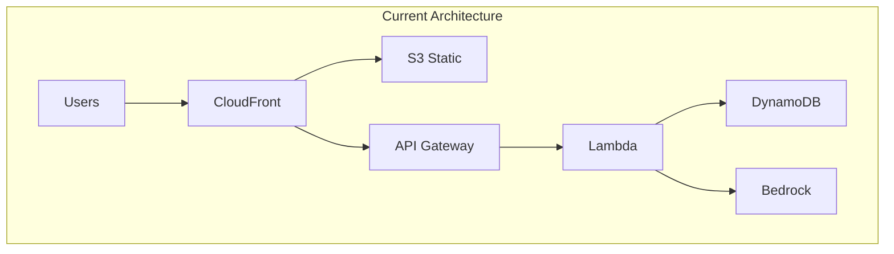

# 확장성 로드맵: MVP에서 엔터프라이즈까지

## Executive Summary
현재의 즉시 동기화 아키텍처는 MVP에 적합하지만, 사용자 증가에 따라 점진적으로 개선이 필요합니다. 이 문서는 단계별 확장 전략을 제시합니다.

## 현재 아키텍처 (MVP)

### 특징
- 동기식 API 호출
- 단일 리전 배포
- 직접 DynamoDB 액세스
- 매 단계 즉시 동기화

### 제약사항
- 최대 동시 사용자: ~1,000명
- 평균 응답 시간: 200-500ms
- 가용성: 99.9%



## Phase 1: 성능 최적화 (사용자 ~10K)

### 목표
- 응답 시간 50% 감소
- 동시 사용자 10배 증가

### 구현 전략

#### 1.1 캐싱 레이어 추가
```typescript
// Redis 캐싱 적용
class ProfileCache {
    private redis: Redis;
    private ttl = 3600; // 1시간
    
    async get(sessionId: string): Promise<Profile | null> {
        const cached = await this.redis.get(`profile:${sessionId}`);
        return cached ? JSON.parse(cached) : null;
    }
    
    async set(sessionId: string, profile: Profile): Promise<void> {
        await this.redis.setex(
            `profile:${sessionId}`,
            this.ttl,
            JSON.stringify(profile)
        );
    }
}
```

#### 1.2 배치 처리
```python
# SQS를 통한 비동기 처리
def handle_profile_update(event, context):
    # 즉시 응답
    sqs.send_message(
        QueueUrl=PROFILE_QUEUE_URL,
        MessageBody=json.dumps(event['body'])
    )
    
    return {
        'statusCode': 202,
        'body': json.dumps({'status': 'accepted'})
    }

# 별도 Lambda에서 배치 처리
def process_profile_batch(event, context):
    messages = event['Records']
    with dynamodb.batch_writer() as batch:
        for message in messages:
            batch.put_item(Item=parse_profile(message))
```

## Phase 2: 글로벌 확장 (사용자 ~100K)

### 목표
- 글로벌 사용자 지원
- 지연 시간 최소화
- 99.99% 가용성

### 구현 전략

#### 2.1 Multi-Region 배포
```yaml
# CloudFormation StackSets
Regions:
  Primary: us-east-1
  Secondary:
    - eu-west-1
    - ap-northeast-1
    
GlobalTables:
  - ProfileTable
  - SessionTable
  
CrossRegionReplication:
  enabled: true
  consistency: eventual
```

#### 2.2 Edge Computing
```javascript
// CloudFront Functions for Edge Logic
function handler(event) {
    const request = event.request;
    const headers = request.headers;
    
    // 지역별 라우팅
    const region = headers['cloudfront-viewer-country'];
    
    if (region.value in ['KR', 'JP', 'CN']) {
        request.origin.custom.domainName = 'api-asia.example.com';
    } else if (region.value in ['DE', 'FR', 'GB']) {
        request.origin.custom.domainName = 'api-europe.example.com';
    }
    
    return request;
}
```

## Phase 3: 실시간 동기화 (사용자 ~500K)

### 목표
- 실시간 데이터 동기화
- Multi-device 지원
- Collaborative features

### 구현 전략

#### 3.1 WebSocket 도입
```typescript
// AWS IoT Core for WebSocket
class RealtimeSync {
    private iotClient: AWS.IotData;
    
    async publishUpdate(sessionId: string, update: ProfileUpdate) {
        await this.iotClient.publish({
            topic: `session/${sessionId}/profile`,
            qos: 1,
            payload: JSON.stringify({
                action: 'UPDATE',
                data: update,
                timestamp: Date.now()
            })
        }).promise();
    }
    
    subscribeToUpdates(sessionId: string, callback: Function) {
        // WebSocket subscription
        this.ws.subscribe(`session/${sessionId}/profile`, callback);
    }
}
```

#### 3.2 Event Sourcing
```python
# 모든 변경사항을 이벤트로 저장
class ProfileEventStore:
    def append_event(self, session_id, event_type, data):
        event = {
            'PK': f'SESSION#{session_id}',
            'SK': f'EVENT#{timestamp()}',
            'Type': event_type,
            'Data': data,
            'Timestamp': datetime.now().isoformat()
        }
        
        # Kinesis로 스트리밍
        kinesis.put_record(
            StreamName='profile-events',
            Data=json.dumps(event),
            PartitionKey=session_id
        )
        
        # DynamoDB 저장
        dynamodb.put_item(TableName='EventStore', Item=event)
```

## Phase 4: AI 최적화 (사용자 ~1M)

### 목표
- AI 응답 시간 단축
- 비용 최적화
- 개인화 강화

### 구현 전략

#### 4.1 모델 캐싱 및 사전 처리
```python
# 자주 사용되는 패턴 캐싱
class AIOptimizer:
    def __init__(self):
        self.pattern_cache = {}
        self.embedding_cache = {}
    
    async def process_with_cache(self, message, profile):
        # 임베딩 캐시 확인
        embedding_key = self.generate_embedding_key(message)
        
        if embedding_key in self.embedding_cache:
            # 캐시된 결과 사용
            return self.embedding_cache[embedding_key]
        
        # 유사 패턴 검색
        similar = self.find_similar_patterns(message)
        if similar:
            return self.adapt_response(similar, profile)
        
        # Bedrock 호출 (캐시 미스)
        response = await self.call_bedrock(message, profile)
        self.update_caches(message, response)
        
        return response
```

#### 4.2 Edge AI
```javascript
// 경량 모델을 Edge에서 실행
class EdgeAI {
    constructor() {
        this.tfliteModel = loadTFLiteModel('profile-classifier-lite');
    }
    
    async classifyIntent(message) {
        // Edge에서 의도 분류
        const intent = await this.tfliteModel.predict(message);
        
        if (intent.confidence > 0.9) {
            // 높은 신뢰도 - Edge에서 처리
            return this.handleKnownIntent(intent);
        } else {
            // 낮은 신뢰도 - Bedrock으로 전달
            return this.escalateToBedrock(message);
        }
    }
}
```

## Phase 5: 엔터프라이즈 (사용자 10M+)

### 목표
- 무제한 확장성
- 99.999% 가용성
- 완전한 개인화

### 구현 전략

#### 5.1 Microservices 전환
```yaml
# Kubernetes 기반 마이크로서비스
services:
  profile-service:
    replicas: 50
    autoscaling:
      min: 10
      max: 100
      targetCPU: 70%
  
  ai-service:
    replicas: 20
    gpu: enabled
    
  sync-service:
    replicas: 30
    type: stateful
    
  cache-service:
    type: redis-cluster
    nodes: 10
```

#### 5.2 ML Pipeline
```python
# 실시간 학습 파이프라인
class PersonalizationPipeline:
    def __init__(self):
        self.feature_store = FeatureStore()
        self.model_registry = ModelRegistry()
        
    def process_interaction(self, user_id, interaction):
        # 특징 추출
        features = self.feature_store.get_features(user_id)
        
        # 실시간 예측
        prediction = self.predict(features, interaction)
        
        # 피드백 수집
        self.collect_feedback(user_id, prediction, interaction)
        
        # 모델 업데이트 (비동기)
        self.schedule_model_update(user_id)
```

## 비용 최적화 전략

### 현재 (MVP)
- 예상 비용: $100-500/월
- 주요 비용: Lambda, DynamoDB, Bedrock API

### 확장 시 비용 관리
```python
# 비용 기반 라우팅
class CostOptimizedRouter:
    def route_request(self, request_type, priority):
        if priority == 'low':
            # Spot Instance 사용
            return self.spot_handler
        elif request_type == 'inference':
            # 캐시 우선
            return self.cached_inference
        else:
            # On-demand
            return self.primary_handler
```

## 마이그레이션 전략

### Zero-Downtime 마이그레이션
1. **Canary 배포**: 새 버전에 5% 트래픽
2. **Blue-Green**: 전체 환경 스위칭
3. **Feature Flags**: 기능별 점진적 활성화

```javascript
// Feature Flag 시스템
class FeatureManager {
    async isEnabled(feature, userId) {
        // 사용자별 점진적 롤아웃
        const rollout = await this.getRolloutConfig(feature);
        
        if (rollout.percentage) {
            const hash = hashUserId(userId);
            return hash % 100 < rollout.percentage;
        }
        
        return rollout.enabled;
    }
}
```

## KPI 및 모니터링

### 핵심 지표
- **응답 시간**: P50, P95, P99
- **에러율**: 4xx, 5xx
- **동시 사용자**: 실시간, 피크
- **비용**: 사용자당 비용

### 모니터링 스택
```yaml
monitoring:
  metrics: CloudWatch + Prometheus
  logging: CloudWatch Logs + ELK
  tracing: X-Ray + Jaeger
  alerting: SNS + PagerDuty
```

## 결론

현재의 즉시 동기화 아키텍처는 확장 가능한 기반을 제공합니다. 각 단계별로:

1. **MVP** (현재): 빠른 출시, 검증
2. **Phase 1**: 성능 최적화
3. **Phase 2**: 글로벌 확장
4. **Phase 3**: 실시간 기능
5. **Phase 4**: AI 최적화
6. **Phase 5**: 무제한 확장

각 단계는 이전 단계를 기반으로 하며, 비즈니스 성장에 맞춰 점진적으로 구현할 수 있습니다.