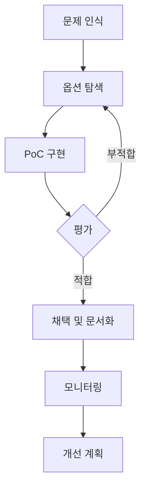

# Architecture Decision Records (ADR)

## 개요
이 폴더는 AI Chef 프로젝트의 주요 아키텍처 결정사항을 문서화합니다. 각 결정의 배경, 고려사항, 그리고 향후 계획을 포함합니다.

## 왜 이 문서들이 중요한가?

우리가 직면한 핵심 도전과제:
- 🔒 **보안**: Frontend 데이터 위조 방지
- 🔄 **일관성**: Frontend-Backend 데이터 동기화
- 📈 **확장성**: MVP에서 엔터프라이즈까지 성장
- 💰 **효율성**: 비용과 성능의 균형

## 문서 구조

### 📋 [001. 데이터 동기화 전략](./001-data-synchronization-strategy.md)
**핵심 결정**: 즉시 동기화 방식 채택

**문제 상황**:
- Frontend localStorage만 사용 시 "아니요, 충분해요" 경로에서 데이터 누락
- Frontend 데이터를 신뢰할 수 없는 보안 문제

**해결책**:
- 매 단계마다 서버 즉시 저장
- 서버가 Single Source of Truth
- POST /session/update 통합 엔드포인트

### 🔐 [002. 보안 고려사항](./002-security-considerations.md)
**핵심 원칙**: Backend 중심 보안 아키텍처

**위협 모델**:
- localStorage 조작
- API 요청 변조
- AI 응답 위조

**대응 전략**:
- 서버 측 모든 검증
- Bedrock 직접 통신
- 점진적 보안 강화 로드맵

### 🚀 [003. 확장성 로드맵](./003-scalability-roadmap.md)
**비전**: MVP에서 10M+ 사용자까지

**단계별 전략**:
- **Phase 1** (~10K): 캐싱, 배치 처리
- **Phase 2** (~100K): Multi-region, Edge Computing
- **Phase 3** (~500K): WebSocket, Event Sourcing
- **Phase 4** (~1M): AI 최적화, Edge AI
- **Phase 5** (10M+): Microservices, ML Pipeline

## 핵심 인사이트

### 현재 아키텍처의 강점
1. **단순함**: 복잡한 동기화 로직 없음
2. **안전함**: 서버가 모든 것을 제어
3. **확장 가능**: 점진적 개선 가능한 구조

### 현재의 트레이드오프
1. **네트워크 의존성**: 오프라인 지원 제한
2. **API 호출 증가**: 비용 상승 가능성
3. **응답 지연**: 매 단계 서버 대기

### 미래 가능성
```
현재 (MVP)           →  미래 (Enterprise)
━━━━━━━━━━━━━━━━━━━━━━━━━━━━━━━━━━━━━━
동기 API             →  WebSocket 실시간
단일 리전            →  글로벌 Multi-region  
직접 DynamoDB        →  캐싱 + Event Sourcing
단순 검증            →  ML 기반 이상 탐지
모놀리식 Lambda      →  Microservices
```

## 의사결정 프로세스



## 다음 단계

### 단기 (1-3개월)
- [ ] Rate Limiting 구현
- [ ] 기본 캐싱 레이어 추가
- [ ] 모니터링 대시보드 구축

### 중기 (3-6개월)  
- [ ] Optimistic UI 패턴 적용
- [ ] 배치 처리 도입
- [ ] A/B 테스트 인프라

### 장기 (6-12개월)
- [ ] Multi-region 준비
- [ ] WebSocket 프로토타입
- [ ] ML 파이프라인 설계

## 기여 가이드

새로운 아키텍처 결정 시:
1. ADR 템플릿 사용 (번호-제목.md)
2. 컨텍스트, 옵션, 결정, 결과 명시
3. 관련 다이어그램 포함
4. PR로 팀 리뷰 요청

## 참고 자료
- [Martin Fowler - Architecture Decision Records](https://martinfowler.com/architecture/)
- [AWS Well-Architected Framework](https://aws.amazon.com/architecture/well-architected/)
- [The Twelve-Factor App](https://12factor.net/)