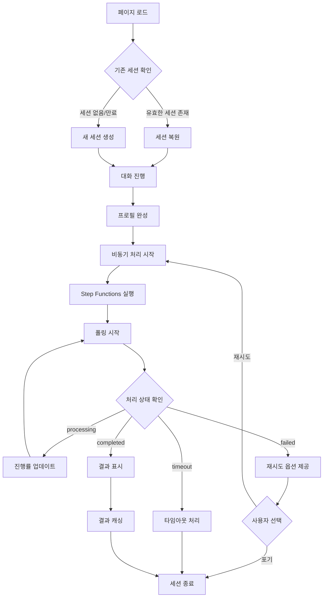
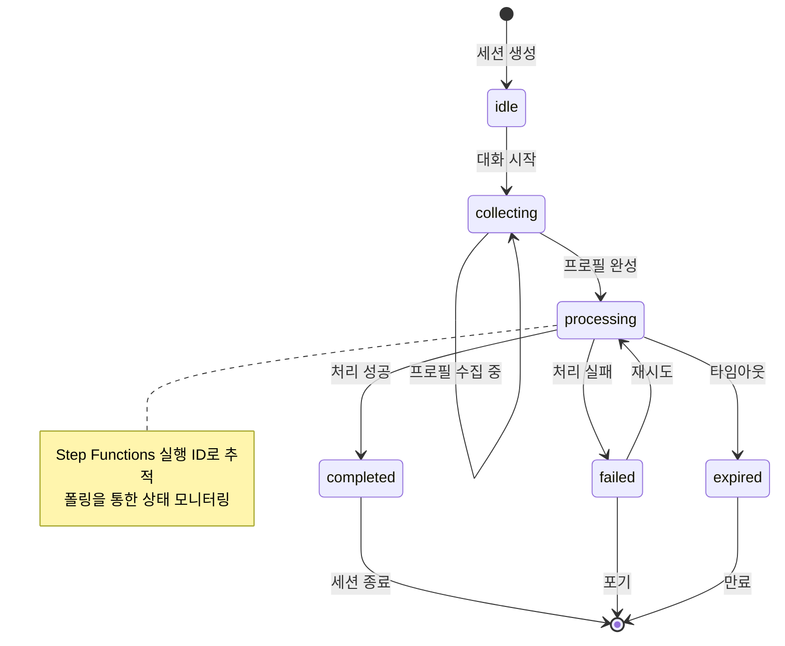

# 세션 관리 명세서

## 개요
AI 셰프 프로젝트의 세션 생명주기 관리 및 상태 추적 명세서

## 세션 생명주기

### 전체 플로우 다이어그램


### 세션 상태 전이도


## 상태 관리

### 세션 상태 정의
```typescript
type SessionStatus = 'idle' | 'collecting' | 'processing' | 'completed' | 'failed' | 'expired';

interface SessionState {
  sessionId: string;
  status: SessionStatus;
  createdAt: string;
  expiresAt: string;
  lastActivity: string;
  executionId?: string;
  retryCount: number;
  maxRetries: number;
}
```

### 상태별 동작
- **idle**: 세션 생성 직후, 대화 대기 상태
- **collecting**: 사용자와 대화하며 프로필 정보 수집
- **processing**: Step Functions 실행 중, 폴링으로 상태 추적
- **completed**: 처리 완료, 결과 표시
- **failed**: 처리 실패, 재시도 옵션 제공
- **expired**: 세션 만료 (2시간 초과)

### 상태 관리 클래스
```javascript
class SessionManager {
  constructor() {
    this.currentSession = null;
    this.stateChangeCallbacks = [];
  }

  async initializeSession() {
    // 기존 세션 확인
    const savedSession = this.loadSessionFromStorage();
    
    if (savedSession && this.isSessionValid(savedSession)) {
      this.currentSession = savedSession;
      this.notifyStateChange('restored', savedSession);
      return savedSession;
    }
    
    // 새 세션 생성
    const newSession = await this.createNewSession();
    this.currentSession = newSession;
    this.saveSessionToStorage(newSession);
    this.notifyStateChange('created', newSession);
    
    return newSession;
  }

  async createNewSession() {
    const response = await fetch('/api/session/start', {
      method: 'POST',
      headers: { 'Content-Type': 'application/json' }
    });

    if (!response.ok) {
      throw new Error('세션 생성 실패');
    }

    const sessionData = await response.json();
    
    return {
      sessionId: sessionData.sessionId,
      status: 'idle',
      createdAt: sessionData.createdAt,
      expiresAt: sessionData.expiresAt,
      lastActivity: new Date().toISOString(),
      retryCount: 0,
      maxRetries: 3
    };
  }

  updateSessionStatus(status, additionalData = {}) {
    if (!this.currentSession) return;

    const previousStatus = this.currentSession.status;
    this.currentSession = {
      ...this.currentSession,
      status,
      lastActivity: new Date().toISOString(),
      ...additionalData
    };

    this.saveSessionToStorage(this.currentSession);
    this.notifyStateChange('status_changed', {
      from: previousStatus,
      to: status,
      session: this.currentSession
    });
  }

  startProcessing(executionId) {
    this.updateSessionStatus('processing', { executionId });
  }

  completeProcessing(result) {
    this.updateSessionStatus('completed', { result });
  }

  failProcessing(error) {
    const retryCount = this.currentSession.retryCount + 1;
    const canRetry = retryCount < this.currentSession.maxRetries;
    
    this.updateSessionStatus('failed', { 
      error, 
      retryCount,
      canRetry 
    });
  }

  async retryProcessing() {
    if (!this.canRetry()) {
      throw new Error('재시도 횟수를 초과했습니다');
    }

    this.updateSessionStatus('processing');
    
    // 기존 프로필로 재시도
    const profile = JSON.parse(localStorage.getItem(`profile_${this.currentSession.sessionId}`) || '{}');
    return await this.submitProfile(profile);
  }

  canRetry() {
    return this.currentSession && 
           this.currentSession.status === 'failed' && 
           this.currentSession.retryCount < this.currentSession.maxRetries;
  }

  isSessionValid(session) {
    if (!session) return false;
    
    const now = new Date();
    const expiresAt = new Date(session.expiresAt);
    
    if (now >= expiresAt) {
      this.updateSessionStatus('expired');
      return false;
    }
    
    return true;
  }

  loadSessionFromStorage() {
    try {
      const sessionData = localStorage.getItem('currentSession');
      return sessionData ? JSON.parse(sessionData) : null;
    } catch (error) {
      console.error('세션 로드 실패:', error);
      return null;
    }
  }

  saveSessionToStorage(session) {
    try {
      localStorage.setItem('currentSession', JSON.stringify(session));
    } catch (error) {
      console.error('세션 저장 실패:', error);
    }
  }

  onStateChange(callback) {
    this.stateChangeCallbacks.push(callback);
  }

  notifyStateChange(event, data) {
    this.stateChangeCallbacks.forEach(callback => {
      try {
        callback(event, data);
      } catch (error) {
        console.error('상태 변경 콜백 오류:', error);
      }
    });
  }

  cleanup() {
    if (this.currentSession) {
      localStorage.removeItem('currentSession');
      localStorage.removeItem(`profile_${this.currentSession.sessionId}`);
      this.currentSession = null;
    }
  }
}
```

## Step Functions 추적

### 실행 상태 모니터링
```javascript
class StepFunctionTracker {
  constructor(sessionManager) {
    this.sessionManager = sessionManager;
    this.pollInterval = null;
  }

  startTracking(executionId) {
    this.sessionManager.startProcessing(executionId);
    this.startPolling();
  }

  startPolling() {
    let attempts = 0;
    const maxAttempts = 30;

    this.pollInterval = setInterval(async () => {
      attempts++;
      
      try {
        const session = this.sessionManager.currentSession;
        const response = await fetch(`/api/session/${session.sessionId}/status`);
        
        if (!response.ok) {
          throw new Error(`HTTP ${response.status}`);
        }
        
        const statusData = await response.json();
        
        // 진행 상황 업데이트
        this.updateProgress(statusData.phase, statusData.progress);
        
        if (statusData.status === 'completed') {
          this.stopPolling();
          this.sessionManager.completeProcessing(statusData.result);
        } else if (statusData.status === 'failed') {
          this.stopPolling();
          this.sessionManager.failProcessing(statusData.error);
        } else if (attempts >= maxAttempts) {
          this.stopPolling();
          this.sessionManager.failProcessing('처리 시간 초과');
        }
        
      } catch (error) {
        console.error('폴링 오류:', error);
        
        if (attempts >= maxAttempts) {
          this.stopPolling();
          this.sessionManager.failProcessing('네트워크 오류');
        }
      }
    }, 2000);
  }

  stopPolling() {
    if (this.pollInterval) {
      clearInterval(this.pollInterval);
      this.pollInterval = null;
    }
  }

  updateProgress(phase, progress) {
    // 진행률 업데이트 이벤트 발생
    this.sessionManager.notifyStateChange('progress_update', {
      phase,
      progress,
      timestamp: new Date().toISOString()
    });
  }
}
```

## 재시도 메커니즘

### 재시도 정책
- 최대 재시도 횟수: 3회
- 재시도 간격: 즉시 (사용자 선택 시)
- 재시도 가능 조건: `failed` 상태이고 최대 횟수 미달

### 재시도 UI 구현
```javascript
class RetryHandler {
  constructor(sessionManager) {
    this.sessionManager = sessionManager;
    this.setupEventListeners();
  }

  setupEventListeners() {
    this.sessionManager.onStateChange((event, data) => {
      if (event === 'status_changed' && data.to === 'failed') {
        this.showRetryDialog(data.session);
      }
    });
  }

  showRetryDialog(session) {
    if (!session.canRetry) {
      this.showMaxRetriesReached();
      return;
    }

    const dialog = document.createElement('div');
    dialog.className = 'retry-dialog';
    dialog.innerHTML = `
      <div class="dialog-content">
        <h3>처리 중 오류가 발생했습니다</h3>
        <p>${session.error}</p>
        <p>재시도 횟수: ${session.retryCount}/${session.maxRetries}</p>
        <div class="dialog-actions">
          <button id="retry-btn">다시 시도</button>
          <button id="cancel-btn">포기</button>
        </div>
      </div>
    `;

    document.body.appendChild(dialog);

    document.getElementById('retry-btn').onclick = async () => {
      dialog.remove();
      try {
        await this.sessionManager.retryProcessing();
      } catch (error) {
        console.error('재시도 실패:', error);
      }
    };

    document.getElementById('cancel-btn').onclick = () => {
      dialog.remove();
      this.sessionManager.cleanup();
    };
  }

  showMaxRetriesReached() {
    alert('최대 재시도 횟수에 도달했습니다. 새로 시작해주세요.');
    this.sessionManager.cleanup();
  }
}
```

## 만료 처리

### 자동 만료 체크
```javascript
class SessionExpiryManager {
  constructor(sessionManager) {
    this.sessionManager = sessionManager;
    this.checkInterval = null;
    this.startExpiryCheck();
  }

  startExpiryCheck() {
    // 1분마다 만료 체크
    this.checkInterval = setInterval(() => {
      this.checkExpiry();
    }, 60000);
  }

  checkExpiry() {
    const session = this.sessionManager.currentSession;
    if (!session) return;

    const now = new Date();
    const expiresAt = new Date(session.expiresAt);
    const timeLeft = expiresAt - now;

    // 10분 전 경고
    if (timeLeft <= 600000 && timeLeft > 0) {
      this.showExpiryWarning(Math.floor(timeLeft / 60000));
    }

    // 만료 처리
    if (timeLeft <= 0) {
      this.handleExpiry();
    }
  }

  showExpiryWarning(minutesLeft) {
    console.warn(`세션이 ${minutesLeft}분 후 만료됩니다.`);
    // UI 경고 표시
  }

  handleExpiry() {
    this.sessionManager.updateSessionStatus('expired');
    this.sessionManager.cleanup();
    
    // 만료 알림
    alert('세션이 만료되었습니다. 새로 시작해주세요.');
    
    // 페이지 새로고침 또는 초기 상태로 복원
    window.location.reload();
  }

  stopExpiryCheck() {
    if (this.checkInterval) {
      clearInterval(this.checkInterval);
      this.checkInterval = null;
    }
  }
}
```

## React 커스텀 훅

### useSession 훅 구현
```typescript
// app/hooks/useSession.ts
import { useState, useEffect, useCallback } from 'react';

interface SessionData {
  sessionId: string;
  createdAt: string;
  expiresAt: string;
}

interface UseSessionReturn {
  sessionId: string | null;
  sessionStatus: 'idle' | 'loading' | 'ready' | 'error';
  isLoading: boolean;
  error: string | null;
  refreshSession: () => Promise<void>;
}

export const useSession = (): UseSessionReturn => {
  const [sessionId, setSessionId] = useState<string | null>(null);
  const [sessionStatus, setSessionStatus] = useState<'idle' | 'loading' | 'ready' | 'error'>('idle');
  const [isLoading, setIsLoading] = useState(false);
  const [error, setError] = useState<string | null>(null);

  const validateSession = async (id: string): Promise<boolean> => {
    try {
      const response = await fetch(`/api/session/${id}`);
      
      if (response.status === 404 || response.status === 410) {
        return false; // 세션 없음 또는 만료
      }
      
      if (!response.ok) {
        throw new Error(`HTTP ${response.status}`);
      }
      
      const sessionData = await response.json();
      const now = new Date();
      const expiresAt = new Date(sessionData.expiresAt);
      
      return now < expiresAt;
    } catch (error) {
      console.error('세션 검증 실패:', error);
      return false;
    }
  };

  const createNewSession = async (): Promise<SessionData> => {
    const response = await fetch('/api/session/start', {
      method: 'POST',
      headers: { 'Content-Type': 'application/json' }
    });

    if (!response.ok) {
      throw new Error(`세션 생성 실패: HTTP ${response.status}`);
    }

    return await response.json();
  };

  const initializeSession = async () => {
    setIsLoading(true);
    setError(null);
    setSessionStatus('loading');

    try {
      // localStorage에서 기존 세션 확인
      const savedSessionId = localStorage.getItem('sessionId');
      
      if (savedSessionId) {
        // 기존 세션 유효성 검증
        const isValid = await validateSession(savedSessionId);
        
        if (isValid) {
          setSessionId(savedSessionId);
          setSessionStatus('ready');
          setIsLoading(false);
          return;
        } else {
          // 만료된 세션 정리
          localStorage.removeItem('sessionId');
          localStorage.removeItem('sessionExpiry');
        }
      }

      // 새 세션 생성
      const newSession = await createNewSession();
      
      localStorage.setItem('sessionId', newSession.sessionId);
      localStorage.setItem('sessionExpiry', newSession.expiresAt);
      
      setSessionId(newSession.sessionId);
      setSessionStatus('ready');
      
    } catch (error) {
      console.error('세션 초기화 실패:', error);
      setError(error instanceof Error ? error.message : '세션 초기화 실패');
      setSessionStatus('error');
      
      // 2초 후 자동 재시도
      setTimeout(() => {
        initializeSession();
      }, 2000);
      
    } finally {
      setIsLoading(false);
    }
  };

  const refreshSession = useCallback(async () => {
    await initializeSession();
  }, []);

  useEffect(() => {
    initializeSession();
  }, []);

  return {
    sessionId,
    sessionStatus,
    isLoading,
    error,
    refreshSession
  };
};
```

### 사용 예제
```typescript
// 컴포넌트에서 사용
import { useSession } from '@/hooks/useSession';

function ChatComponent() {
  const { sessionId, sessionStatus, isLoading, error, refreshSession } = useSession();

  if (isLoading) {
    return <div>세션 초기화 중...</div>;
  }

  if (error) {
    return (
      <div>
        <p>오류: {error}</p>
        <button onClick={refreshSession}>다시 시도</button>
      </div>
    );
  }

  if (sessionStatus === 'ready' && sessionId) {
    return <div>세션 준비 완료: {sessionId}</div>;
  }

  return <div>세션 상태: {sessionStatus}</div>;
}
```

## 사용 예제

### 전체 시스템 초기화
```javascript
// 세션 관리자 초기화
const sessionManager = new SessionManager();
const stepFunctionTracker = new StepFunctionTracker(sessionManager);
const retryHandler = new RetryHandler(sessionManager);
const expiryManager = new SessionExpiryManager(sessionManager);

// 상태 변경 이벤트 리스너
sessionManager.onStateChange((event, data) => {
  console.log('세션 이벤트:', event, data);
  
  switch (event) {
    case 'created':
      console.log('새 세션 생성:', data.sessionId);
      break;
    case 'restored':
      console.log('세션 복원:', data.sessionId);
      break;
    case 'status_changed':
      updateUI(data.to, data.session);
      break;
    case 'progress_update':
      updateProgressBar(data.phase, data.progress);
      break;
  }
});

// 애플리케이션 시작
async function initializeApp() {
  try {
    const session = await sessionManager.initializeSession();
    console.log('세션 준비 완료:', session.sessionId);
  } catch (error) {
    console.error('초기화 실패:', error);
  }
}

initializeApp();
```
