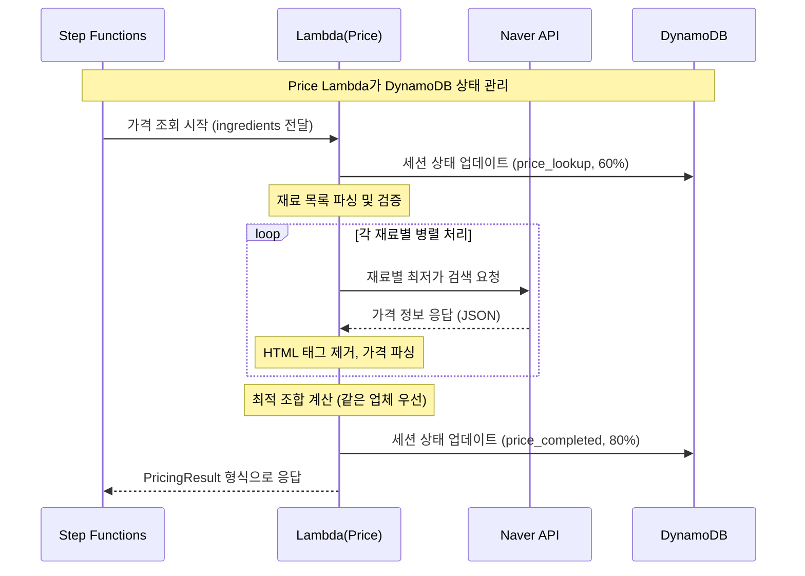

# Price Lambda 기능 명세서 (업데이트됨)

## 개요
네이버 쇼핑 API를 활용한 식재료 실시간 가격 조회 Lambda 함수
**Recipe Lambda → Price Lambda → Naver API → DynamoDB 상태 관리** 플로우 구현

## 전체 시퀀스 플로우 (수정됨)



## 핵심 변경사항

### 1. DynamoDB 상태 관리 추가
- **기존**: Step Functions에서 상태 관리
- **개선**: Price Lambda가 직접 DynamoDB 업데이트
- **상태**: `price_lookup` (60%) → `price_completed` (80%)

### 2. Recipe Lambda 연동
- **입력**: Recipe Lambda에서 생성된 재료 목록
- **처리**: 재료별 실시간 가격 조회
- **출력**: 가격 정보 + 총 비용 계산

### 3. 에러 처리 강화
- **네이버 API 실패**: 기본 가격으로 fallback
- **DynamoDB 실패**: 로그 기록 후 계속 진행
- **재시도 로직**: 네트워크 오류 시 3회 재시도

## 전문가 에이전트 작업 분배

### 1. **lambda-dev-worker** 담당 작업
- **Lambda 함수 코드 구현**
  - `backend/lambda/price/index.js` - 메인 핸들러
  - `backend/lambda/price/package.json` - 의존성 관리
  - 환경변수 처리 및 에러 핸들링
  - Step Functions 호환 입출력 형식

### 2. **external-api-worker** 담당 작업  
- **네이버 API 연동 모듈**
  - `backend/lambda/price/utils/naver-client.js` - API 클라이언트
  - HTTP 요청/응답 처리
  - Rate Limit 및 재시도 로직
  - 데이터 변환 및 정제

### 3. **api-integration-agent** 담당 작업
- **Step Functions 통합**
  - Step Functions 워크플로우 정의 수정
  - Lambda 함수 배포 및 권한 설정
  - DynamoDB 테이블 연동 확인
  - 전체 플로우 테스트

### 4. **dynamodb-expert** 담당 작업
- **데이터 저장 최적화**
  - 결과 저장 스키마 검증
  - TTL 설정 및 성능 최적화
  - 인덱스 설계 (필요시)

## 구현 우선순위

### Phase 1: 기본 구현 (lambda-dev-worker)
1. Lambda 함수 기본 구조 생성
2. Step Functions 입출력 형식 구현
3. 기본 에러 핸들링

### Phase 2: API 연동 (external-api-worker)  
1. 네이버 API 클라이언트 구현
2. 병렬 처리 및 최적화
3. 데이터 변환 로직

### Phase 3: 통합 테스트 (api-integration-agent)
1. Step Functions 워크플로우 연동
2. 전체 플로우 테스트
3. 성능 최적화

### Phase 4: 데이터 최적화 (dynamodb-expert)
1. 저장 스키마 최적화
2. 성능 튜닝

## Step Functions 워크플로우 정의

### 병렬 처리 구조
```json
{
  "Comment": "AI Chef Recipe Generation Workflow",
  "StartAt": "ParallelProcessing", 
  "States": {
    "ParallelProcessing": {
      "Type": "Parallel",
      "Branches": [
        {
          "StartAt": "GenerateRecipe",
          "States": {
            "GenerateRecipe": {
              "Type": "Task",
              "Resource": "arn:aws:lambda:region:account:function:ai-chef-recipe",
              "End": true
            }
          }
        },
        {
          "StartAt": "FetchPrices", 
          "States": {
            "FetchPrices": {
              "Type": "Task",
              "Resource": "arn:aws:lambda:region:account:function:ai-chef-price",
              "End": true
            }
          }
        }
      ],
      "Next": "CombineResults"
    },
    "CombineResults": {
      "Type": "Task",
      "Resource": "arn:aws:lambda:region:account:function:ai-chef-combine",
      "End": true
    }
  }
}
```

### Price Lambda 입력 (Step Functions에서 전달)
```json
{
  "ingredients": [
    {"name": "새우", "amount": "200", "unit": "g"},
    {"name": "아보카도", "amount": "1", "unit": "개"}
  ],
  "sessionId": "sess_abc123",
  "profile": {
    "target": "keto",
    "budget": 30000
  }
}
```

## DynamoDB 저장 스키마

### ai-chef-sessions 테이블 업데이트
```json
{
  "sessionId": "sess_abc123",
  "status": "processing",
  "phase": "price_fetching", 
  "progress": 70,
  "result": null,
  "updatedAt": "2024-09-05T13:00:00Z"
}
```

### ai-chef-results 테이블 저장
```json
{
  "sessionId": "sess_abc123",
  "result": {
    "recipe": { /* RecipeResult */ },
    "pricing": { /* PricingResult */ },
    "generatedAt": "2024-09-05T13:01:00Z"
  },
  "createdAt": "2024-09-05T13:01:00Z",
  "TTL": 1725609660
}
```

### 핵심 기능
- 식재료 목록을 받아 네이버 쇼핑 API로 최저가 검색
- Step Functions 워크플로우와 호환되는 응답 형식
- 에러 핸들링 및 재시도 로직
- API 키 보안 관리

### 입력 형식 (Step Functions에서 전달)
```json
{
  "ingredients": [
    {"name": "새우", "amount": "200", "unit": "g"},
    {"name": "아보카도", "amount": "1", "unit": "개"},
    {"name": "버터", "amount": "2", "unit": "큰술"}
  ],
  "sessionId": "sess_abc123"
}
```

### 출력 형식 (PricingResult 타입 준수)
```json
{
  "total": 25000,
  "optimal": {
    "vendor": "쿠팡",
    "items": [
      {
        "name": "새우",
        "price": 12000,
        "quantity": "200g"
      },
      {
        "name": "아보카도", 
        "price": 3000,
        "quantity": "1개"
      }
    ]
  },
  "alternatives": [
    {
      "vendor": "마켓컬리",
      "total": 27000,
      "items": [
        {
          "name": "새우",
          "price": 15000,
          "quantity": "200g"
        }
      ]
    }
  ]
}
```

## 기술 구현

### 파일 구조
```
backend/lambda/price/
├── index.js          # 메인 핸들러
├── package.json      # 의존성
└── utils/
    ├── naver-client.js  # API 클라이언트
    └── formatter.js     # 응답 포맷터
```

### 환경변수
- `NAVER_CLIENT_ID`: 네이버 API 클라이언트 ID
- `NAVER_CLIENT_SECRET`: 네이버 API 시크릿

### 에러 처리
```javascript
// 네이버 API 호출 실패 처리
try {
  const response = await axios.get(naverApiUrl, config);
  return response.data;
} catch (error) {
  if (error.response?.status === 429) {
    // Rate Limit 처리
    await new Promise(resolve => setTimeout(resolve, 1000));
    return retryApiCall(ingredient, retryCount + 1);
  }
  
  // 부분 실패 시에도 가능한 결과 반환
  console.warn(`가격 조회 실패: ${ingredient.name}`, error.message);
  return {
    ingredient: ingredient.name,
    prices: [{ vendor: '정보없음', price: 0, productName: '가격 정보 없음' }]
  };
}
```

### 병렬 처리 최적화
```javascript
// Promise.allSettled로 병렬 처리
const pricePromises = ingredients.map(ingredient => 
  fetchIngredientPrice(ingredient).catch(error => ({
    ingredient: ingredient.name,
    error: error.message,
    prices: []
  }))
);

const results = await Promise.allSettled(pricePromises);
```

## 네이버 쇼핑 API 연동

### API 엔드포인트
```
GET https://openapi.naver.com/v1/search/shop.json
```

### 요청 헤더
```
X-Naver-Client-Id: {CLIENT_ID}
X-Naver-Client-Secret: {CLIENT_SECRET}
```

### 쿼리 파라미터
- `query`: 검색어 (식재료명)
- `display`: 결과 개수 (기본 10개)
- `start`: 시작 위치 (기본 1)
- `sort`: 정렬 (sim - 정확도순, price_asc - 가격순)

### 응답 처리
```javascript
// HTML 태그 제거 및 가격 파싱
const cleanTitle = item.title.replace(/<[^>]*>/g, '');
const price = parseInt(item.lprice);

// 최적 조합 계산 로직
const calculateOptimalPricing = (priceResults) => {
  const vendors = {};
  let totalPrice = 0;
  
  // 각 재료의 최저가 찾기
  priceResults.forEach(result => {
    const cheapest = result.prices[0];
    totalPrice += cheapest.price;
    
    if (!vendors[cheapest.vendor]) {
      vendors[cheapest.vendor] = [];
    }
    vendors[cheapest.vendor].push({
      name: result.ingredient,
      price: cheapest.price,
      quantity: `${result.amount}${result.unit}`
    });
  });
  
  // 같은 업체에서 많이 살 수 있는 조합 우선
  const optimalVendor = Object.keys(vendors).reduce((a, b) => 
    vendors[a].length > vendors[b].length ? a : b
  );
  
  return { total: totalPrice, optimal: {...}, alternatives: [...] };
};
```

## 성능 최적화

### 병렬 처리
- 여러 식재료 동시 조회로 응답 시간 단축
- Promise.allSettled() 사용

### 캐싱 (선택사항)
- 동일 재료 중복 조회 방지
- 메모리 캐시 (Lambda 실행 중에만 유효)

## 배포 설정

### Lambda 구성
- Runtime: Node.js 18.x
- Memory: 256MB
- Timeout: 60초
- Environment Variables: NAVER_CLIENT_ID, NAVER_CLIENT_SECRET

### IAM 권한
- CloudWatch Logs 쓰기 권한만 필요 (외부 API 호출)

---
**작성일**: 2024-09-05  
**작성자**: Team21 AWS Hackathon
