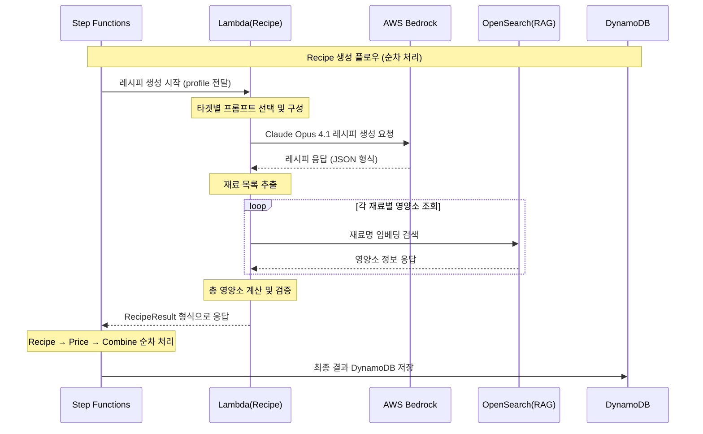

# Recipe Lambda 기능 명세서 (Python 구현)

## 개요
AWS Bedrock Claude Opus 4.1을 활용한 개인 맞춤형 AI 레시피 생성 Lambda 함수
**Step Functions → Recipe Lambda → Bedrock → 영양소 RAG → DynamoDB 저장** 플로우 구현

## 전체 시퀀스 플로우



## 핵심 기능

### 1. 타겟별 맞춤 레시피 생성
- **케토 다이어트**: 저탄수화물 고지방 레시피 (탄수화물 5g 이하, 지방 70% 이상)
- **이유식**: 월령별 안전한 이유식 레시피 (질식 위험 없는 크기와 질감)
- **당뇨 관리**: 혈당 지수 고려 레시피 (GI 55 이하 식품 우선)
- **일반 다이어트**: 칼로리 제한 건강 레시피 (고단백 저칼로리)
- **냉장고 털기**: 보유 재료 활용 레시피 (음식물 쓰레기 최소화)

### 2. 개인화 요소 반영
- 건강 상태 및 목표
- 식단 제한사항 (알레르기, 종교적 제약)
- 요리 실력 수준 (초급, 중급, 고급)
- 예산 범위
- 선호 음식 스타일

### 3. 영양소 정보 제공
- RAG 시스템을 통한 정확한 영양소 계산
- 칼로리, 탄수화물, 단백질, 지방, 식이섬유 상세 정보
- 타겟별 영양 목표 달성도 평가
- 매크로 영양소 비율 계산

## Step Functions 워크플로우 정의 (수정됨)

### 순차 처리 구조
```json
{
  "Comment": "AI Chef Recipe Generation Workflow - Fixed Sequence",
  "StartAt": "ValidateInput",
  "States": {
    "ValidateInput": {
      "Type": "Task",
      "Resource": "arn:aws:states:::lambda:invoke",
      "Parameters": {
        "FunctionName": "ai-chef-validator-PLACEHOLDER",
        "Payload.$": "$"
      },
      "ResultPath": "$.validation",
      "Next": "UpdateSessionStatus"
    },
    "UpdateSessionStatus": {
      "Type": "Task",
      "Resource": "arn:aws:states:::dynamodb:putItem",
      "Parameters": {
        "TableName": "ai-chef-sessions-PLACEHOLDER",
        "Item": {
          "sessionId": {"S.$": "$.sessionId"},
          "status": {"S": "processing"},
          "phase": {"S": "recipe_generation"},
          "progress": {"N": "10"},
          "updatedAt": {"S.$": "$$.State.EnteredTime"}
        }
      },
      "ResultPath": null,
      "Next": "GenerateRecipe"
    },
    "GenerateRecipe": {
      "Type": "Task",
      "Resource": "arn:aws:states:::lambda:invoke",
      "Parameters": {
        "FunctionName": "ai-chef-recipe-dev",
        "Payload.$": "$"
      },
      "ResultSelector": {
        "recipe.$": "$.Payload.body"
      },
      "ResultPath": "$.recipeResult",
      "Next": "UpdatePricePhase"
    },
    "UpdatePricePhase": {
      "Type": "Task",
      "Resource": "arn:aws:states:::dynamodb:updateItem",
      "Parameters": {
        "TableName": "ai-chef-sessions-PLACEHOLDER",
        "Key": {
          "sessionId": {"S.$": "$.sessionId"}
        },
        "UpdateExpression": "SET #phase = :phase, #progress = :progress",
        "ExpressionAttributeNames": {
          "#phase": "phase",
          "#progress": "progress"
        },
        "ExpressionAttributeValues": {
          ":phase": {"S": "price_lookup"},
          ":progress": {"N": "50"}
        }
      },
      "ResultPath": null,
      "Next": "FetchPrices"
    },
    "FetchPrices": {
      "Type": "Task",
      "Resource": "arn:aws:states:::lambda:invoke",
      "Parameters": {
        "FunctionName": "ai-chef-price-PLACEHOLDER",
        "Payload": {
          "sessionId.$": "$.sessionId",
          "profile.$": "$.profile",
          "ingredients.$": "$.recipeResult.recipe.ingredients"
        }
      },
      "ResultSelector": {
        "pricing.$": "$.Payload.body"
      },
      "ResultPath": "$.pricingResult",
      "Next": "CombineResults"
    },
    "CombineResults": {
      "Type": "Task",
      "Resource": "arn:aws:states:::lambda:invoke",
      "Parameters": {
        "FunctionName": "ai-chef-combine-PLACEHOLDER",
        "Payload": {
          "sessionId.$": "$.sessionId",
          "profile.$": "$.profile",
          "recipeResult.$": "$.recipeResult.recipe",
          "pricingResult.$": "$.pricingResult.pricing"
        }
      },
      "End": true
    }
  }
}
```

### Recipe Lambda 입력 (Step Functions에서 전달)
```json
{
  "sessionId": "sess_abc123",
  "profile": {
    "target": "keto",
    "healthConditions": ["diabetes"],
    "allergies": ["nuts"],
    "cookingLevel": "beginner",
    "budget": 30000,
    "preferences": {
      "cuisine": "korean",
      "spicyLevel": "mild"
    },
    "availableIngredients": ["chicken", "broccoli"]
  },
  "constraints": {
    "maxCalories": 600,
    "maxCookingTime": 30
  }
}
```

## AWS Bedrock Claude Opus 4.1 연동

### 모델 설정 (업데이트됨)
```python
bedrock_config = {
    'modelId': 'anthropic.claude-opus-4-1-20250805-v1:0',
    'region': 'us-east-1',
    'max_tokens': 4000,
    'temperature': 0.7
}
```

### 실제 구현 코드 (Python)
```python
import json
import boto3
from datetime import datetime
import logging
from typing import Dict, List, Any

logger = logging.getLogger()
logger.setLevel(logging.INFO)

bedrock = boto3.client('bedrock-runtime', region_name='us-east-1')

def lambda_handler(event: Dict[str, Any], context) -> Dict[str, Any]:
    """Recipe generation Lambda handler with Claude Opus 4.1"""
    try:
        session_id = event.get('sessionId')
        profile = event.get('profile', {})
        
        logger.info(f"Processing recipe generation for session: {session_id}")
        
        # Generate recipe using Claude Opus 4.1
        recipe = generate_recipe_with_bedrock(profile)
        
        # Get nutrition information for ingredients
        nutrition_info = get_nutrition_info(recipe.get('ingredients', []))
        
        # Calculate total nutrition
        total_nutrition = calculate_total_nutrition(nutrition_info)
        recipe['nutrition'] = total_nutrition
        
        # Validate target compliance
        compliance = validate_target_compliance(recipe, profile.get('target'))
        recipe['targetCompliance'] = compliance
        
        return {
            'statusCode': 200,
            'body': {
                'recipe': recipe,
                'generatedAt': datetime.now().isoformat(),
                'nutritionInfo': nutrition_info
            }
        }
        
    except Exception as e:
        logger.error(f'Recipe generation error: {str(e)}')
        return {
            'statusCode': 500,
            'body': {
                'error': str(e),
                'recipe': get_default_recipe(profile.get('target', 'general'))
            }
        }

def generate_recipe_with_bedrock(profile: Dict[str, Any]) -> Dict[str, Any]:
    """Generate recipe using Claude Opus 4.1 with target-specific prompts"""
    target = profile.get('target', 'general')
    prompt = build_target_specific_prompt(profile)
    
    try:
        response = bedrock.invoke_model(
            modelId='anthropic.claude-opus-4-1-20250805-v1:0',
            body=json.dumps({
                'anthropic_version': 'bedrock-2023-05-31',
                'max_tokens': 4000,
                'temperature': 0.7,
                'messages': [{'role': 'user', 'content': prompt}]
            })
        )
        
        result = json.loads(response['body'].read())
        recipe_text = result['content'][0]['text']
        recipe = extract_json_from_text(recipe_text)
        return recipe
        
    except Exception as e:
        logger.error(f'Bedrock API error: {str(e)}')
        return get_default_recipe(target)

def build_target_specific_prompt(profile: Dict[str, Any]) -> str:
    """Build target-specific prompts for different diet types"""
    target = profile.get('target', 'general')
    
    if target == 'keto':
        return build_keto_prompt(profile)
    elif target == 'baby_food':
        return build_baby_food_prompt(profile)
    elif target == 'diabetes':
        return build_diabetes_prompt(profile)
    elif target == 'diet':
        return build_diet_prompt(profile)
    elif target == 'fridge':
        return build_fridge_clearing_prompt(profile)
    else:
        return build_general_prompt(profile)
```

### 프롬프트 엔지니어링 전략

#### 1. 케토 다이어트 프롬프트
```python
def build_keto_prompt(profile: Dict[str, Any]) -> str:
    health_conditions = ', '.join(profile.get('healthConditions', [])) or '없음'
    allergies = ', '.join(profile.get('allergies', [])) or '없음'
    cooking_level = profile.get('cookingLevel', '초급')
    budget = profile.get('budget', 30000)
    
    return f"""당신은 케토제닉 다이어트 전문 영양사입니다. 다음 조건에 맞는 레시피를 생성해주세요:

사용자 프로필:
- 건강 상태: {health_conditions}
- 알레르기: {allergies}
- 요리 실력: {cooking_level}
- 예산: {budget}원

케토 다이어트 요구사항:
- 탄수화물: 5g 이하
- 지방: 70% 이상
- 단백질: 25% 내외
- 총 칼로리: 600kcal 이하

JSON 형식으로 응답:
{{
  "recipeName": "케토 아보카도 샐러드",
  "description": "고지방 저탄수화물 케토 다이어트 샐러드",
  "cookingTime": 15,
  "difficulty": "easy",
  "servings": 2,
  "ingredients": [
    {{"name": "아보카도", "amount": "2", "unit": "개"}},
    {{"name": "올리브오일", "amount": "3", "unit": "큰술"}},
    {{"name": "레몬즙", "amount": "1", "unit": "큰술"}}
  ],
  "instructions": [
    "1. 아보카도를 깍둑썰기 합니다.",
    "2. 올리브오일과 레몬즙을 섞어 드레싱을 만듭니다.",
    "3. 아보카도에 드레싱을 뿌려 완성합니다."
  ],
  "ketoNotes": "완벽한 케토 매크로 비율입니다. MCT 오일 추가로 케토시스 촉진 가능"
}}"""
```

#### 2. 이유식 프롬프트
```python
def build_baby_food_prompt(profile: Dict[str, Any]) -> str:
    baby_age = profile.get('babyAge', 6)
    allergies = ', '.join(profile.get('allergies', [])) or '없음'
    current_foods = ', '.join(profile.get('currentFoods', [])) or '없음'
    
    return f"""당신은 소아영양 전문가입니다. 안전하고 영양가 있는 이유식 레시피를 생성해주세요:

아기 정보:
- 월령: {baby_age}개월
- 알레르기 이력: {allergies}
- 현재 먹고 있는 음식: {current_foods}

이유식 안전 기준:
- 월령에 적합한 식재료만 사용
- 질식 위험 없는 크기와 질감
- 소금, 설탕, 꿀 등 첨가물 금지
- 알레르기 유발 가능 식품 주의

JSON 형식으로 응답:
{{
  "recipeName": "이유식명",
  "ageAppropriate": "6-8개월",
  "texture": "으깬 형태",
  "ingredients": [...],
  "instructions": [...],
  "safetyNotes": "질식 위험 주의사항",
  "nutritionBenefits": "영양학적 이점",
  "storageInstructions": "보관 방법"
}}"""
```

## 영양소 RAG 시스템 연동

### 영양소 조회 및 계산
```python
def get_nutrition_info(ingredients: List[Dict[str, Any]]) -> List[Dict[str, Any]]:
    """Get nutrition information for ingredients using RAG system"""
    nutrition_data = []
    
    for ingredient in ingredients:
        try:
            # Clean ingredient name
            clean_name = clean_ingredient_name(ingredient['name'])
            
            # Search in nutrition database (mock implementation)
            nutrition = search_nutrition_database(clean_name)
            
            # Calculate nutrition by amount
            calculated_nutrition = calculate_nutrition_by_amount(
                nutrition, 
                float(ingredient.get('amount', 1)), 
                ingredient.get('unit', '개')
            )
            
            nutrition_data.append({
                'ingredient': ingredient['name'],
                'nutrition': calculated_nutrition
            })
            
        except Exception as e:
            logger.warning(f"Failed to get nutrition for {ingredient['name']}: {e}")
            nutrition_data.append({
                'ingredient': ingredient['name'],
                'nutrition': get_default_nutrition()
            })
    
    return nutrition_data

def calculate_total_nutrition(nutrition_info: List[Dict[str, Any]]) -> Dict[str, Any]:
    """Calculate total nutrition from all ingredients"""
    total = {'calories': 0, 'protein': 0, 'fat': 0, 'carbs': 0, 'fiber': 0}
    
    for item in nutrition_info:
        nutrition = item['nutrition']
        for key in total:
            total[key] += nutrition.get(key, 0)
    
    # Calculate macro ratios
    total_macros = total['protein'] * 4 + total['fat'] * 9 + total['carbs'] * 4
    if total_macros > 0:
        macro_ratio = {
            'protein': round((total['protein'] * 4 / total_macros) * 100, 1),
            'fat': round((total['fat'] * 9 / total_macros) * 100, 1),
            'carbs': round((total['carbs'] * 4 / total_macros) * 100, 1)
        }
    else:
        macro_ratio = {'protein': 0, 'fat': 0, 'carbs': 0}
    
    return {
        'total': total,
        'perServing': {k: round(v / 2, 1) for k, v in total.items()},
        'macroRatio': macro_ratio
    }
```

## 입출력 데이터 형식

### Recipe Lambda 출력 (RecipeResult 타입)
```json
{
  "recipe": {
    "recipeName": "케토 아보카도 샐러드",
    "description": "고지방 저탄수화물 케토 다이어트 샐러드",
    "cookingTime": 15,
    "difficulty": "easy",
    "servings": 2,
    "ingredients": [
      {"name": "아보카도", "amount": "2", "unit": "개"},
      {"name": "올리브오일", "amount": "3", "unit": "큰술"},
      {"name": "레몬즙", "amount": "1", "unit": "큰술"}
    ],
    "instructions": [
      "1. 아보카도를 깍둑썰기 합니다.",
      "2. 올리브오일과 레몬즙을 섞어 드레싱을 만듭니다.",
      "3. 아보카도에 드레싱을 뿌려 완성합니다."
    ],
    "nutrition": {
      "total": {
        "calories": 520,
        "protein": 6.8,
        "fat": 48.2,
        "carbs": 4.1,
        "fiber": 13.6
      },
      "perServing": {
        "calories": 260,
        "protein": 3.4,
        "fat": 24.1,
        "carbs": 2.05,
        "fiber": 6.8
      },
      "macroRatio": {
        "fat": 83.5,
        "protein": 5.2,
        "carbs": 3.1
      }
    },
    "targetCompliance": {
      "target": "keto",
      "compliance": 95,
      "notes": "완벽한 케토 매크로 비율입니다.",
      "recommendations": ["MCT 오일 추가로 케토시스 촉진 가능"]
    }
  },
  "generatedAt": "2025-09-05T16:00:00Z",
  "nutritionInfo": [
    {
      "ingredient": "아보카도",
      "nutrition": {
        "calories": 320,
        "protein": 4,
        "fat": 30,
        "carbs": 18,
        "fiber": 14
      }
    }
  ]
}
```

## 에러 핸들링

### Bedrock API 에러 처리
```python
def generate_recipe_with_retry(prompt: str, retry_count: int = 0) -> Dict[str, Any]:
    """Generate recipe with retry logic"""
    try:
        response = bedrock.invoke_model(
            modelId='anthropic.claude-opus-4-1-20250805-v1:0',
            body=json.dumps({
                'anthropic_version': 'bedrock-2023-05-31',
                'max_tokens': 4000,
                'messages': [{'role': 'user', 'content': prompt}]
            })
        )
        
        return json.loads(response['body'].read())
        
    except Exception as e:
        if 'ThrottlingException' in str(e) and retry_count < 3:
            import time
            time.sleep(1 * (retry_count + 1))
            return generate_recipe_with_retry(prompt, retry_count + 1)
        
        if 'ValidationException' in str(e):
            raise ValueError('Invalid prompt format')
        
        # Return default recipe for other errors
        logger.error(f"Bedrock error: {e}")
        return get_default_recipe('general')
```

### 영양소 조회 실패 처리
```python
def handle_missing_nutrition(ingredient_name: str) -> Dict[str, float]:
    """Handle missing nutrition data with category-based estimation"""
    category_nutrition = {
        '채소류': {'calories': 25, 'protein': 2, 'fat': 0.2, 'carbs': 5, 'fiber': 2},
        '육류': {'calories': 200, 'protein': 20, 'fat': 15, 'carbs': 0, 'fiber': 0},
        '곡류': {'calories': 350, 'protein': 8, 'fat': 2, 'carbs': 75, 'fiber': 3}
    }
    
    category = classify_ingredient(ingredient_name)
    return category_nutrition.get(category, category_nutrition['채소류'])
```

## 성능 최적화

### Lambda 설정
- **Runtime**: Python 3.11
- **Memory**: 512MB
- **Timeout**: 120초
- **Environment Variables**: BEDROCK_REGION, OPENSEARCH_ENDPOINT

### 병렬 처리 최적화
```python
import asyncio
from concurrent.futures import ThreadPoolExecutor

async def process_recipe_generation(profile: Dict[str, Any]) -> Dict[str, Any]:
    """Process recipe generation with parallel nutrition lookup"""
    
    # Generate recipe
    recipe = await generate_recipe_async(profile)
    
    # Parallel nutrition lookup
    with ThreadPoolExecutor(max_workers=5) as executor:
        nutrition_futures = [
            executor.submit(get_ingredient_nutrition, ingredient)
            for ingredient in recipe.get('ingredients', [])
        ]
        
        nutrition_results = [future.result() for future in nutrition_futures]
    
    # Combine results
    recipe['nutrition'] = calculate_total_nutrition(nutrition_results)
    return recipe
```

### 캐싱 전략
```python
from functools import lru_cache

@lru_cache(maxsize=1000)
def get_cached_nutrition(ingredient_name: str) -> Dict[str, float]:
    """Cache nutrition data for frequently used ingredients"""
    return search_nutrition_database(ingredient_name)

# Lambda memory caching
nutrition_cache = {}
prompt_cache = {}

def get_nutrition_with_cache(ingredient_name: str) -> Dict[str, float]:
    """Get nutrition with in-memory caching"""
    if ingredient_name in nutrition_cache:
        return nutrition_cache[ingredient_name]
    
    nutrition = search_nutrition_database(ingredient_name)
    nutrition_cache[ingredient_name] = nutrition
    return nutrition
```

## 배포 설정 (업데이트됨)

### IAM 권한
```json
{
  "Version": "2012-10-17",
  "Statement": [
    {
      "Effect": "Allow",
      "Action": [
        "bedrock:InvokeModel"
      ],
      "Resource": "arn:aws:bedrock:us-east-1::foundation-model/anthropic.claude-opus-4-1-20250805-v1:0"
    },
    {
      "Effect": "Allow", 
      "Action": [
        "es:ESHttpPost",
        "es:ESHttpGet"
      ],
      "Resource": "arn:aws:es:*:*:domain/ingredient-nutrition/*"
    }
  ]
}
```

### CloudFormation 리소스 (실제 배포됨)
```yaml
RecipeLambda:
  Type: AWS::Lambda::Function
  Properties:
    FunctionName: ai-chef-recipe-dev
    Runtime: python3.11
    Handler: lambda_function.lambda_handler
    MemorySize: 512
    Timeout: 120
    Environment:
      Variables:
        BEDROCK_REGION: us-east-1
        OPENSEARCH_ENDPOINT: !GetAtt NutritionSearchDomain.DomainEndpoint
```

### 배포된 리소스 정보
- **Lambda 함수명**: `ai-chef-recipe-dev`
- **Lambda ARN**: `arn:aws:lambda:us-east-1:491085385364:function:ai-chef-recipe-dev`
- **Step Functions**: `ai-chef-workflow-dev`
- **지역**: `us-east-1`
- **모델**: Claude Opus 4.1

### 테스트 실행
```bash
# Step Functions 실행
aws stepfunctions start-execution \
  --state-machine-arn arn:aws:states:us-east-1:491085385364:stateMachine:ai-chef-workflow-dev \
  --input '{
    "sessionId": "sess_abc123",
    "profile": {
      "target": "keto",
      "healthConditions": ["diabetes"],
      "allergies": [],
      "cookingLevel": "beginner",
      "budget": 30000
    }
  }' \
  --name execution-$(date +%s)

# 로컬 테스트
python test_lambda.py
```

### 의존성 관리
```txt
# requirements.txt
boto3>=1.26.0
typing-extensions>=4.0.0
```

---
**작성일**: 2025-09-05  
**작성자**: Team21 AWS Hackathon  
**최종 업데이트**: Python 구현 완료, Claude Opus 4.1 적용
