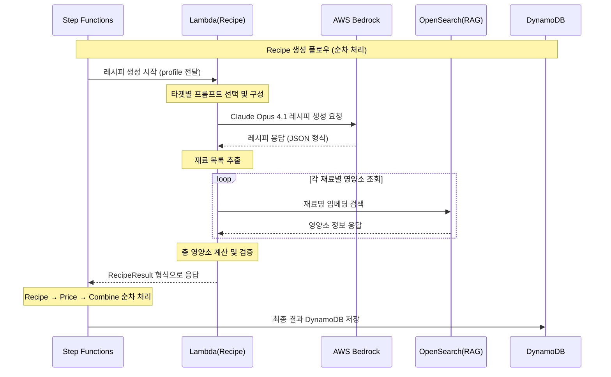

# Recipe Lambda 기능 명세서

## 개요
AWS Bedrock Claude Opus 4.1을 활용한 개인 맞춤형 AI 레시피 생성 Lambda 함수
**Step Functions → Recipe Lambda → Bedrock → 영양소 RAG → DynamoDB 저장** 플로우 구현

## 전체 시퀀스 플로우



## 핵심 기능

### 1. 타겟별 맞춤 레시피 생성
- **케토 다이어트**: 저탄수화물 고지방 레시피
- **이유식**: 월령별 안전한 이유식 레시피  
- **당뇨 관리**: 혈당 지수 고려 레시피
- **일반 다이어트**: 칼로리 제한 건강 레시피
- **냉장고 털기**: 보유 재료 활용 레시피

### 2. 개인화 요소 반영
- 건강 상태 및 목표
- 식단 제한사항 (알레르기, 종교적 제약)
- 요리 실력 수준
- 예산 범위
- 선호 음식 스타일

### 3. 영양소 정보 제공
- RAG 시스템을 통한 정확한 영양소 계산
- 칼로리, 탄수화물, 단백질, 지방 상세 정보
- 타겟별 영양 목표 달성도 평가

## Step Functions 워크플로우 정의 (수정됨)

### 순차 처리 구조
```json
{
  "Comment": "AI Chef Recipe Generation Workflow - Fixed Sequence",
  "StartAt": "ValidateInput",
  "States": {
    "ValidateInput": {
      "Type": "Task",
      "Resource": "arn:aws:states:::lambda:invoke",
      "Parameters": {
        "FunctionName": "ai-chef-validator-PLACEHOLDER",
        "Payload.$": "$"
      },
      "ResultPath": "$.validation",
      "Next": "UpdateSessionStatus"
    },
    "UpdateSessionStatus": {
      "Type": "Task",
      "Resource": "arn:aws:states:::dynamodb:putItem",
      "Parameters": {
        "TableName": "ai-chef-sessions-PLACEHOLDER",
        "Item": {
          "sessionId": {"S.$": "$.sessionId"},
          "status": {"S": "processing"},
          "phase": {"S": "recipe_generation"},
          "progress": {"N": "10"},
          "updatedAt": {"S.$": "$$.State.EnteredTime"}
        }
      },
      "ResultPath": null,
      "Next": "GenerateRecipe"
    },
    "GenerateRecipe": {
      "Type": "Task",
      "Resource": "arn:aws:states:::lambda:invoke",
      "Parameters": {
        "FunctionName": "ai-chef-recipe-dev",
        "Payload.$": "$"
      },
      "ResultSelector": {
        "recipe.$": "$.Payload.body"
      },
      "ResultPath": "$.recipeResult",
      "Next": "UpdatePricePhase"
    },
    "UpdatePricePhase": {
      "Type": "Task",
      "Resource": "arn:aws:states:::dynamodb:updateItem",
      "Parameters": {
        "TableName": "ai-chef-sessions-PLACEHOLDER",
        "Key": {
          "sessionId": {"S.$": "$.sessionId"}
        },
        "UpdateExpression": "SET #phase = :phase, #progress = :progress",
        "ExpressionAttributeNames": {
          "#phase": "phase",
          "#progress": "progress"
        },
        "ExpressionAttributeValues": {
          ":phase": {"S": "price_lookup"},
          ":progress": {"N": "50"}
        }
      },
      "ResultPath": null,
      "Next": "FetchPrices"
    },
    "FetchPrices": {
      "Type": "Task",
      "Resource": "arn:aws:states:::lambda:invoke",
      "Parameters": {
        "FunctionName": "ai-chef-price-PLACEHOLDER",
        "Payload": {
          "sessionId.$": "$.sessionId",
          "profile.$": "$.profile",
          "ingredients.$": "$.recipeResult.recipe.ingredients"
        }
      },
      "ResultSelector": {
        "pricing.$": "$.Payload.body"
      },
      "ResultPath": "$.pricingResult",
      "Next": "CombineResults"
    },
    "CombineResults": {
      "Type": "Task",
      "Resource": "arn:aws:states:::lambda:invoke",
      "Parameters": {
        "FunctionName": "ai-chef-combine-PLACEHOLDER",
        "Payload": {
          "sessionId.$": "$.sessionId",
          "profile.$": "$.profile",
          "recipeResult.$": "$.recipeResult.recipe",
          "pricingResult.$": "$.pricingResult.pricing"
        }
      },
      "End": true
    }
  }
}
```

### Recipe Lambda 입력 (Step Functions에서 전달)
```json
{
  "sessionId": "sess_abc123",
  "profile": {
    "target": "keto",
    "healthConditions": ["diabetes"],
    "allergies": ["nuts"],
    "cookingLevel": "beginner",
    "budget": 30000,
    "preferences": {
      "cuisine": "korean",
      "spicyLevel": "mild"
    },
    "availableIngredients": ["chicken", "broccoli"]
  },
  "constraints": {
    "maxCalories": 600,
    "maxCookingTime": 30
  }
}
```

## AWS Bedrock Claude Opus 4.1 연동

### 모델 설정 (업데이트됨)
```javascript
const bedrockConfig = {
  modelId: "anthropic.claude-opus-4-1-20250805-v1:0",
  region: "us-east-1",
  maxTokens: 4000,
  temperature: 0.7,
  topP: 0.9
};
```

### 실제 구현 코드
```javascript
const { BedrockRuntimeClient, InvokeModelCommand } = require('@aws-sdk/client-bedrock-runtime');

const bedrock = new BedrockRuntimeClient({ region: 'us-east-1' });

exports.handler = async (event) => {
    try {
        const { sessionId, profile } = event;
        
        const prompt = `당신은 전문 영양사입니다. 다음 조건에 맞는 레시피를 JSON 형식으로 생성해주세요:

사용자 프로필:
- 타겟: ${profile?.target || 'general'}
- 건강 상태: ${profile?.healthConditions?.join(', ') || '없음'}
- 알레르기: ${profile?.allergies?.join(', ') || '없음'}
- 요리 실력: ${profile?.cookingLevel || '초급'}
- 예산: ${profile?.budget || 20000}원

응답 형식:
{
  "recipeName": "레시피명",
  "description": "레시피 설명", 
  "cookingTime": 30,
  "difficulty": "easy",
  "servings": 2,
  "ingredients": [
    {"name": "재료명", "amount": "1", "unit": "개"}
  ],
  "instructions": [
    "1. 조리 단계"
  ],
  "nutrition": {
    "calories": 400,
    "protein": 25,
    "fat": 15,
    "carbs": 30
  }
}`;
        
        const command = new InvokeModelCommand({
            modelId: 'anthropic.claude-opus-4-1-20250805-v1:0',
            body: JSON.stringify({
                anthropic_version: 'bedrock-2023-05-31',
                max_tokens: 4000,
                messages: [{ role: 'user', content: prompt }]
            })
        });
        
        const response = await bedrock.send(command);
        const result = JSON.parse(new TextDecoder().decode(response.body));
        
        const recipeText = result.content[0].text;
        const recipe = JSON.parse(recipeText);
        
        return {
            statusCode: 200,
            body: {
                recipe: recipe,
                generatedAt: new Date().toISOString()
            }
        };
        
    } catch (error) {
        console.error('Recipe generation error:', error);
        return {
            statusCode: 500,
            body: {
                error: error.message,
                recipe: getDefaultRecipe(event.profile?.target || 'general')
            }
        };
    }
};
```

### 프롬프트 엔지니어링 전략

#### 1. 케토 다이어트 프롬프트
```javascript
const KETO_PROMPT = `
당신은 케토제닉 다이어트 전문 영양사입니다. 다음 조건에 맞는 레시피를 생성해주세요:

사용자 프로필:
- 건강 상태: {healthConditions}
- 알레르기: {allergies}
- 요리 실력: {cookingLevel}
- 예산: {budget}원

케토 다이어트 요구사항:
- 탄수화물: 5g 이하
- 지방: 70% 이상
- 단백질: 25% 내외
- 총 칼로리: {maxCalories}kcal 이하

다음 JSON 형식으로 응답해주세요:
{
  "recipeName": "레시피명",
  "description": "레시피 설명",
  "cookingTime": 25,
  "difficulty": "easy",
  "servings": 2,
  "ingredients": [
    {"name": "아보카도", "amount": "1", "unit": "개"},
    {"name": "올리브오일", "amount": "2", "unit": "큰술"}
  ],
  "instructions": [
    "1. 아보카도를 반으로 자릅니다.",
    "2. 올리브오일을 뿌립니다."
  ],
  "nutritionTips": "케토 다이어트에 완벽한 고지방 저탄수화물 레시피입니다.",
  "ketoNotes": "케토시스 유지에 도움되는 MCT 오일 추가를 권장합니다."
}
`;
```

#### 2. 이유식 프롬프트
```javascript
const BABY_FOOD_PROMPT = `
당신은 소아영양 전문가입니다. 안전하고 영양가 있는 이유식 레시피를 생성해주세요:

아기 정보:
- 월령: {babyAge}개월
- 알레르기 이력: {allergies}
- 현재 먹고 있는 음식: {currentFoods}

이유식 안전 기준:
- 월령에 적합한 식재료만 사용
- 질식 위험 없는 크기와 질감
- 소금, 설탕, 꿀 등 첨가물 금지
- 알레르기 유발 가능 식품 주의

JSON 형식으로 응답:
{
  "recipeName": "이유식명",
  "ageAppropriate": "6-8개월",
  "texture": "으깬 형태",
  "ingredients": [...],
  "instructions": [...],
  "safetyNotes": "질식 위험 주의사항",
  "nutritionBenefits": "영양학적 이점",
  "storageInstructions": "보관 방법"
}
`;
```

#### 3. 당뇨 관리 프롬프트
```javascript
const DIABETES_PROMPT = `
당신은 당뇨병 전문 영양사입니다. 혈당 관리에 도움되는 레시피를 생성해주세요:

환자 정보:
- 당뇨 유형: {diabetesType}
- 현재 혈당 수치: {bloodSugar}
- 복용 약물: {medications}
- 목표 칼로리: {targetCalories}

당뇨 식단 원칙:
- 혈당 지수(GI) 55 이하 식품 우선
- 복합 탄수화물 위주
- 식이섬유 풍부한 재료
- 단순당 최소화

JSON 응답에 추가 필드:
{
  ...,
  "glycemicIndex": "낮음",
  "bloodSugarImpact": "완만한 상승 예상",
  "diabeticNotes": "식후 혈당 모니터링 권장",
  "portionControl": "1회 제공량 준수 중요"
}
`;
```

#### 4. 냉장고 털기 프롬프트
```javascript
const FRIDGE_CLEARING_PROMPT = `
당신은 창의적인 요리사입니다. 주어진 재료로 맛있는 레시피를 만들어주세요:

보유 재료:
{availableIngredients}

추가 구매 가능 재료 (예산 {budget}원):
- 기본 조미료 (소금, 후추, 기름 등)
- 저렴한 부재료

목표:
- 음식물 쓰레기 최소화
- 경제적인 레시피
- 영양 균형 고려

JSON 응답에 추가:
{
  ...,
  "usedIngredients": ["보유 재료 중 사용된 것들"],
  "additionalIngredients": ["추가 구매 필요한 재료들"],
  "estimatedCost": 15000,
  "wasteReduction": "냉장고 재료 90% 활용",
  "variations": ["남은 재료로 만들 수 있는 다른 요리"]
}
`;
```

## 영양소 RAG 시스템 연동

### OpenSearch 영양소 조회
```javascript
async function getNutritionInfo(ingredients) {
  const nutritionPromises = ingredients.map(async (ingredient) => {
    // 1. 재료명 정규화
    const cleanName = ingredient.name.replace(/[0-9]+[가-힣]*\s*/g, '');
    
    // 2. OpenSearch 임베딩 검색
    const embedding = await getBedrockEmbedding(cleanName);
    const searchResult = await opensearchClient.search({
      index: 'ingredient-nutrition',
      body: {
        query: {
          knn: {
            embedding: {
              vector: embedding,
              k: 1
            }
          }
        }
      }
    });
    
    // 3. 양에 따른 영양소 계산
    const nutritionData = searchResult.body.hits.hits[0]._source;
    const amount = parseFloat(ingredient.amount);
    const unit = ingredient.unit;
    
    return calculateNutritionByAmount(nutritionData, amount, unit);
  });
  
  return Promise.all(nutritionPromises);
}
```

### 총 영양소 계산
```javascript
function calculateTotalNutrition(ingredientNutritions) {
  return ingredientNutritions.reduce((total, nutrition) => ({
    calories: total.calories + nutrition.calories,
    protein: total.protein + nutrition.protein,
    fat: total.fat + nutrition.fat,
    carbs: total.carbs + nutrition.carbs,
    fiber: total.fiber + nutrition.fiber,
    sodium: total.sodium + nutrition.sodium
  }), {
    calories: 0, protein: 0, fat: 0, carbs: 0, fiber: 0, sodium: 0
  });
}
```

## 입출력 데이터 형식

### Recipe Lambda 출력 (RecipeResult 타입)
```json
{
  "recipe": {
    "name": "케토 아보카도 샐러드",
    "description": "고지방 저탄수화물 케토 다이어트 샐러드",
    "cookingTime": 15,
    "difficulty": "easy",
    "servings": 2,
    "ingredients": [
      {"name": "아보카도", "amount": "2", "unit": "개"},
      {"name": "올리브오일", "amount": "3", "unit": "큰술"},
      {"name": "레몬즙", "amount": "1", "unit": "큰술"}
    ],
    "instructions": [
      "1. 아보카도를 깍둑썰기 합니다.",
      "2. 올리브오일과 레몬즙을 섞어 드레싱을 만듭니다.",
      "3. 아보카도에 드레싱을 뿌려 완성합니다."
    ]
  },
  "nutrition": {
    "total": {
      "calories": 520,
      "protein": 6.8,
      "fat": 48.2,
      "carbs": 4.1,
      "fiber": 13.6,
      "sodium": 12
    },
    "perServing": {
      "calories": 260,
      "protein": 3.4,
      "fat": 24.1,
      "carbs": 2.05,
      "fiber": 6.8,
      "sodium": 6
    },
    "macroRatio": {
      "fat": 83.5,
      "protein": 5.2,
      "carbs": 3.1
    }
  },
  "targetCompliance": {
    "target": "keto",
    "compliance": 95,
    "notes": "완벽한 케토 매크로 비율입니다.",
    "recommendations": ["MCT 오일 추가로 케토시스 촉진 가능"]
  },
  "generatedAt": "2024-09-05T13:00:00Z"
}
```

## 에러 핸들링

### Bedrock API 에러 처리
```javascript
async function generateRecipeWithRetry(prompt, retryCount = 0) {
  try {
    const response = await bedrockClient.invokeModel({
      modelId: 'anthropic.claude-3-sonnet-20240229-v1:0',
      body: JSON.stringify({
        anthropic_version: "bedrock-2023-05-31",
        max_tokens: 4000,
        messages: [{ role: "user", content: prompt }]
      })
    });
    
    return JSON.parse(response.body);
  } catch (error) {
    if (error.name === 'ThrottlingException' && retryCount < 3) {
      await new Promise(resolve => setTimeout(resolve, 1000 * (retryCount + 1)));
      return generateRecipeWithRetry(prompt, retryCount + 1);
    }
    
    if (error.name === 'ValidationException') {
      throw new Error('Invalid prompt format');
    }
    
    // 기본 레시피 반환
    return getDefaultRecipe(profile.target);
  }
}
```

### 영양소 조회 실패 처리
```javascript
function handleMissingNutrition(ingredientName) {
  // 카테고리 기반 추정값 제공
  const categoryNutrition = {
    '채소류': { calories: 25, protein: 2, fat: 0.2, carbs: 5 },
    '육류': { calories: 200, protein: 20, fat: 15, carbs: 0 },
    '곡류': { calories: 350, protein: 8, fat: 2, carbs: 75 }
  };
  
  const category = classifyIngredient(ingredientName);
  return categoryNutrition[category] || categoryNutrition['채소류'];
}
```

## 성능 최적화

### Lambda 설정
- **Runtime**: Node.js 18.x
- **Memory**: 512MB
- **Timeout**: 120초
- **Environment Variables**: BEDROCK_REGION, OPENSEARCH_ENDPOINT

### 병렬 처리 최적화
```javascript
// Bedrock 호출과 영양소 조회 병렬 처리
async function processRecipeGeneration(profile) {
  const [recipeResponse, nutritionCache] = await Promise.all([
    generateRecipe(profile),
    preloadCommonNutritions()
  ]);
  
  const ingredients = extractIngredients(recipeResponse);
  const nutritionInfo = await getNutritionInfo(ingredients);
  
  return combineRecipeAndNutrition(recipeResponse, nutritionInfo);
}
```

### 캐싱 전략
```javascript
// Lambda 메모리 캐싱
const nutritionCache = new Map();
const promptCache = new Map();

function getCachedNutrition(ingredientName) {
  if (nutritionCache.has(ingredientName)) {
    return nutritionCache.get(ingredientName);
  }
  
  const nutrition = fetchNutritionFromOpenSearch(ingredientName);
  nutritionCache.set(ingredientName, nutrition);
  return nutrition;
}
```

## 배포 설정 (업데이트됨)

### IAM 권한
```json
{
  "Version": "2012-10-17",
  "Statement": [
    {
      "Effect": "Allow",
      "Action": [
        "bedrock:InvokeModel"
      ],
      "Resource": "arn:aws:bedrock:us-east-1::foundation-model/anthropic.claude-opus-4-1-20250805-v1:0"
    },
    {
      "Effect": "Allow", 
      "Action": [
        "es:ESHttpPost",
        "es:ESHttpGet"
      ],
      "Resource": "arn:aws:es:*:*:domain/ingredient-nutrition/*"
    }
  ]
}
```

### CloudFormation 리소스 (실제 배포됨)
```yaml
RecipeLambda:
  Type: AWS::Lambda::Function
  Properties:
    FunctionName: ai-chef-recipe-dev
    Runtime: nodejs18.x
    Handler: index.handler
    MemorySize: 512
    Timeout: 120
    Environment:
      Variables:
        BEDROCK_REGION: us-east-1
        OPENSEARCH_ENDPOINT: !GetAtt NutritionSearchDomain.DomainEndpoint
```

### 배포된 리소스 정보
- **Lambda 함수명**: `ai-chef-recipe-dev`
- **Lambda ARN**: `arn:aws:lambda:us-east-1:491085385364:function:ai-chef-recipe-dev`
- **Step Functions**: `ai-chef-workflow-dev`
- **지역**: `us-east-1`
- **모델**: Claude Opus 4.1

### 테스트 실행
```bash
# Step Functions 실행
aws stepfunctions start-execution \
  --state-machine-arn arn:aws:states:us-east-1:491085385364:stateMachine:ai-chef-workflow-dev \
  --input '{
    "sessionId": "sess_abc123",
    "profile": {
      "target": "keto",
      "healthConditions": ["diabetes"],
      "allergies": [],
      "cookingLevel": "beginner",
      "budget": 30000
    }
  }' \
  --name execution-$(date +%s)
```

---
**작성일**: 2025-09-05  
**작성자**: Team21 AWS Hackathon  
**최종 업데이트**: Claude Opus 4.1 적용 완료
