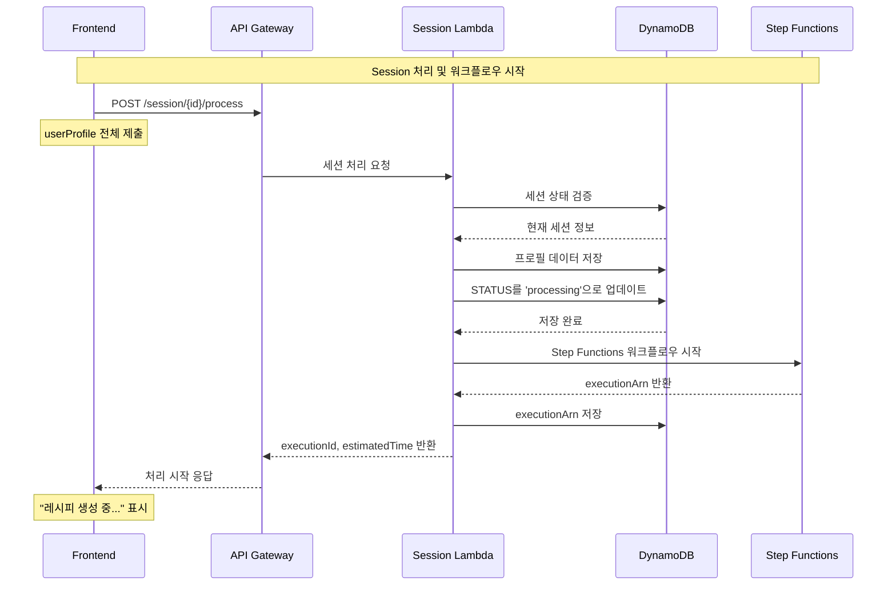

# Session Lambda 기능 명세서

## 개요
사용자 프로필 수집 완료 후 Step Functions 워크플로우를 시작하는 Session 처리 Lambda 함수
**API Gateway → Session Lambda → DynamoDB → Step Functions** 플로우 구현

## 전체 시퀀스 플로우



## 핵심 기능

### 1. 세션 상태 관리
- **세션 검증**: 유효한 세션 ID인지 확인
- **상태 업데이트**: `collected` → `processing` 상태 변경
- **프로필 저장**: 수집된 사용자 프로필 DynamoDB 저장

### 2. Step Functions 워크플로우 시작
- **워크플로우 실행**: `ai-chef-workflow-dev` 시작
- **실행 추적**: executionArn을 세션에 저장
- **예상 시간 계산**: 타겟별 예상 처리 시간 반환

### 3. 에러 처리 및 검증
- **프로필 유효성 검사**: 필수 필드 및 타겟별 검증
- **중복 처리 방지**: 이미 처리 중인 세션 체크
- **실패 시 롤백**: 에러 발생 시 세션 상태 복구

## API 엔드포인트 정의

### POST /session/{id}/process

#### 요청 형식
```json
{
  "userProfile": {
    "target": "keto",
    "step": 101,
    "responses": {
      "1": "diabetes",
      "2": "nuts",
      "3": "beginner",
      "100": 30000,
      "101": 2
    },
    "metadata": {
      "startedAt": "2025-09-05T16:00:00Z",
      "completedAt": "2025-09-05T16:05:00Z",
      "userAgent": "Mozilla/5.0..."
    }
  }
}
```

#### 응답 형식 (성공)
```json
{
  "success": true,
  "executionId": "arn:aws:states:us-east-1:491085385364:execution:ai-chef-workflow-dev:execution-1757060699",
  "estimatedTime": 30,
  "status": "processing",
  "message": "레시피 생성이 시작되었습니다."
}
```

#### 응답 형식 (에러)
```json
{
  "success": false,
  "error": "INVALID_PROFILE",
  "message": "필수 프로필 정보가 누락되었습니다.",
  "details": {
    "missingFields": ["target", "responses.100"]
  }
}
```

## Lambda 함수 구현 (Python)

### 메인 핸들러
```python
import json
import boto3
from datetime import datetime, timedelta
import logging
from typing import Dict, Any, Optional

logger = logging.getLogger()
logger.setLevel(logging.INFO)

# AWS 클라이언트 초기화
dynamodb = boto3.resource('dynamodb', region_name='us-east-1')
stepfunctions = boto3.client('stepfunctions', region_name='us-east-1')

# DynamoDB 테이블
sessions_table = dynamodb.Table('ai-chef-sessions-dev')

def lambda_handler(event: Dict[str, Any], context) -> Dict[str, Any]:
    """Session 처리 Lambda 핸들러"""
    try:
        # API Gateway 이벤트 파싱
        session_id = event['pathParameters']['id']
        body = json.loads(event['body'])
        user_profile = body.get('userProfile')
        
        logger.info(f"Processing session: {session_id}")
        
        # 1. 세션 상태 검증
        session = validate_session(session_id)
        if not session:
            return create_error_response(404, "SESSION_NOT_FOUND", "세션을 찾을 수 없습니다.")
        
        # 2. 프로필 유효성 검사
        validation_result = validate_user_profile(user_profile)
        if not validation_result['valid']:
            return create_error_response(400, "INVALID_PROFILE", 
                                       validation_result['message'], 
                                       validation_result.get('details'))
        
        # 3. 중복 처리 체크
        if session.get('status') == 'processing':
            return create_error_response(409, "ALREADY_PROCESSING", 
                                       "이미 처리 중인 세션입니다.")
        
        # 4. 프로필 데이터 저장 및 상태 업데이트
        update_session_with_profile(session_id, user_profile)
        
        # 5. Step Functions 워크플로우 시작
        execution_arn = start_workflow(session_id, user_profile)
        
        # 6. 실행 정보 저장
        save_execution_info(session_id, execution_arn)
        
        # 7. 예상 시간 계산
        estimated_time = calculate_estimated_time(user_profile.get('target'))
        
        return create_success_response(execution_arn, estimated_time)
        
    except Exception as e:
        logger.error(f"Session processing error: {str(e)}")
        return create_error_response(500, "INTERNAL_ERROR", 
                                   "서버 내부 오류가 발생했습니다.")

def validate_session(session_id: str) -> Optional[Dict[str, Any]]:
    """세션 유효성 검사"""
    try:
        response = sessions_table.get_item(Key={'sessionId': session_id})
        return response.get('Item')
    except Exception as e:
        logger.error(f"Session validation error: {e}")
        return None

def validate_user_profile(user_profile: Dict[str, Any]) -> Dict[str, Any]:
    """사용자 프로필 유효성 검사"""
    if not user_profile:
        return {
            'valid': False,
            'message': '사용자 프로필이 필요합니다.',
            'details': {'missingFields': ['userProfile']}
        }
    
    # 필수 필드 검사
    required_fields = ['target', 'step', 'responses']
    missing_fields = []
    
    for field in required_fields:
        if field not in user_profile:
            missing_fields.append(field)
    
    # 타겟별 필수 응답 검사
    target = user_profile.get('target')
    responses = user_profile.get('responses', {})
    
    # 공통 필수 응답 (예산, 인분)
    if '100' not in responses:  # 예산
        missing_fields.append('responses.100')
    if '101' not in responses:  # 인분
        missing_fields.append('responses.101')
    
    # 타겟별 필수 응답 검사
    target_required = get_target_required_responses(target)
    for req_step in target_required:
        if str(req_step) not in responses:
            missing_fields.append(f'responses.{req_step}')
    
    if missing_fields:
        return {
            'valid': False,
            'message': '필수 프로필 정보가 누락되었습니다.',
            'details': {'missingFields': missing_fields}
        }
    
    return {'valid': True}

def get_target_required_responses(target: str) -> list:
    """타겟별 필수 응답 단계"""
    target_requirements = {
        'keto': [1, 2, 3],  # 건강상태, 알레르기, 요리실력
        'baby_food': [1, 2, 4],  # 월령, 알레르기, 현재음식
        'diabetes': [1, 2, 5],  # 당뇨유형, 혈당수치, 복용약물
        'diet': [1, 2, 3],  # 목표체중, 알레르기, 요리실력
        'fridge': [6, 7]  # 보유재료, 추가구매가능재료
    }
    return target_requirements.get(target, [1, 2, 3])

def update_session_with_profile(session_id: str, user_profile: Dict[str, Any]):
    """세션에 프로필 저장 및 상태 업데이트"""
    try:
        sessions_table.update_item(
            Key={'sessionId': session_id},
            UpdateExpression="""
                SET #status = :status, 
                    #profile = :profile, 
                    #updatedAt = :updatedAt,
                    #phase = :phase,
                    #progress = :progress
            """,
            ExpressionAttributeNames={
                '#status': 'status',
                '#profile': 'profile',
                '#updatedAt': 'updatedAt',
                '#phase': 'phase',
                '#progress': 'progress'
            },
            ExpressionAttributeValues={
                ':status': 'processing',
                ':profile': user_profile,
                ':updatedAt': datetime.now().isoformat(),
                ':phase': 'workflow_starting',
                ':progress': 5
            }
        )
    except Exception as e:
        logger.error(f"Failed to update session: {e}")
        raise

def start_workflow(session_id: str, user_profile: Dict[str, Any]) -> str:
    """Step Functions 워크플로우 시작"""
    try:
        # 워크플로우 입력 데이터 구성
        workflow_input = {
            'sessionId': session_id,
            'profile': transform_profile_for_workflow(user_profile)
        }
        
        # Step Functions 실행
        response = stepfunctions.start_execution(
            stateMachineArn='arn:aws:states:us-east-1:491085385364:stateMachine:ai-chef-workflow-dev',
            name=f'execution-{int(datetime.now().timestamp())}',
            input=json.dumps(workflow_input)
        )
        
        return response['executionArn']
        
    except Exception as e:
        logger.error(f"Failed to start workflow: {e}")
        raise

def transform_profile_for_workflow(user_profile: Dict[str, Any]) -> Dict[str, Any]:
    """사용자 프로필을 워크플로우 형식으로 변환"""
    responses = user_profile.get('responses', {})
    target = user_profile.get('target')
    
    # 기본 프로필 구조
    workflow_profile = {
        'target': target,
        'budget': int(responses.get('100', 20000)),
        'servings': int(responses.get('101', 2))
    }
    
    # 타겟별 프로필 변환
    if target == 'keto':
        workflow_profile.update({
            'healthConditions': [responses.get('1', '')],
            'allergies': [responses.get('2', '')] if responses.get('2') else [],
            'cookingLevel': responses.get('3', 'beginner')
        })
    elif target == 'baby_food':
        workflow_profile.update({
            'babyAge': int(responses.get('1', 6)),
            'allergies': [responses.get('2', '')] if responses.get('2') else [],
            'currentFoods': responses.get('4', '').split(',') if responses.get('4') else []
        })
    elif target == 'diabetes':
        workflow_profile.update({
            'diabetesType': responses.get('1', 'type2'),
            'bloodSugar': responses.get('2', 'normal'),
            'medications': responses.get('5', '').split(',') if responses.get('5') else []
        })
    elif target == 'fridge':
        workflow_profile.update({
            'availableIngredients': responses.get('6', '').split(',') if responses.get('6') else [],
            'additionalBudget': int(responses.get('7', 10000))
        })
    
    return workflow_profile

def save_execution_info(session_id: str, execution_arn: str):
    """실행 정보 저장"""
    try:
        sessions_table.update_item(
            Key={'sessionId': session_id},
            UpdateExpression="SET executionArn = :arn, startedAt = :startedAt",
            ExpressionAttributeValues={
                ':arn': execution_arn,
                ':startedAt': datetime.now().isoformat()
            }
        )
    except Exception as e:
        logger.error(f"Failed to save execution info: {e}")
        raise

def calculate_estimated_time(target: str) -> int:
    """타겟별 예상 처리 시간 계산 (초)"""
    target_times = {
        'keto': 25,
        'baby_food': 30,
        'diabetes': 35,
        'diet': 20,
        'fridge': 40
    }
    return target_times.get(target, 30)

def create_success_response(execution_arn: str, estimated_time: int) -> Dict[str, Any]:
    """성공 응답 생성"""
    return {
        'statusCode': 200,
        'headers': {
            'Content-Type': 'application/json',
            'Access-Control-Allow-Origin': '*'
        },
        'body': json.dumps({
            'success': True,
            'executionId': execution_arn,
            'estimatedTime': estimated_time,
            'status': 'processing',
            'message': '레시피 생성이 시작되었습니다.'
        })
    }

def create_error_response(status_code: int, error_code: str, message: str, details: Dict = None) -> Dict[str, Any]:
    """에러 응답 생성"""
    error_body = {
        'success': False,
        'error': error_code,
        'message': message
    }
    
    if details:
        error_body['details'] = details
    
    return {
        'statusCode': status_code,
        'headers': {
            'Content-Type': 'application/json',
            'Access-Control-Allow-Origin': '*'
        },
        'body': json.dumps(error_body)
    }
```

## DynamoDB 테이블 구조

### Sessions Table
```json
{
  "sessionId": "sess_abc123",
  "status": "processing",
  "phase": "workflow_starting",
  "progress": 5,
  "profile": {
    "target": "keto",
    "step": 101,
    "responses": {
      "1": "diabetes",
      "2": "nuts",
      "3": "beginner",
      "100": 30000,
      "101": 2
    }
  },
  "executionArn": "arn:aws:states:us-east-1:491085385364:execution:ai-chef-workflow-dev:execution-1757060699",
  "createdAt": "2025-09-05T16:00:00Z",
  "updatedAt": "2025-09-05T16:05:30Z",
  "startedAt": "2025-09-05T16:05:30Z",
  "ttl": 1735689600
}
```

## API Gateway 설정

### CloudFormation 템플릿
```yaml
# API Gateway
ApiGateway:
  Type: AWS::ApiGateway::RestApi
  Properties:
    Name: !Sub 'ai-chef-api-${Environment}'
    Description: 'AI Chef Session Processing API'

# Session Resource
SessionResource:
  Type: AWS::ApiGateway::Resource
  Properties:
    RestApiId: !Ref ApiGateway
    ParentId: !GetAtt ApiGateway.RootResourceId
    PathPart: 'session'

# Session ID Resource
SessionIdResource:
  Type: AWS::ApiGateway::Resource
  Properties:
    RestApiId: !Ref ApiGateway
    ParentId: !Ref SessionResource
    PathPart: '{id}'

# Process Resource
ProcessResource:
  Type: AWS::ApiGateway::Resource
  Properties:
    RestApiId: !Ref ApiGateway
    ParentId: !Ref SessionIdResource
    PathPart: 'process'

# POST Method
ProcessMethod:
  Type: AWS::ApiGateway::Method
  Properties:
    RestApiId: !Ref ApiGateway
    ResourceId: !Ref ProcessResource
    HttpMethod: POST
    AuthorizationType: NONE
    Integration:
      Type: AWS_PROXY
      IntegrationHttpMethod: POST
      Uri: !Sub 'arn:aws:apigateway:${AWS::Region}:lambda:path/2015-03-31/functions/${SessionLambda.Arn}/invocations'
```

## 에러 처리

### 에러 코드 정의
```python
ERROR_CODES = {
    'SESSION_NOT_FOUND': {
        'status': 404,
        'message': '세션을 찾을 수 없습니다.'
    },
    'INVALID_PROFILE': {
        'status': 400,
        'message': '프로필 정보가 유효하지 않습니다.'
    },
    'ALREADY_PROCESSING': {
        'status': 409,
        'message': '이미 처리 중인 세션입니다.'
    },
    'WORKFLOW_START_FAILED': {
        'status': 500,
        'message': '워크플로우 시작에 실패했습니다.'
    },
    'INTERNAL_ERROR': {
        'status': 500,
        'message': '서버 내부 오류가 발생했습니다.'
    }
}
```

### 재시도 로직
```python
def start_workflow_with_retry(session_id: str, user_profile: Dict[str, Any], max_retries: int = 3) -> str:
    """재시도 로직이 포함된 워크플로우 시작"""
    for attempt in range(max_retries):
        try:
            return start_workflow(session_id, user_profile)
        except Exception as e:
            if attempt == max_retries - 1:
                raise e
            logger.warning(f"Workflow start attempt {attempt + 1} failed: {e}")
            time.sleep(2 ** attempt)  # 지수 백오프
```

## 배포 설정

### Lambda 함수 설정
- **Runtime**: Python 3.11
- **Memory**: 256MB
- **Timeout**: 30초
- **Environment Variables**: 
  - `SESSIONS_TABLE_NAME`: ai-chef-sessions-dev
  - `STEP_FUNCTIONS_ARN`: arn:aws:states:us-east-1:491085385364:stateMachine:ai-chef-workflow-dev

### IAM 권한
```json
{
  "Version": "2012-10-17",
  "Statement": [
    {
      "Effect": "Allow",
      "Action": [
        "dynamodb:GetItem",
        "dynamodb:PutItem",
        "dynamodb:UpdateItem"
      ],
      "Resource": "arn:aws:dynamodb:us-east-1:*:table/ai-chef-sessions-dev"
    },
    {
      "Effect": "Allow",
      "Action": [
        "states:StartExecution"
      ],
      "Resource": "arn:aws:states:us-east-1:*:stateMachine:ai-chef-workflow-dev"
    }
  ]
}
```

### 테스트 실행
```bash
# API Gateway 테스트
curl -X POST https://api-id.execute-api.us-east-1.amazonaws.com/dev/session/sess_abc123/process \
  -H "Content-Type: application/json" \
  -d '{
    "userProfile": {
      "target": "keto",
      "step": 101,
      "responses": {
        "1": "diabetes",
        "2": "",
        "3": "beginner",
        "100": 30000,
        "101": 2
      }
    }
  }'
```

---
**작성일**: 2025-09-05  
**작성자**: Team21 AWS Hackathon  
**최종 업데이트**: Session Lambda 명세서 작성 완료
