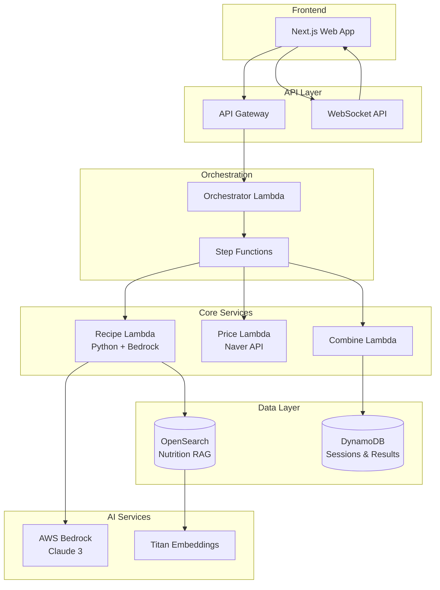

# 서버리스 통합 구현 가이드

## 개요
AI Chef 서버리스 아키텍처의 전체 구현 가이드 - Python Lambda, CloudFormation, Step Functions, Bedrock 연동을 포함한 완전한 구현 방법

## 🏗️ 아키텍처 개요



## 📋 구현 단계별 가이드

### Phase 1: 인프라 구축
1. **CloudFormation 템플릿 준비**
2. **S3 배포 버킷 생성**
3. **기본 리소스 배포**

### Phase 2: Lambda 함수 구현
1. **Recipe Lambda (Python)**
2. **Price Lambda**
3. **Combine Lambda**
4. **Orchestrator Lambda**

### Phase 3: Step Functions 워크플로우
1. **워크플로우 정의**
2. **병렬 처리 구성**
3. **에러 핸들링**

### Phase 4: 통합 테스트 및 배포
1. **단위 테스트**
2. **통합 테스트**
3. **프로덕션 배포**

## 🚀 빠른 시작 가이드

### 1. 사전 준비
```bash
# 필수 도구 설치 확인
aws --version
python3 --version
jq --version

# 프로젝트 클론 및 이동
git clone <repository-url>
cd team21-aws-hackathon/backend/infrastructure
```

### 2. 환경 설정
```bash
# 환경 설정 스크립트 실행
./scripts/setup-env.sh dev us-east-1 default

# 네이버 API 키 설정 (실제 값으로 교체)
vim .env.dev
```

### 3. 배포 실행
```bash
# 권한 부여
chmod +x deploy.sh cleanup.sh build-lambdas.sh

# 개발 환경 배포
./deploy.sh dev us-east-1 default
```

### 4. 배포 확인
```bash
# 스택 상태 확인
aws cloudformation describe-stacks \
  --stack-name ai-chef-dev \
  --region us-east-1

# API 엔드포인트 테스트
curl -X GET https://your-api-endpoint/health
```

## 📁 프로젝트 구조

### 백엔드 디렉토리 구조
```
backend/
├── lambda/                     # Lambda 함수들
│   ├── recipe/                # Recipe Lambda (Python)
│   │   ├── lambda_function.py # 메인 핸들러
│   │   ├── requirements.txt   # Python 의존성
│   │   ├── utils/            # 유틸리티 모듈
│   │   ├── prompts/          # 프롬프트 템플릿
│   │   └── models/           # 데이터 모델
│   ├── price/                # Price Lambda
│   ├── combine/              # Combine Lambda
│   └── orchestrator/         # Orchestrator Lambda
├── infrastructure/           # 인프라 코드
│   ├── main-template.yaml    # 메인 CloudFormation
│   ├── nested-templates/     # 중첩 템플릿들
│   ├── parameters/           # 환경별 파라미터
│   ├── deploy.sh            # 배포 스크립트
│   ├── cleanup.sh           # 정리 스크립트
│   └── scripts/             # 유틸리티 스크립트
└── shared/                  # 공통 모듈
    ├── utils/               # 공통 유틸리티
    └── constants/           # 상수 정의
```

## 🔧 상세 구현 가이드

### Recipe Lambda 구현

#### 1. 메인 핸들러 구현
```python
# lambda_function.py
import json
import logging
from utils.bedrock_client import BedrockClient
from utils.nutrition_rag import NutritionRAG
from prompts import get_prompt_by_target

def lambda_handler(event, context):
    try:
        # 입력 검증
        session_id = event['sessionId']
        profile = event['profile']
        target = profile['target']
        
        # Bedrock 클라이언트 초기화
        bedrock_client = BedrockClient()
        
        # 프롬프트 생성 및 레시피 생성
        prompt = get_prompt_by_target(target, profile)
        recipe_response = bedrock_client.generate_recipe(prompt)
        
        # 영양소 정보 조회
        nutrition_rag = NutritionRAG()
        nutrition_info = nutrition_rag.get_nutrition_info(
            recipe_response['ingredients']
        )
        
        # 결과 반환
        return {
            'statusCode': 200,
            'body': {
                'recipe': recipe_response,
                'nutrition': nutrition_info,
                'target_compliance': calculate_compliance(
                    recipe_response, nutrition_info, target
                )
            }
        }
        
    except Exception as e:
        logging.error(f"Recipe generation failed: {str(e)}")
        return {
            'statusCode': 500,
            'body': {'error': str(e)}
        }
```

#### 2. Bedrock 클라이언트 구현
```python
# utils/bedrock_client.py
import boto3
import json
from botocore.exceptions import ClientError

class BedrockClient:
    def __init__(self):
        self.client = boto3.client('bedrock-runtime')
        self.model_id = 'anthropic.claude-3-sonnet-20240229-v1:0'
    
    def generate_recipe(self, prompt):
        body = {
            "anthropic_version": "bedrock-2023-05-31",
            "max_tokens": 4000,
            "temperature": 0.7,
            "messages": [{"role": "user", "content": prompt}]
        }
        
        response = self.client.invoke_model(
            modelId=self.model_id,
            body=json.dumps(body)
        )
        
        response_body = json.loads(response['body'].read())
        content = response_body['content'][0]['text']
        
        return json.loads(content)
```

### CloudFormation 배포

#### 1. 메인 템플릿 구조
```yaml
# main-template.yaml
AWSTemplateFormatVersion: '2010-09-09'
Description: 'AI Chef Serverless Architecture'

Parameters:
  Environment:
    Type: String
    Default: dev
  ProjectName:
    Type: String
    Default: ai-chef

Resources:
  # S3 배포 버킷
  DeploymentBucket:
    Type: AWS::S3::Bucket
    Properties:
      BucketName: !Sub '${ProjectName}-deployment-${Environment}-${AWS::AccountId}'
  
  # DynamoDB 스택
  DynamoDBStack:
    Type: AWS::CloudFormation::Stack
    Properties:
      TemplateURL: !Sub 'https://${DeploymentBucket}.s3.amazonaws.com/nested-templates/dynamodb.yaml'
  
  # Lambda 스택
  LambdaStack:
    Type: AWS::CloudFormation::Stack
    Properties:
      TemplateURL: !Sub 'https://${DeploymentBucket}.s3.amazonaws.com/nested-templates/lambda-functions.yaml'
  
  # Step Functions 스택
  StepFunctionsStack:
    Type: AWS::CloudFormation::Stack
    Properties:
      TemplateURL: !Sub 'https://${DeploymentBucket}.s3.amazonaws.com/nested-templates/step-functions.yaml'
```

#### 2. Lambda 함수 템플릿
```yaml
# nested-templates/lambda-functions.yaml
Resources:
  RecipeLambda:
    Type: AWS::Lambda::Function
    Properties:
      FunctionName: !Sub '${ProjectName}-recipe-${Environment}'
      Runtime: python3.11
      Handler: lambda_function.lambda_handler
      Code:
        S3Bucket: !Ref DeploymentBucket
        S3Key: lambda/recipe.zip
      Environment:
        Variables:
          BEDROCK_REGION: !Ref AWS::Region
          OPENSEARCH_ENDPOINT: !Ref OpenSearchEndpoint
```

### Step Functions 워크플로우

#### 1. 워크플로우 정의
```json
{
  "Comment": "AI Chef Recipe Generation Workflow",
  "StartAt": "ParallelProcessing",
  "States": {
    "ParallelProcessing": {
      "Type": "Parallel",
      "Branches": [
        {
          "StartAt": "GenerateRecipe",
          "States": {
            "GenerateRecipe": {
              "Type": "Task",
              "Resource": "arn:aws:states:::lambda:invoke",
              "Parameters": {
                "FunctionName": "${RecipeLambdaArn}",
                "Payload.$": "$"
              },
              "End": true
            }
          }
        },
        {
          "StartAt": "FetchPrices",
          "States": {
            "FetchPrices": {
              "Type": "Task",
              "Resource": "arn:aws:states:::lambda:invoke",
              "Parameters": {
                "FunctionName": "${PriceLambdaArn}",
                "Payload.$": "$"
              },
              "End": true
            }
          }
        }
      ],
      "Next": "CombineResults"
    },
    "CombineResults": {
      "Type": "Task",
      "Resource": "arn:aws:states:::lambda:invoke",
      "Parameters": {
        "FunctionName": "${CombineLambdaArn}",
        "Payload": {
          "sessionId.$": "$.sessionId",
          "recipeResult.$": "$.parallelResults[0].recipe",
          "pricingResult.$": "$.parallelResults[1].pricing"
        }
      },
      "End": true
    }
  }
}
```

## 🧪 테스트 가이드

### 1. 단위 테스트
```python
# tests/test_recipe_lambda.py
import unittest
from unittest.mock import patch, MagicMock
from lambda_function import lambda_handler

class TestRecipeLambda(unittest.TestCase):
    @patch('utils.bedrock_client.BedrockClient')
    def test_recipe_generation(self, mock_bedrock):
        # Mock 설정
        mock_bedrock.return_value.generate_recipe.return_value = {
            'recipeName': 'Test Recipe',
            'ingredients': [{'name': 'test', 'amount': '1', 'unit': 'cup'}]
        }
        
        # 테스트 이벤트
        event = {
            'sessionId': 'test-session',
            'profile': {'target': 'keto'}
        }
        
        # 함수 실행
        result = lambda_handler(event, None)
        
        # 검증
        self.assertEqual(result['statusCode'], 200)
        self.assertIn('recipe', result['body'])
```

### 2. 통합 테스트
```bash
# 통합 테스트 스크립트
#!/bin/bash

# Step Functions 실행 테스트
aws stepfunctions start-execution \
  --state-machine-arn arn:aws:states:us-east-1:123456789012:stateMachine:ai-chef-workflow-dev \
  --input '{
    "sessionId": "test-session-123",
    "profile": {
      "target": "keto",
      "healthConditions": [],
      "allergies": [],
      "cookingLevel": "beginner",
      "budget": 30000
    }
  }' \
  --name test-execution-$(date +%s)
```

## 📊 모니터링 및 로깅

### 1. CloudWatch 대시보드
```yaml
# CloudWatch 대시보드 설정
MonitoringDashboard:
  Type: AWS::CloudWatch::Dashboard
  Properties:
    DashboardName: !Sub '${ProjectName}-${Environment}-dashboard'
    DashboardBody: !Sub |
      {
        "widgets": [
          {
            "type": "metric",
            "properties": {
              "metrics": [
                ["AWS/Lambda", "Duration", "FunctionName", "${ProjectName}-recipe-${Environment}"],
                ["AWS/Lambda", "Errors", "FunctionName", "${ProjectName}-recipe-${Environment}"]
              ],
              "period": 300,
              "stat": "Average",
              "region": "${AWS::Region}",
              "title": "Recipe Lambda Metrics"
            }
          }
        ]
      }
```

### 2. 알람 설정
```yaml
# Lambda 에러 알람
LambdaErrorAlarm:
  Type: AWS::CloudWatch::Alarm
  Properties:
    AlarmName: !Sub '${ProjectName}-recipe-errors-${Environment}'
    MetricName: Errors
    Namespace: AWS/Lambda
    Statistic: Sum
    Period: 300
    EvaluationPeriods: 2
    Threshold: 1
    ComparisonOperator: GreaterThanOrEqualToThreshold
    Dimensions:
      - Name: FunctionName
        Value: !Ref RecipeLambda
```

## 🔒 보안 고려사항

### 1. IAM 최소 권한 원칙
```json
{
  "Version": "2012-10-17",
  "Statement": [
    {
      "Effect": "Allow",
      "Action": [
        "bedrock:InvokeModel"
      ],
      "Resource": [
        "arn:aws:bedrock:*:*:foundation-model/anthropic.claude-3-sonnet-20240229-v1:0"
      ]
    }
  ]
}
```

### 2. 환경변수 암호화
```yaml
Environment:
  Variables:
    NAVER_CLIENT_ID: !Ref NaverClientId
    NAVER_CLIENT_SECRET: !Ref NaverClientSecret
    # KMS 키로 암호화
  KmsKeyArn: !GetAtt LambdaKMSKey.Arn
```

## 🚨 트러블슈팅

### 1. 일반적인 문제들

#### Bedrock 권한 에러
```bash
# 에러: AccessDeniedException
# 해결: IAM 역할에 Bedrock 권한 추가
aws iam attach-role-policy \
  --role-name ai-chef-lambda-execution-role-dev \
  --policy-arn arn:aws:iam::aws:policy/AmazonBedrockFullAccess
```

#### Lambda 타임아웃
```yaml
# CloudFormation에서 타임아웃 증가
Timeout: 120  # 기본 3초에서 120초로 증가
MemorySize: 512  # 메모리도 함께 증가
```

#### DynamoDB 권한 에러
```json
{
  "Effect": "Allow",
  "Action": [
    "dynamodb:GetItem",
    "dynamodb:PutItem",
    "dynamodb:UpdateItem"
  ],
  "Resource": "arn:aws:dynamodb:*:*:table/ai-chef-*"
}
```

### 2. 디버깅 도구

#### CloudWatch Logs 확인
```bash
# 최근 로그 확인
aws logs tail /aws/lambda/ai-chef-recipe-dev --follow
```

#### X-Ray 트레이싱
```python
# Lambda 함수에 X-Ray 추가
from aws_xray_sdk.core import xray_recorder

@xray_recorder.capture('recipe_generation')
def lambda_handler(event, context):
    # 함수 로직
    pass
```

## 📈 성능 최적화

### 1. Lambda 최적화
- **메모리 크기**: 512MB-1024MB (Bedrock 호출용)
- **타임아웃**: 120초 (AI 응답 대기)
- **동시 실행**: 100개 (기본값)

### 2. 캐싱 전략
```python
# Lambda 메모리 캐싱
import functools

@functools.lru_cache(maxsize=100)
def get_nutrition_data(ingredient_name):
    # 영양소 데이터 조회
    pass
```

### 3. 비용 최적화
- **DynamoDB**: On-Demand 모드 (개발), Provisioned 모드 (프로덕션)
- **Lambda**: ARM64 아키텍처 사용 (20% 비용 절감)
- **S3**: Intelligent Tiering 활성화

## 🎯 다음 단계

### 1. 고급 기능 추가
- [ ] 실시간 알림 (WebSocket)
- [ ] 사용자 피드백 시스템
- [ ] A/B 테스트 프레임워크

### 2. 확장성 개선
- [ ] Multi-region 배포
- [ ] CDN 연동 (CloudFront)
- [ ] 캐싱 레이어 추가 (ElastiCache)

### 3. 운영 개선
- [ ] CI/CD 파이프라인 구축
- [ ] 자동화된 테스트 스위트
- [ ] 성능 모니터링 강화

---

**작성일**: 2024-09-05  
**작성자**: Team21 AWS Hackathon  
**버전**: 1.0
