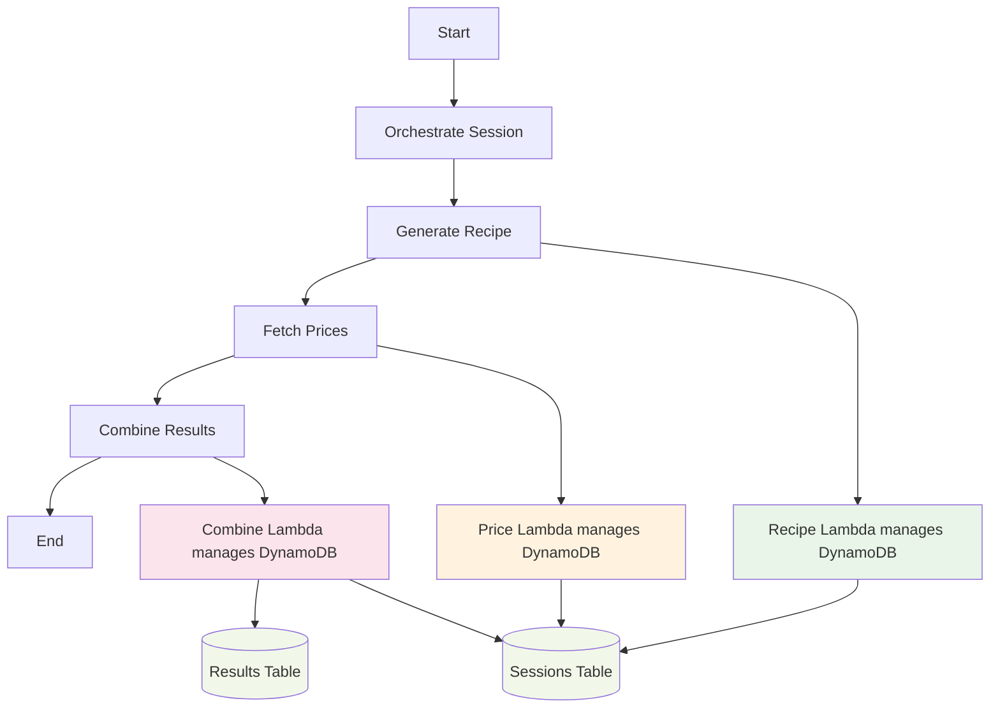

# Step Functions 워크플로우 정의 (업데이트됨)

## 개요
AI Chef 레시피 생성을 위한 AWS Step Functions 워크플로우 정의
**Lambda가 DynamoDB 상태 관리를 담당하는 Best Practice 적용**

## 워크플로우 아키텍처 (최종 수정됨)



## 핵심 변경사항 (Best Practice 적용)

### 1. Lambda가 DynamoDB 직접 관리
- **기존**: Step Functions에서 DynamoDB 직접 호출
- **개선**: 각 Lambda가 자신의 상태를 DynamoDB에 직접 업데이트
- **장점**: 관심사 분리, 에러 처리 개선, 유지보수성 향상

### 2. 순차 처리 워크플로우
- **기존**: Recipe와 Price 병렬 처리
- **개선**: Recipe → Price → Combine 순차 처리
- **이유**: Price Lambda가 Recipe의 재료 목록 필요

### 3. 단순화된 Step Functions
- **기존**: 복잡한 DynamoDB 상태 관리
- **개선**: Lambda 간 오케스트레이션만 담당
- **결과**: 워크플로우 가독성 및 유지보수성 향상

## Step Functions 정의 파일 (최종 버전)

### 단순화된 워크플로우 (simplified-workflow.json)
```json
{
  "Comment": "AI Chef Simplified Workflow - Lambda manages DynamoDB",
  "StartAt": "OrchestrateSession",
  "States": {
    "OrchestrateSession": {
      "Type": "Task",
      "Resource": "arn:aws:states:::lambda:invoke",
      "Parameters": {
        "FunctionName": "ai-chef-orchestrator-dev",
        "Payload.$": "$"
      },
      "ResultPath": "$.sessionResult",
      "Next": "GenerateRecipe"
    },
    "GenerateRecipe": {
      "Type": "Task",
      "Resource": "arn:aws:states:::lambda:invoke",
      "Parameters": {
        "FunctionName": "ai-chef-recipe-dev",
        "Payload.$": "$"
      },
      "ResultSelector": {
        "recipe.$": "$.Payload.body"
      },
      "ResultPath": "$.recipeResult",
      "Retry": [
        {
          "ErrorEquals": ["Lambda.ServiceException", "Lambda.AWSLambdaException"],
          "IntervalSeconds": 2,
          "MaxAttempts": 3,
          "BackoffRate": 2.0
        }
      ],
      "Next": "FetchPrices"
    },
    "FetchPrices": {
      "Type": "Task",
      "Resource": "arn:aws:states:::lambda:invoke",
      "Parameters": {
        "FunctionName": "ai-chef-price-dev",
        "Payload": {
          "sessionId.$": "$.sessionId",
          "profile.$": "$.profile",
          "ingredients.$": "$.recipeResult.recipe.ingredients"
        }
      },
      "ResultSelector": {
        "pricing.$": "$.Payload.body"
      },
      "ResultPath": "$.pricingResult",
      "Retry": [
        {
          "ErrorEquals": ["Lambda.ServiceException", "Lambda.AWSLambdaException"],
          "IntervalSeconds": 2,
          "MaxAttempts": 3,
          "BackoffRate": 2.0
        }
      ],
      "Next": "CombineResults"
    },
    "CombineResults": {
      "Type": "Task",
      "Resource": "arn:aws:states:::lambda:invoke",
      "Parameters": {
        "FunctionName": "ai-chef-combine-dev",
        "Payload": {
          "sessionId.$": "$.sessionId",
          "profile.$": "$.profile",
          "recipeResult.$": "$.recipeResult.recipe",
          "pricingResult.$": "$.pricingResult.pricing"
        }
      },
      "End": true
    }
  }
}
```

## Lambda별 DynamoDB 상태 관리

### 1. Recipe Lambda 상태 관리
```python
def update_session_status(session_id: str, status: str, phase: str, progress: int, error: str = None):
    """Update session status in DynamoDB"""
    try:
        sessions_table.update_item(
            Key={'sessionId': session_id},
            UpdateExpression="SET #status = :status, #phase = :phase, #progress = :progress, #updatedAt = :updatedAt",
            ExpressionAttributeNames={
                '#status': 'status',
                '#phase': 'phase',
                '#progress': 'progress',
                '#updatedAt': 'updatedAt'
            },
            ExpressionAttributeValues={
                ':status': status,
                ':phase': phase,
                ':progress': progress,
                ':updatedAt': datetime.now().isoformat()
            }
        )
    except Exception as e:
        logger.error(f"Failed to update session status: {e}")

# Recipe Lambda 실행 시
update_session_status(session_id, 'processing', 'recipe_generation', 10)
# ... 레시피 생성 로직 ...
update_session_status(session_id, 'processing', 'recipe_completed', 50)
```

### 2. Price Lambda 상태 관리
```python
# Price Lambda 실행 시
update_session_status(session_id, 'processing', 'price_lookup', 60)
# ... 가격 조회 로직 ...
update_session_status(session_id, 'processing', 'price_completed', 80)
```

### 3. Combine Lambda 상태 관리
```python
# Combine Lambda 실행 시
update_session_status(session_id, 'processing', 'combining_results', 90)
# ... 결과 결합 로직 ...

# 최종 결과 저장
save_final_results(session_id, combined_result)
update_session_status(session_id, 'completed', 'finished', 100)
```

## 데이터 흐름

### 1. 입력 데이터
```json
{
  "sessionId": "sess_abc123",
  "profile": {
    "target": "keto",
    "healthConditions": ["diabetes"],
    "allergies": [],
    "cookingLevel": "beginner",
    "budget": 30000
  }
}
```

### 2. Recipe Lambda → Price Lambda 데이터 전달
```json
{
  "sessionId": "sess_abc123",
  "profile": {...},
  "ingredients": [
    {"name": "아보카도", "amount": "2", "unit": "개"},
    {"name": "올리브오일", "amount": "3", "unit": "큰술"}
  ]
}
```

### 3. Price Lambda → Combine Lambda 데이터 전달
```json
{
  "sessionId": "sess_abc123",
  "profile": {...},
  "recipeResult": {...},
  "pricingResult": [
    {"name": "아보카도", "price": 3500, "shop": "네이버쇼핑"},
    {"name": "올리브오일", "price": 8000, "shop": "네이버쇼핑"}
  ]
}
```

## DynamoDB 테이블 구조

### Sessions Table
```json
{
  "sessionId": "sess_abc123",
  "status": "completed",
  "phase": "finished",
  "progress": 100,
  "createdAt": "2025-09-05T16:00:00Z",
  "updatedAt": "2025-09-05T16:02:30Z",
  "ttl": 1735689600
}
```

### Results Table
```json
{
  "sessionId": "sess_abc123",
  "result": {
    "recipe": {...},
    "pricing": [...],
    "totalCost": 11500,
    "costPerServing": 5750
  },
  "createdAt": "2025-09-05T16:02:30Z",
  "ttl": 1735689600
}
```

## 배포 및 테스트

### 배포 명령어
```bash
# Step Functions 업데이트
cd backend/infrastructure/
aws stepfunctions update-state-machine \
  --state-machine-arn arn:aws:states:us-east-1:491085385364:stateMachine:ai-chef-workflow-dev \
  --definition file://simplified-workflow.json

# Lambda 함수들 배포
aws cloudformation deploy \
  --template-file recipe-lambda.yaml \
  --stack-name ai-chef-recipe-lambda-dev \
  --capabilities CAPABILITY_IAM
```

### 테스트 실행
```bash
# Step Functions 실행
aws stepfunctions start-execution \
  --state-machine-arn arn:aws:states:us-east-1:491085385364:stateMachine:ai-chef-workflow-dev \
  --input '{
    "sessionId": "sess_test_123",
    "profile": {
      "target": "keto",
      "healthConditions": ["diabetes"],
      "budget": 30000
    }
  }' \
  --name execution-$(date +%s)
```

## 모니터링 및 로깅

### CloudWatch 메트릭
- Lambda 실행 성공/실패 횟수
- 각 Lambda별 실행 시간
- DynamoDB 읽기/쓰기 용량
- Step Functions 실행 상태

### 로그 확인
```bash
# Recipe Lambda 로그
aws logs tail /aws/lambda/ai-chef-recipe-dev --follow

# Price Lambda 로그
aws logs tail /aws/lambda/ai-chef-price-dev --follow

# Combine Lambda 로그
aws logs tail /aws/lambda/ai-chef-combine-dev --follow
```

## Best Practice 적용 결과

### 장점
1. **관심사 분리**: 각 Lambda가 자신의 비즈니스 로직과 상태 관리 담당
2. **단순한 워크플로우**: Step Functions는 오케스트레이션만 담당
3. **에러 처리 개선**: Lambda 내부에서 세밀한 에러 핸들링
4. **유지보수성**: 각 Lambda가 독립적으로 개발/배포 가능
5. **확장성**: 새로운 Lambda 추가 시 워크플로우 변경 최소화

### 성능 개선
- DynamoDB 호출 최적화 (Lambda 내부에서 배치 처리)
- 에러 발생 시 즉시 상태 업데이트
- 재시도 로직 Lambda 내부로 이동

---
**작성일**: 2025-09-05  
**작성자**: Team21 AWS Hackathon  
**최종 업데이트**: Lambda 기반 DynamoDB 관리 Best Practice 적용
