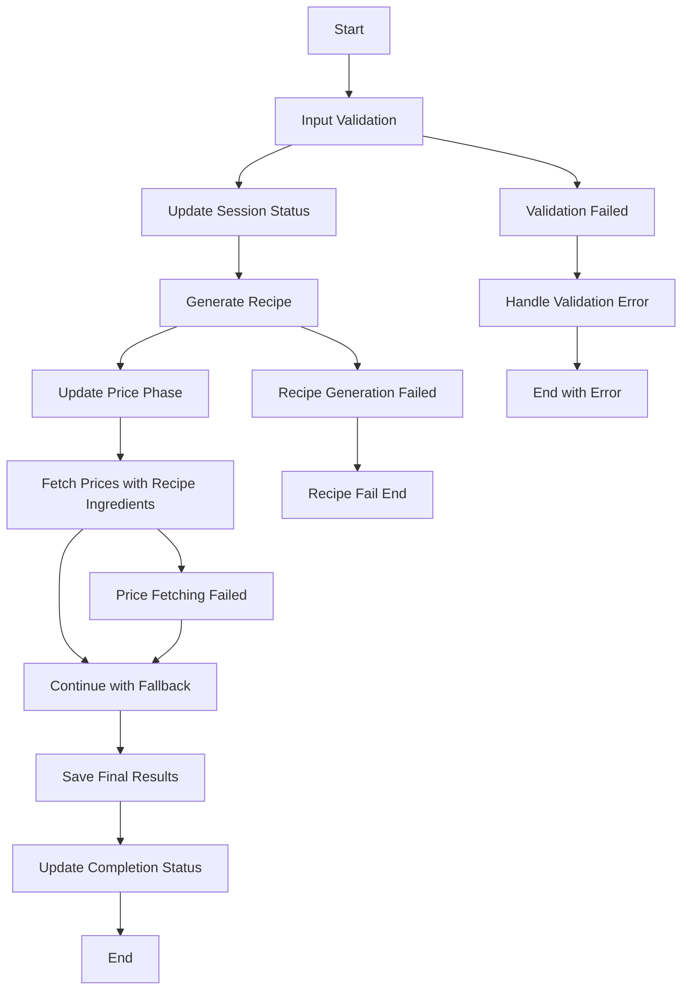

# Step Functions 워크플로우 정의

## 개요
AI Chef 레시피 생성을 위한 AWS Step Functions 워크플로우 정의

## 워크플로우 아키텍처 (수정됨)



## 핵심 변경사항

### 1. 순차 처리로 변경
- **기존**: Recipe와 Price를 병렬 처리
- **수정**: Recipe 먼저 생성 → 재료 목록 추출 → Price 조회

### 2. 진행 상태 세분화
- 10%: 레시피 생성 시작
- 50%: 가격 조회 시작  
- 80%: 결과 결합 시작
- 100%: 완료

### 3. 에러 핸들링 개선
- 가격 조회 실패 시 fallback으로 계속 진행
- 레시피 생성 실패 시 전체 워크플로우 중단

## Step Functions 정의 파일

### 메인 워크플로우 (step-functions-definition.json)
```json
{
  "Comment": "AI Chef Recipe Generation Workflow",
  "StartAt": "ValidateInput",
  "States": {
    "ValidateInput": {
      "Type": "Task",
      "Resource": "arn:aws:states:::lambda:invoke",
      "Parameters": {
        "FunctionName": "${ValidatorLambdaArn}",
        "Payload.$": "$"
      },
      "ResultPath": "$.validation",
      "Next": "UpdateSessionStatus",
      "Catch": [
        {
          "ErrorEquals": ["States.ALL"],
          "Next": "HandleValidationError",
          "ResultPath": "$.error"
        }
      ]
    },
    
    "UpdateSessionStatus": {
      "Type": "Task",
      "Resource": "arn:aws:states:::dynamodb:putItem",
      "Parameters": {
        "TableName": "${SessionsTableName}",
        "Item": {
          "sessionId": {"S.$": "$.sessionId"},
          "status": {"S": "processing"},
          "phase": {"S": "recipe_generation"},
          "progress": {"N": "10"},
          "updatedAt": {"S.$": "$$.State.EnteredTime"}
        }
      },
      "ResultPath": null,
      "Next": "ParallelProcessing"
    },
    
    "ParallelProcessing": {
      "Type": "Parallel",
      "Branches": [
        {
          "StartAt": "GenerateRecipe",
          "States": {
            "GenerateRecipe": {
              "Type": "Task",
              "Resource": "arn:aws:states:::lambda:invoke",
              "Parameters": {
                "FunctionName": "${RecipeLambdaArn}",
                "Payload.$": "$"
              },
              "ResultSelector": {
                "recipe.$": "$.Payload.body"
              },
              "Retry": [
                {
                  "ErrorEquals": ["Lambda.ServiceException", "Lambda.AWSLambdaException"],
                  "IntervalSeconds": 2,
                  "MaxAttempts": 3,
                  "BackoffRate": 2.0
                }
              ],
              "Catch": [
                {
                  "ErrorEquals": ["States.ALL"],
                  "Next": "RecipeGenerationFailed",
                  "ResultPath": "$.error"
                }
              ],
              "End": true
            },
            
            "RecipeGenerationFailed": {
              "Type": "Pass",
              "Result": {
                "recipe": {
                  "error": "Recipe generation failed",
                  "fallback": true
                }
              },
              "End": true
            }
          }
        },
        {
          "StartAt": "FetchPrices",
          "States": {
            "FetchPrices": {
              "Type": "Task",
              "Resource": "arn:aws:states:::lambda:invoke",
              "Parameters": {
                "FunctionName": "${PriceLambdaArn}",
                "Payload.$": "$"
              },
              "ResultSelector": {
                "pricing.$": "$.Payload.body"
              },
              "Retry": [
                {
                  "ErrorEquals": ["Lambda.ServiceException", "Lambda.AWSLambdaException"],
                  "IntervalSeconds": 2,
                  "MaxAttempts": 3,
                  "BackoffRate": 2.0
                }
              ],
              "Catch": [
                {
                  "ErrorEquals": ["States.ALL"],
                  "Next": "PriceFetchingFailed",
                  "ResultPath": "$.error"
                }
              ],
              "End": true
            },
            
            "PriceFetchingFailed": {
              "Type": "Pass",
              "Result": {
                "pricing": {
                  "error": "Price fetching failed",
                  "fallback": true
                }
              },
              "End": true
            }
          }
        }
      ],
      "ResultPath": "$.parallelResults",
      "Next": "UpdateProgressStatus"
    },
    
    "UpdateProgressStatus": {
      "Type": "Task",
      "Resource": "arn:aws:states:::dynamodb:updateItem",
      "Parameters": {
        "TableName": "${SessionsTableName}",
        "Key": {
          "sessionId": {"S.$": "$.sessionId"}
        },
        "UpdateExpression": "SET #status = :status, #phase = :phase, #progress = :progress, #updatedAt = :updatedAt",
        "ExpressionAttributeNames": {
          "#status": "status",
          "#phase": "phase", 
          "#progress": "progress",
          "#updatedAt": "updatedAt"
        },
        "ExpressionAttributeValues": {
          ":status": {"S": "processing"},
          ":phase": {"S": "combining_results"},
          ":progress": {"N": "80"},
          ":updatedAt": {"S.$": "$$.State.EnteredTime"}
        }
      },
      "ResultPath": null,
      "Next": "CombineResults"
    },
    
    "CombineResults": {
      "Type": "Task",
      "Resource": "arn:aws:states:::lambda:invoke",
      "Parameters": {
        "FunctionName": "${CombineLambdaArn}",
        "Payload": {
          "sessionId.$": "$.sessionId",
          "profile.$": "$.profile",
          "recipeResult.$": "$.parallelResults[0].recipe",
          "pricingResult.$": "$.parallelResults[1].pricing"
        }
      },
      "ResultSelector": {
        "combinedResult.$": "$.Payload.body"
      },
      "Retry": [
        {
          "ErrorEquals": ["Lambda.ServiceException", "Lambda.AWSLambdaException"],
          "IntervalSeconds": 1,
          "MaxAttempts": 2,
          "BackoffRate": 2.0
        }
      ],
      "Next": "SaveFinalResults"
    },
    
    "SaveFinalResults": {
      "Type": "Task",
      "Resource": "arn:aws:states:::dynamodb:putItem",
      "Parameters": {
        "TableName": "${ResultsTableName}",
        "Item": {
          "sessionId": {"S.$": "$.sessionId"},
          "createdAt": {"S.$": "$$.State.EnteredTime"},
          "result": {"S.$": "States.JsonToString($.combinedResult)"},
          "ttl": {"N.$": "States.StringToJson(States.Format('{}', States.MathAdd(States.StringToJson($$.State.EnteredTime), 604800)))"}
        }
      },
      "ResultPath": null,
      "Next": "UpdateCompletionStatus"
    },
    
    "UpdateCompletionStatus": {
      "Type": "Task",
      "Resource": "arn:aws:states:::dynamodb:updateItem",
      "Parameters": {
        "TableName": "${SessionsTableName}",
        "Key": {
          "sessionId": {"S.$": "$.sessionId"}
        },
        "UpdateExpression": "SET #status = :status, #phase = :phase, #progress = :progress, #result = :result, #updatedAt = :updatedAt",
        "ExpressionAttributeNames": {
          "#status": "status",
          "#phase": "phase",
          "#progress": "progress", 
          "#result": "result",
          "#updatedAt": "updatedAt"
        },
        "ExpressionAttributeValues": {
          ":status": {"S": "completed"},
          ":phase": {"S": "finished"},
          ":progress": {"N": "100"},
          ":result": {"S.$": "States.JsonToString($.combinedResult)"},
          ":updatedAt": {"S.$": "$$.State.EnteredTime"}
        }
      },
      "ResultPath": null,
      "Next": "SendNotification"
    },
    
    "SendNotification": {
      "Type": "Task",
      "Resource": "arn:aws:states:::lambda:invoke",
      "Parameters": {
        "FunctionName": "${NotificationLambdaArn}",
        "Payload": {
          "sessionId.$": "$.sessionId",
          "status": "completed",
          "result.$": "$.combinedResult"
        }
      },
      "ResultPath": null,
      "End": true
    },
    
    "HandleValidationError": {
      "Type": "Task",
      "Resource": "arn:aws:states:::dynamodb:updateItem",
      "Parameters": {
        "TableName": "${SessionsTableName}",
        "Key": {
          "sessionId": {"S.$": "$.sessionId"}
        },
        "UpdateExpression": "SET #status = :status, #error = :error, #updatedAt = :updatedAt",
        "ExpressionAttributeNames": {
          "#status": "status",
          "#error": "error",
          "#updatedAt": "updatedAt"
        },
        "ExpressionAttributeValues": {
          ":status": {"S": "failed"},
          ":error": {"S.$": "States.JsonToString($.error)"},
          ":updatedAt": {"S.$": "$$.State.EnteredTime"}
        }
      },
      "Next": "ValidationErrorEnd"
    },
    
    "ValidationErrorEnd": {
      "Type": "Fail",
      "Cause": "Input validation failed"
    }
  }
}
```

## CloudFormation 템플릿 (nested-templates/step-functions.yaml)
```yaml
AWSTemplateFormatVersion: '2010-09-09'
Description: 'AI Chef Step Functions Workflow'

Parameters:
  ProjectName:
    Type: String
  Environment:
    Type: String
  RecipeLambdaArn:
    Type: String
  PriceLambdaArn:
    Type: String
  CombineLambdaArn:
    Type: String
  SessionsTableName:
    Type: String
  ResultsTableName:
    Type: String

Resources:
  # Step Functions 실행 역할
  StepFunctionsExecutionRole:
    Type: AWS::IAM::Role
    Properties:
      RoleName: !Sub '${ProjectName}-stepfunctions-role-${Environment}'
      AssumeRolePolicyDocument:
        Version: '2012-10-17'
        Statement:
          - Effect: Allow
            Principal:
              Service: states.amazonaws.com
            Action: sts:AssumeRole
      Policies:
        - PolicyName: LambdaInvokePolicy
          PolicyDocument:
            Version: '2012-10-17'
            Statement:
              - Effect: Allow
                Action:
                  - lambda:InvokeFunction
                Resource:
                  - !Ref RecipeLambdaArn
                  - !Ref PriceLambdaArn
                  - !Ref CombineLambdaArn
        - PolicyName: DynamoDBAccessPolicy
          PolicyDocument:
            Version: '2012-10-17'
            Statement:
              - Effect: Allow
                Action:
                  - dynamodb:GetItem
                  - dynamodb:PutItem
                  - dynamodb:UpdateItem
                Resource:
                  - !Sub 'arn:aws:dynamodb:${AWS::Region}:${AWS::AccountId}:table/${SessionsTableName}'
                  - !Sub 'arn:aws:dynamodb:${AWS::Region}:${AWS::AccountId}:table/${ResultsTableName}'

  # Validator Lambda (입력 검증용)
  ValidatorLambda:
    Type: AWS::Lambda::Function
    Properties:
      FunctionName: !Sub '${ProjectName}-validator-${Environment}'
      Runtime: python3.11
      Handler: index.handler
      Role: !GetAtt ValidatorLambdaRole.Arn
      Code:
        ZipFile: |
          import json
          
          def handler(event, context):
              """입력 검증 Lambda"""
              try:
                  # 필수 필드 검증
                  required_fields = ['sessionId', 'profile']
                  for field in required_fields:
                      if field not in event:
                          raise ValueError(f"Missing required field: {field}")
                  
                  # 프로필 검증
                  profile = event['profile']
                  if 'target' not in profile:
                      raise ValueError("Missing target in profile")
                  
                  valid_targets = ['keto', 'baby_food', 'diabetes', 'diet', 'fridge']
                  if profile['target'] not in valid_targets:
                      raise ValueError(f"Invalid target: {profile['target']}")
                  
                  return {
                      'statusCode': 200,
                      'body': {
                          'valid': True,
                          'message': 'Input validation successful'
                      }
                  }
              except Exception as e:
                  return {
                      'statusCode': 400,
                      'body': {
                          'valid': False,
                          'error': str(e)
                      }
                  }
      Timeout: 30

  ValidatorLambdaRole:
    Type: AWS::IAM::Role
    Properties:
      AssumeRolePolicyDocument:
        Version: '2012-10-17'
        Statement:
          - Effect: Allow
            Principal:
              Service: lambda.amazonaws.com
            Action: sts:AssumeRole
      ManagedPolicyArns:
        - arn:aws:iam::aws:policy/service-role/AWSLambdaBasicExecutionRole

  # Notification Lambda (알림 전송용)
  NotificationLambda:
    Type: AWS::Lambda::Function
    Properties:
      FunctionName: !Sub '${ProjectName}-notification-${Environment}'
      Runtime: python3.11
      Handler: index.handler
      Role: !GetAtt NotificationLambdaRole.Arn
      Code:
        ZipFile: |
          import json
          import boto3
          
          def handler(event, context):
              """알림 전송 Lambda (WebSocket 또는 SNS)"""
              try:
                  session_id = event['sessionId']
                  status = event['status']
                  
                  # WebSocket API Gateway로 알림 전송 (구현 예정)
                  # 또는 SNS 토픽으로 알림 전송
                  
                  print(f"Notification sent for session {session_id}: {status}")
                  
                  return {
                      'statusCode': 200,
                      'body': {
                          'message': 'Notification sent successfully'
                      }
                  }
              except Exception as e:
                  print(f"Notification error: {e}")
                  return {
                      'statusCode': 500,
                      'body': {
                          'error': str(e)
                      }
                  }
      Timeout: 30

  NotificationLambdaRole:
    Type: AWS::IAM::Role
    Properties:
      AssumeRolePolicyDocument:
        Version: '2012-10-17'
        Statement:
          - Effect: Allow
            Principal:
              Service: lambda.amazonaws.com
            Action: sts:AssumeRole
      ManagedPolicyArns:
        - arn:aws:iam::aws:policy/service-role/AWSLambdaBasicExecutionRole

  # Step Functions State Machine
  RecipeGenerationStateMachine:
    Type: AWS::StepFunctions::StateMachine
    Properties:
      StateMachineName: !Sub '${ProjectName}-workflow-${Environment}'
      RoleArn: !GetAtt StepFunctionsExecutionRole.Arn
      DefinitionString: !Sub |
        {
          "Comment": "AI Chef Recipe Generation Workflow",
          "StartAt": "ValidateInput",
          "States": {
            "ValidateInput": {
              "Type": "Task",
              "Resource": "arn:aws:states:::lambda:invoke",
              "Parameters": {
                "FunctionName": "${ValidatorLambda}",
                "Payload.$": "$"
              },
              "ResultPath": "$.validation",
              "Next": "UpdateSessionStatus",
              "Catch": [
                {
                  "ErrorEquals": ["States.ALL"],
                  "Next": "HandleValidationError",
                  "ResultPath": "$.error"
                }
              ]
            },
            "UpdateSessionStatus": {
              "Type": "Task",
              "Resource": "arn:aws:states:::dynamodb:putItem",
              "Parameters": {
                "TableName": "${SessionsTableName}",
                "Item": {
                  "sessionId": {"S.$": "$.sessionId"},
                  "status": {"S": "processing"},
                  "phase": {"S": "recipe_generation"},
                  "progress": {"N": "10"},
                  "updatedAt": {"S.$": "$$.State.EnteredTime"}
                }
              },
              "ResultPath": null,
              "Next": "ParallelProcessing"
            },
            "ParallelProcessing": {
              "Type": "Parallel",
              "Branches": [
                {
                  "StartAt": "GenerateRecipe",
                  "States": {
                    "GenerateRecipe": {
                      "Type": "Task",
                      "Resource": "arn:aws:states:::lambda:invoke",
                      "Parameters": {
                        "FunctionName": "${RecipeLambdaArn}",
                        "Payload.$": "$"
                      },
                      "ResultSelector": {
                        "recipe.$": "$.Payload.body"
                      },
                      "Retry": [
                        {
                          "ErrorEquals": ["Lambda.ServiceException", "Lambda.AWSLambdaException"],
                          "IntervalSeconds": 2,
                          "MaxAttempts": 3,
                          "BackoffRate": 2.0
                        }
                      ],
                      "End": true
                    }
                  }
                },
                {
                  "StartAt": "FetchPrices",
                  "States": {
                    "FetchPrices": {
                      "Type": "Task",
                      "Resource": "arn:aws:states:::lambda:invoke",
                      "Parameters": {
                        "FunctionName": "${PriceLambdaArn}",
                        "Payload.$": "$"
                      },
                      "ResultSelector": {
                        "pricing.$": "$.Payload.body"
                      },
                      "Retry": [
                        {
                          "ErrorEquals": ["Lambda.ServiceException", "Lambda.AWSLambdaException"],
                          "IntervalSeconds": 2,
                          "MaxAttempts": 3,
                          "BackoffRate": 2.0
                        }
                      ],
                      "End": true
                    }
                  }
                }
              ],
              "ResultPath": "$.parallelResults",
              "Next": "CombineResults"
            },
            "CombineResults": {
              "Type": "Task",
              "Resource": "arn:aws:states:::lambda:invoke",
              "Parameters": {
                "FunctionName": "${CombineLambdaArn}",
                "Payload": {
                  "sessionId.$": "$.sessionId",
                  "profile.$": "$.profile",
                  "recipeResult.$": "$.parallelResults[0].recipe",
                  "pricingResult.$": "$.parallelResults[1].pricing"
                }
              },
              "ResultSelector": {
                "combinedResult.$": "$.Payload.body"
              },
              "Next": "SaveFinalResults"
            },
            "SaveFinalResults": {
              "Type": "Task",
              "Resource": "arn:aws:states:::dynamodb:putItem",
              "Parameters": {
                "TableName": "${ResultsTableName}",
                "Item": {
                  "sessionId": {"S.$": "$.sessionId"},
                  "createdAt": {"S.$": "$$.State.EnteredTime"},
                  "result": {"S.$": "States.JsonToString($.combinedResult)"},
                  "ttl": {"N": "1735689600"}
                }
              },
              "ResultPath": null,
              "Next": "UpdateCompletionStatus"
            },
            "UpdateCompletionStatus": {
              "Type": "Task",
              "Resource": "arn:aws:states:::dynamodb:updateItem",
              "Parameters": {
                "TableName": "${SessionsTableName}",
                "Key": {
                  "sessionId": {"S.$": "$.sessionId"}
                },
                "UpdateExpression": "SET #status = :status, #phase = :phase, #progress = :progress, #result = :result, #updatedAt = :updatedAt",
                "ExpressionAttributeNames": {
                  "#status": "status",
                  "#phase": "phase",
                  "#progress": "progress",
                  "#result": "result",
                  "#updatedAt": "updatedAt"
                },
                "ExpressionAttributeValues": {
                  ":status": {"S": "completed"},
                  ":phase": {"S": "finished"},
                  ":progress": {"N": "100"},
                  ":result": {"S.$": "States.JsonToString($.combinedResult)"},
                  ":updatedAt": {"S.$": "$$.State.EnteredTime"}
                }
              },
              "ResultPath": null,
              "Next": "SendNotification"
            },
            "SendNotification": {
              "Type": "Task",
              "Resource": "arn:aws:states:::lambda:invoke",
              "Parameters": {
                "FunctionName": "${NotificationLambda}",
                "Payload": {
                  "sessionId.$": "$.sessionId",
                  "status": "completed",
                  "result.$": "$.combinedResult"
                }
              },
              "ResultPath": null,
              "End": true
            },
            "HandleValidationError": {
              "Type": "Fail",
              "Cause": "Input validation failed"
            }
          }
        }

Outputs:
  StateMachineArn:
    Description: Step Functions State Machine ARN
    Value: !Ref RecipeGenerationStateMachine
  
  StateMachineName:
    Description: Step Functions State Machine Name
    Value: !Ref RecipeGenerationStateMachine
```

## 워크플로우 실행 예시

### 입력 데이터
```json
{
  "sessionId": "sess_abc123",
  "profile": {
    "target": "keto",
    "healthConditions": ["diabetes"],
    "allergies": ["nuts"],
    "cookingLevel": "beginner",
    "budget": 30000,
    "preferences": {
      "cuisine": "korean",
      "spicyLevel": "mild"
    }
  },
  "constraints": {
    "maxCalories": 600,
    "maxCookingTime": 30
  }
}
```

### 실행 명령어
```bash
# Step Functions 실행
aws stepfunctions start-execution \
  --state-machine-arn arn:aws:states:us-east-1:123456789012:stateMachine:ai-chef-workflow-dev \
  --input file://input.json \
  --name execution-$(date +%s)

# 실행 상태 확인
aws stepfunctions describe-execution \
  --execution-arn arn:aws:states:us-east-1:123456789012:execution:ai-chef-workflow-dev:execution-1234567890
```

## 모니터링 및 로깅

### CloudWatch 메트릭
- 실행 성공/실패 횟수
- 평균 실행 시간
- 각 단계별 소요 시간
- 에러 발생률

### X-Ray 트레이싱
```yaml
# Step Functions에서 X-Ray 활성화
TracingConfiguration:
  Enabled: true
```

### 알람 설정
```yaml
# 실행 실패 알람
ExecutionFailedAlarm:
  Type: AWS::CloudWatch::Alarm
  Properties:
    AlarmName: !Sub '${ProjectName}-stepfunctions-failed-${Environment}'
    MetricName: ExecutionsFailed
    Namespace: AWS/States
    Statistic: Sum
    Period: 300
    EvaluationPeriods: 1
    Threshold: 1
    ComparisonOperator: GreaterThanOrEqualToThreshold
```
