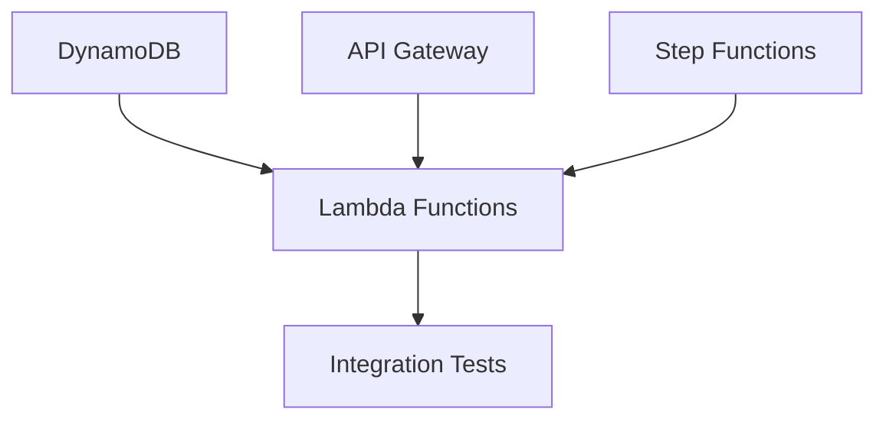

# 배포 파이프라인 아키텍처

## 개요

AI Chef 프로젝트의 배포 파이프라인은 **일관성**, **독립성**, **확장성**을 중심으로 설계되었습니다.

## 핵심 원칙

### 1. 서비스별 독립 배포
- 각 서비스는 독립적인 GitHub Actions 워크플로우를 가짐
- 서비스 간 의존성 최소화
- 병렬 배포 지원

### 2. 일관된 파일 구조
```
backend/infrastructure/
├── {service}-{component}.yaml     # CloudFormation 템플릿
├── deploy-{service}.sh            # 배포 스크립트
└── README.md

.github/workflows/
├── deploy-{service}.yml           # GitHub Actions 워크플로우
```

### 3. 표준화된 트리거 조건
```yaml
on:
  push:
    paths:
      - 'backend/infrastructure/{service}-*.yaml'
      - 'backend/infrastructure/deploy-{service}.sh'
      - '.github/workflows/deploy-{service}.yml'
  workflow_dispatch:
```

## 서비스 분류

### Tier 1: 기반 서비스 (독립 배포)
- **DynamoDB**: 데이터베이스 스키마
- **API Gateway**: API 엔드포인트 관리
- **Step Functions**: 워크플로우 오케스트레이션

### Tier 2: 컴퓨팅 서비스 (통합 배포)
- **Lambda Functions**: 모든 Lambda 함수들
  - session-create, session-update
  - recipe, price, combine
  - image-generator, nutrition-calculator

## 배포 순서



**병렬 배포**: DynamoDB, API Gateway, Step Functions는 동시 실행 가능
**순차 배포**: Lambda Functions는 기반 서비스 완료 후 배포 권장

## 파일 명명 규칙

### CloudFormation 템플릿
- `{service}-{component}.yaml`
- 예: `session-create-lambda.yaml`, `dynamodb-schema.yaml`

### 배포 스크립트
- `deploy-{service}.sh`
- 예: `deploy-backend.sh`, `deploy-api-gateway.sh`

### GitHub Actions
- `deploy-{service}.yml`
- 예: `deploy-backend.yml`, `deploy-dynamodb.yml`

## 표준 기능

### 1. 자동 스택 복구
모든 배포 스크립트는 `ROLLBACK_COMPLETE` 상태 자동 처리:
```bash
if [ "$STACK_STATUS" = "ROLLBACK_COMPLETE" ]; then
  aws cloudformation delete-stack --stack-name ${STACK_NAME}
  aws cloudformation wait stack-delete-complete --stack-name ${STACK_NAME}
fi
```

### 2. CloudWatch 모니터링
모든 서비스는 기본 모니터링 포함:
- 로그 그룹 (7일 보존)
- 에러 알람 (임계값 3개)
- 성능 메트릭

### 3. Discord 알림
배포 성공/실패 시 자동 알림:
```yaml
- name: Discord Success Notification
  if: success()
  run: |
    curl -H "Content-Type: application/json" \
    -d '{"embeds": [{"title": "✅ {Service} Deployed"}]}' \
    ${DISCORD_WEBHOOK_URL}
```

## 확장 가이드

새로운 서비스 추가 시 다음 단계를 따르세요:

1. **CloudFormation 템플릿 작성**
2. **배포 스크립트 생성**
3. **GitHub Actions 워크플로우 설정**
4. **트리거 조건 구성**
5. **모니터링 및 알림 설정**

자세한 구현 가이드는 각 서비스별 문서를 참조하세요.
