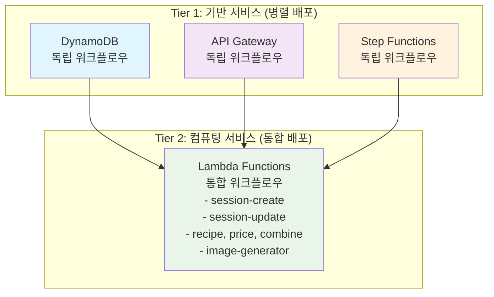

# 배포 파이프라인 빠른 시작 가이드

## 개요

이 가이드는 AI Chef 프로젝트의 배포 파이프라인을 처음 사용하는 개발자를 위한 빠른 시작 가이드입니다.

## 전체 아키텍처



## 5분 빠른 시작

### 1. 저장소 클론 및 설정
```bash
git clone https://github.com/your-org/ai-chef-project.git
cd ai-chef-project

# AWS 자격 증명 설정
aws configure
```

### 2. GitHub Secrets 설정
GitHub 저장소 Settings > Secrets and variables > Actions에서 설정:
```
AWS_ACCESS_KEY_ID=your-access-key
AWS_SECRET_ACCESS_KEY=your-secret-key
DISCORD_WEBHOOK_URL=your-discord-webhook-url
```

### 3. 기반 서비스 배포 (병렬 실행)
```bash
# DynamoDB 배포
cd backend/infrastructure
./deploy-dynamodb.sh

# API Gateway 배포 (다른 터미널)
./deploy-api-gateway.sh

# Step Functions 배포 (다른 터미널)
./deploy-stepfunctions.sh
```

### 4. Lambda 함수 배포
```bash
# 모든 Lambda 함수 통합 배포
./deploy.sh
```

### 5. 배포 확인
```bash
# 스택 상태 확인
aws cloudformation list-stacks --stack-status-filter CREATE_COMPLETE UPDATE_COMPLETE

# API 테스트
curl -X POST https://your-api-gateway-url/prod/sessions \
  -H "Content-Type: application/json" \
  -d '{"userProfile": "test"}'
```

## 파일 구조 이해하기

### 프로젝트 구조
```
ai-chef-project/
├── backend/infrastructure/           # 인프라 코드
│   ├── dynamodb-schema.yaml        # DynamoDB 테이블 정의
│   ├── api-gateway-only.yaml       # API Gateway 설정
│   ├── step-functions.yaml         # Step Functions 워크플로우
│   ├── session-create-lambda.yaml  # Lambda 함수들
│   ├── session-update-lambda.yaml
│   ├── deploy-dynamodb.sh          # 배포 스크립트들
│   ├── deploy-api-gateway.sh
│   ├── deploy-stepfunctions.sh
│   └── deploy.sh                   # Lambda 통합 배포
├── .github/workflows/               # GitHub Actions
│   ├── deploy-dynamodb.yml         # 독립 워크플로우들
│   ├── deploy-api-gateway.yml
│   ├── deploy-stepfunctions.yml
│   └── deploy-backend.yml          # Lambda 통합 워크플로우
└── docs/deployment/                 # 문서
    ├── pipeline-architecture.md
    ├── lambda-deployment-guide.md
    └── ...
```

### 명명 규칙
- **CloudFormation 템플릿**: `{service}-{component}.yaml`
- **배포 스크립트**: `deploy-{service}.sh`
- **GitHub Actions**: `deploy-{service}.yml`
- **AWS 리소스**: `ai-chef-{resource-name}`

## 워크플로우 이해하기

### 독립 배포 서비스 (3개)
각각 별도의 GitHub Actions 워크플로우를 가짐:

1. **DynamoDB** (`deploy-dynamodb.yml`)
   - 트리거: `dynamodb-schema.yaml`, `deploy-dynamodb.sh` 변경
   - 역할: 데이터베이스 스키마 관리

2. **API Gateway** (`deploy-api-gateway.yml`)
   - 트리거: `api-gateway-only.yaml`, `deploy-api-gateway.sh` 변경
   - 역할: API 엔드포인트 관리
   - 특징: 강제 재배포 로직 포함

3. **Step Functions** (`deploy-stepfunctions.yml`)
   - 트리거: `step-functions.yaml`, `deploy-stepfunctions.sh` 변경
   - 역할: 워크플로우 오케스트레이션

### 통합 배포 서비스 (1개)
모든 Lambda 함수를 하나의 워크플로우로 관리:

4. **Lambda Functions** (`deploy-backend.yml`)
   - 트리거: `*-lambda.yaml`, `deploy.sh` 변경
   - 역할: 모든 Lambda 함수 통합 관리
   - 포함: session-create, session-update, recipe, price, combine 등

## 새로운 서비스 추가하기

### Lambda 함수 추가 (권장)
Lambda 함수는 기존 통합 워크플로우에 추가:

1. **CloudFormation 템플릿 생성**
```bash
cp session-create-lambda.yaml new-function-lambda.yaml
# 내용 수정: 함수명, 역할, 코드 등
```

2. **배포 스크립트에 추가**
```bash
# deploy.sh에 추가
deploy_lambda "new-function-lambda.yaml" "ai-chef-new-function-lambda" "New Function"
```

3. **자동 배포**
파일명이 `*-lambda.yaml` 패턴이므로 자동으로 트리거됨

### 독립 서비스 추가 (신중히 고려)
새로운 독립 서비스가 정말 필요한 경우:

1. **CloudFormation 템플릿**: `new-service.yaml`
2. **배포 스크립트**: `deploy-new-service.sh`
3. **GitHub Actions**: `deploy-new-service.yml`
4. **트리거 조건 설정**

## 배포 전략

### 개발 워크플로우
```bash
# 1. 기능 브랜치 생성
git checkout -b feature/new-lambda-function

# 2. 코드 작성 및 테스트
# CloudFormation 템플릿 작성
# 로컬 테스트

# 3. 커밋 및 푸시
git add .
git commit -m "Add new lambda function"
git push origin feature/new-lambda-function

# 4. Pull Request 생성
# GitHub에서 PR 생성 및 리뷰

# 5. 메인 브랜치 병합
# 자동으로 GitHub Actions 실행됨
```

### 배포 순서 권장사항
1. **기반 서비스 먼저**: DynamoDB, API Gateway, Step Functions
2. **Lambda 함수 나중에**: 의존성이 있는 서비스들 이후
3. **병렬 배포 활용**: 독립적인 서비스들은 동시 배포 가능

## 모니터링 및 알림

### Discord 알림
모든 배포는 Discord로 결과 알림:
- ✅ 성공: 초록색 임베드
- ❌ 실패: 빨간색 임베드
- 포함 정보: 서비스명, 커밋 해시, 타임스탬프

### CloudWatch 모니터링
모든 서비스는 기본 모니터링 포함:
- 로그 그룹 (7일 보존)
- 에러 알람 (임계값 3-5개)
- 성능 메트릭

### 로그 확인 방법
```bash
# Lambda 로그
aws logs describe-log-streams --log-group-name "/aws/lambda/ai-chef-function-name"

# API Gateway 로그
aws logs describe-log-streams --log-group-name "/aws/apigateway/ai-chef-api"

# Step Functions 로그
aws logs describe-log-streams --log-group-name "/aws/stepfunctions/ai-chef-workflow"
```

## 트러블슈팅

### 일반적인 문제들

1. **ROLLBACK_COMPLETE 상태**
   - 원인: 이전 배포 실패
   - 해결: 자동 스택 복구 로직이 처리함

2. **권한 에러**
   - 원인: IAM 권한 부족
   - 해결: CloudFormation 템플릿의 IAM 정책 확인

3. **API Gateway 403 에러**
   - 원인: 배포가 prod 스테이지에 반영되지 않음
   - 해결: 강제 재배포 로직이 처리함

4. **Lambda 함수 호출 실패**
   - 원인: 함수 존재하지 않음 또는 권한 부족
   - 해결: 함수 배포 상태 및 API Gateway 권한 확인

### 디버깅 명령어
```bash
# 스택 상태 확인
aws cloudformation describe-stacks --stack-name stack-name

# 스택 이벤트 확인
aws cloudformation describe-stack-events --stack-name stack-name

# 리소스 확인
aws cloudformation describe-stack-resources --stack-name stack-name

# Lambda 함수 확인
aws lambda list-functions --query 'Functions[?starts_with(FunctionName, `ai-chef`)]'
```

## 베스트 프랙티스

### 1. 코드 품질
- CloudFormation 템플릿 검증
- 배포 스크립트 테스트
- 에러 처리 포함

### 2. 보안
- 최소 권한 원칙
- 민감 정보는 환경변수 사용
- 정기적인 권한 검토

### 3. 비용 최적화
- 로그 보존 기간 설정 (7일)
- DynamoDB PAY_PER_REQUEST 모드
- Lambda 메모리/타임아웃 최적화

### 4. 모니터링
- 모든 서비스에 CloudWatch 알람 설정
- Discord 알림으로 즉시 피드백
- 정기적인 로그 검토

## 다음 단계

1. **상세 가이드 읽기**: 각 서비스별 상세 배포 가이드 참조
2. **실습**: 테스트 Lambda 함수 추가해보기
3. **커스터마이징**: 프로젝트 요구사항에 맞게 수정
4. **팀 공유**: 팀원들과 배포 프로세스 공유

## 참고 문서

- [배포 파이프라인 아키텍처](./pipeline-architecture.md)
- [Lambda 배포 가이드](./lambda-deployment-guide.md)
- [API Gateway 배포 가이드](./api-gateway-deployment-guide.md)
- [Step Functions 배포 가이드](./stepfunctions-deployment-guide.md)
- [DynamoDB 배포 가이드](./dynamodb-deployment-guide.md)
