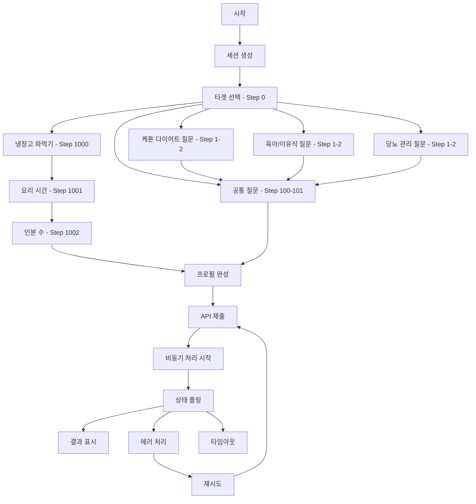

# 대화 플로우 명세서

## 개요
AI 셰프 프로젝트의 사용자 대화 흐름 및 프로필 수집 명세서

## 전체 대화 플로우

### 메인 플로우 다이어그램


## Step 번호 체계

### Step 분류
- **0번**: 타겟 선택
- **1-99번**: 타겟별 질문
- **100-199번**: 공통 질문
- **1000-1099번**: 냉장고 파먹기 전용

### 타겟별 질문 구조
```typescript
interface QuestionFlow {
  keto: {
    1: 'phase', // 1-2주 적응기, 3-4주, 1개월 이상 유지기
    2: 'carbLimit' // 20g 이하 엄격, 20-50g 표준, 50g 이상 유연
  },
  baby: {
    1: 'months', // 4-6개월 초기, 7-9개월 중기, 10-12개월 후기, 12개월 이상 완료기
    2: 'allergies' // 알레르기 확인
  },
  diabetes: {
    1: 'bloodSugar', // 혈당 수치
    2: 'medication' // 복용 약물
  },
  common: {
    100: 'budget', // 💵 1만원 이하, 💵💵 1-2만원, 💵💵💵 2-3만원, 💵💵💵💵 3만원 이상
    101: 'servings' // 1인분, 2인분, 3-4인분, 5인분 이상
  },
  fridge: {
    1000: 'ingredients', // 재료 선택
    1001: 'cookingTime', // 요리 시간
    1002: 'servings' // 인분 수
  }
}
```

## 핵심 로직 구현

### handleAnswer 함수
```javascript
async function handleAnswer(userInput, selectedOption = null) {
  // 1. 사용자 메시지 추가
  const userMessage = {
    id: Date.now(),
    text: userInput,
    sender: 'user',
    timestamp: new Date().toISOString()
  };
  setMessages(prev => [...prev, userMessage]);
  
  // 2. 타이핑 상태 설정
  setIsTyping(true);
  
  // 3. 자연스러운 대화 연출 (1초 지연)
  setTimeout(async () => {
    try {
      if (currentStep === 0) {
        // 타겟 선택 처리
        await handleTargetSelection(selectedOption);
      } else if (currentStep >= 1 && currentStep <= 99) {
        // 타겟별 질문 처리
        await handleTargetSpecificQuestion(userInput, selectedOption);
      } else if (currentStep >= 100 && currentStep <= 199) {
        // 공통 질문 처리
        await handleCommonQuestion(userInput, selectedOption);
      } else if (currentStep >= 1000 && currentStep <= 1099) {
        // 냉장고 파먹기 전용 처리
        await handleFridgeQuestion(userInput, selectedOption);
      }
    } catch (error) {
      console.error('답변 처리 오류:', error);
      showErrorMessage('답변 처리 중 오류가 발생했습니다.');
    } finally {
      setIsTyping(false);
    }
  }, 1000);
}

async function handleTargetSelection(target) {
  setUserProfile(prev => ({ ...prev, target }));
  
  switch (target) {
    case 'fridge':
      setIsFridgeMode(true);
      setShowIngredientSelector(true);
      setCurrentStep(1000);
      break;
    case 'general':
      setCurrentStep(100); // 바로 공통 질문으로
      break;
    default:
      setCurrentStep(1); // 타겟별 질문으로
      break;
  }
  
  addAIMessage(getNextQuestion());
}

async function handleCommonQuestion(userInput, selectedOption) {
  if (currentStep === 100) {
    // 예산 설정
    setUserProfile(prev => ({ ...prev, budget: selectedOption }));
    setCurrentStep(101);
  } else if (currentStep === 101) {
    // 인분 수 설정 (마지막 질문)
    setUserProfile(prev => ({ ...prev, servings: selectedOption }));
    await handleCompletion();
    return;
  }
  
  addAIMessage(getNextQuestion());
}

async function handleCompletion() {
  setIsCompleted(true);
  addAIMessage('프로필이 완성되었습니다! 맞춤 레시피를 생성하고 있어요...');
  
  // 프로필 제출
  await submitProfile(userProfile);
}
```

### 프로필 제출 및 비동기 처리
```javascript
async function submitProfile(profile) {
  if (isProcessing) return; // 중복 클릭 방지
  
  setIsProcessing(true);
  setProcessingStatus('submitting');
  
  try {
    const result = await submitProfileToAPI(profile);
    setExecutionId(result.executionId);
    setProcessingStatus('processing');
    
    // 폴링 시작
    startPolling();
    
  } catch (error) {
    console.error('프로필 제출 실패:', error);
    setProcessingStatus('failed');
    showErrorMessage('프로필 제출 중 오류가 발생했습니다.');
  } finally {
    setIsProcessing(false);
  }
}

async function submitProfileToAPI(profile) {
  const response = await fetch(`/api/session/${sessionId}/process`, {
    method: 'POST',
    headers: {
      'Content-Type': 'application/json'
    },
    body: JSON.stringify({ profile })
  });

  if (!response.ok) {
    throw new Error(`HTTP ${response.status}`);
  }

  return await response.json();
}

function startPolling() {
  let attempts = 0;
  const maxAttempts = 30;
  
  const pollInterval = setInterval(async () => {
    attempts++;
    
    try {
      const response = await fetch(`/api/session/${sessionId}/status`);
      const data = await response.json();
      
      // 진행률 업데이트
      const progressMap = {
        'recipe_generation': 40,
        'price_fetching': 70,
        'combining': 90
      };
      
      setPollingProgress(progressMap[data.phase] || 0);
      
      if (data.status === 'completed') {
        clearInterval(pollInterval);
        setProcessingStatus('completed');
        setProcessingResult(data.result);
        onShowResult(data.result);
      } else if (data.status === 'failed') {
        clearInterval(pollInterval);
        setProcessingStatus('failed');
        showErrorMessage(data.error || '처리 중 오류가 발생했습니다.');
      } else if (attempts >= maxAttempts) {
        clearInterval(pollInterval);
        setProcessingStatus('timeout');
        showErrorMessage('처리 시간이 초과되었습니다.');
      }
      
    } catch (error) {
      console.error('폴링 오류:', error);
      
      if (attempts >= maxAttempts) {
        clearInterval(pollInterval);
        setProcessingStatus('failed');
        showErrorMessage('네트워크 오류가 발생했습니다.');
      }
    }
  }, 2000);
}
```

### 리셋 처리
```javascript
function handleReset() {
  // 대화 상태 초기화
  setMessages([{
    id: 1,
    text: '안녕하세요! AI 셰프입니다. 어떤 도움이 필요하신가요?',
    sender: 'ai',
    timestamp: new Date().toISOString()
  }]);
  
  setCurrentStep(0);
  setUserProfile({});
  setIsCompleted(false);
  setShowIngredientSelector(false);
  setIsFridgeMode(false);
  
  // 비동기 처리 상태 초기화
  setExecutionId(null);
  setProcessingStatus('idle');
  setPollingProgress(0);
  setProcessingResult(null);
  setIsProcessing(false);
  
  // UI 상태 초기화
  setIsTyping(false);
  setError(null);
}
```

### 냉장고 모드 검증
```javascript
function validateFridgeIngredients(selectedIngredients) {
  if (selectedIngredients.length < 2) {
    showErrorMessage('냉장고 파먹기는 최소 2개 이상의 재료를 선택해주세요.');
    return false;
  }
  
  return true;
}

function handleIngredientSelection(ingredients) {
  if (!validateFridgeIngredients(ingredients)) {
    return;
  }
  
  setUserProfile(prev => ({ ...prev, ingredients }));
  setShowIngredientSelector(false);
  setCurrentStep(1001);
  addAIMessage('재료 선택이 완료되었습니다! 요리 시간은 얼마나 걸려도 될까요?');
}
```

## 테스트 시나리오

### 시나리오 1: 케톤 다이어트
```javascript
const ketoScenario = {
  target: 'keto',
  steps: [
    { step: 0, input: '케톤 다이어트', expected: 'phase 질문' },
    { step: 1, input: '1-2주 적응기', expected: 'carbLimit 질문' },
    { step: 2, input: '20g 이하 엄격', expected: 'budget 질문' },
    { step: 100, input: '1-2만원', expected: 'servings 질문' },
    { step: 101, input: '2인분', expected: '프로필 완성' }
  ],
  expectedProfile: {
    target: 'keto',
    phase: '1-2주 적응기',
    carbLimit: '20g 이하',
    budget: '1-2만원',
    servings: '2인분'
  }
};
```

### 시나리오 2: 냉장고 파먹기
```javascript
const fridgeScenario = {
  target: 'fridge',
  steps: [
    { step: 0, input: '냉장고 파먹기', expected: '재료 선택기 표시' },
    { step: 1000, input: ['계란', '김치', '밥'], expected: 'cookingTime 질문' },
    { step: 1001, input: '15분 이하', expected: 'servings 질문' },
    { step: 1002, input: '1인분', expected: '프로필 완성' }
  ],
  expectedProfile: {
    target: 'fridge',
    ingredients: ['계란', '김치', '밥'],
    cookingTime: '15분 이하',
    servings: '1인분'
  }
};
```

### 시나리오 3: 일반 식단
```javascript
const generalScenario = {
  target: 'general',
  steps: [
    { step: 0, input: '일반 식단', expected: 'budget 질문 (바로 100번)' },
    { step: 100, input: '1만원 이하', expected: 'servings 질문' },
    { step: 101, input: '3-4인분', expected: '프로필 완성' }
  ],
  expectedProfile: {
    target: 'general',
    budget: '1만원 이하',
    servings: '3-4인분'
  }
};
```

## 상태 관리 인터페이스

### 대화 상태
```typescript
interface ConversationState {
  // 기본 상태
  messages: Message[];
  currentStep: number;
  userProfile: UserProfile;
  isCompleted: boolean;
  isTyping: boolean;
  
  // 냉장고 모드
  showIngredientSelector: boolean;
  isFridgeMode: boolean;
  
  // 비동기 처리
  executionId: string | null;
  processingStatus: 'idle' | 'submitting' | 'processing' | 'completed' | 'failed' | 'timeout';
  pollingProgress: number;
  processingResult: ProcessingResult | null;
  isProcessing: boolean;
  
  // 에러 처리
  error: string | null;
}
```

### 메시지 인터페이스
```typescript
interface Message {
  id: number;
  text: string;
  sender: 'user' | 'ai';
  timestamp: string;
  options?: string[];
  type?: 'text' | 'options' | 'ingredient-selector';
}
```

## 에러 처리 및 검증

### 입력 검증
```javascript
function validateUserInput(step, input) {
  switch (step) {
    case 1000: // 냉장고 재료 선택
      return input.length >= 2;
    case 100: // 예산
      return ['1만원 이하', '1-2만원', '2-3만원', '3만원 이상'].includes(input);
    case 101: // 인분 수
      return ['1인분', '2인분', '3-4인분', '5인분 이상'].includes(input);
    default:
      return true;
  }
}

function showErrorMessage(message) {
  setError(message);
  setTimeout(() => setError(null), 3000);
}
```
