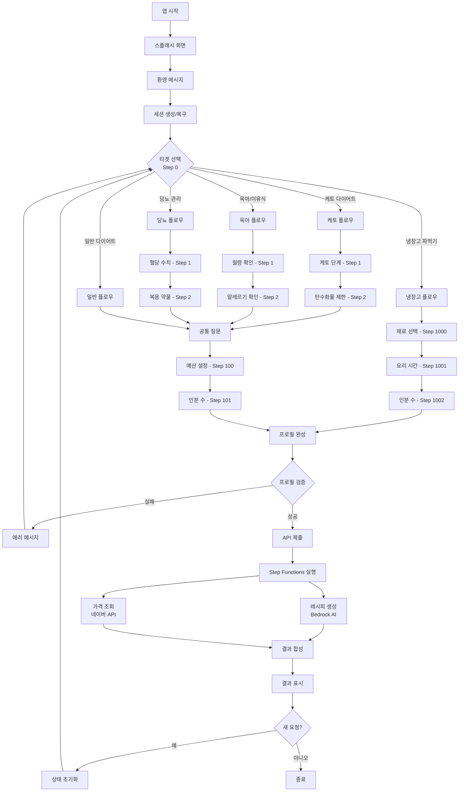
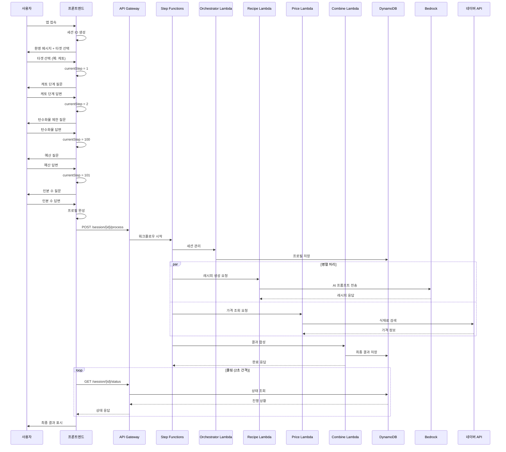
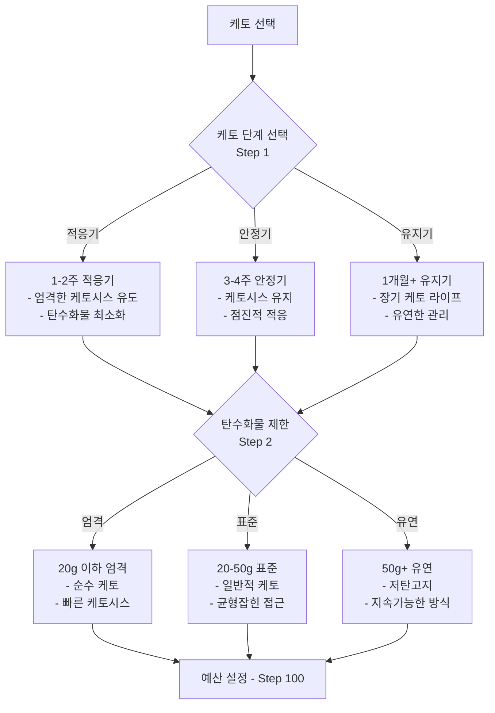
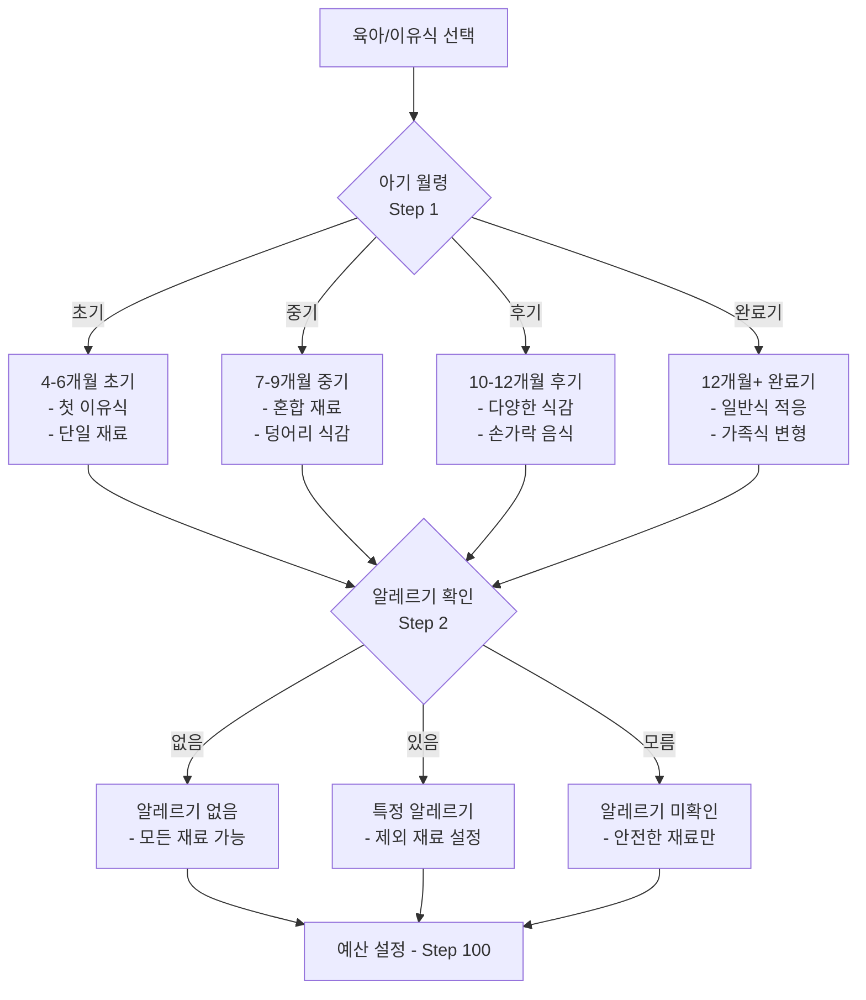
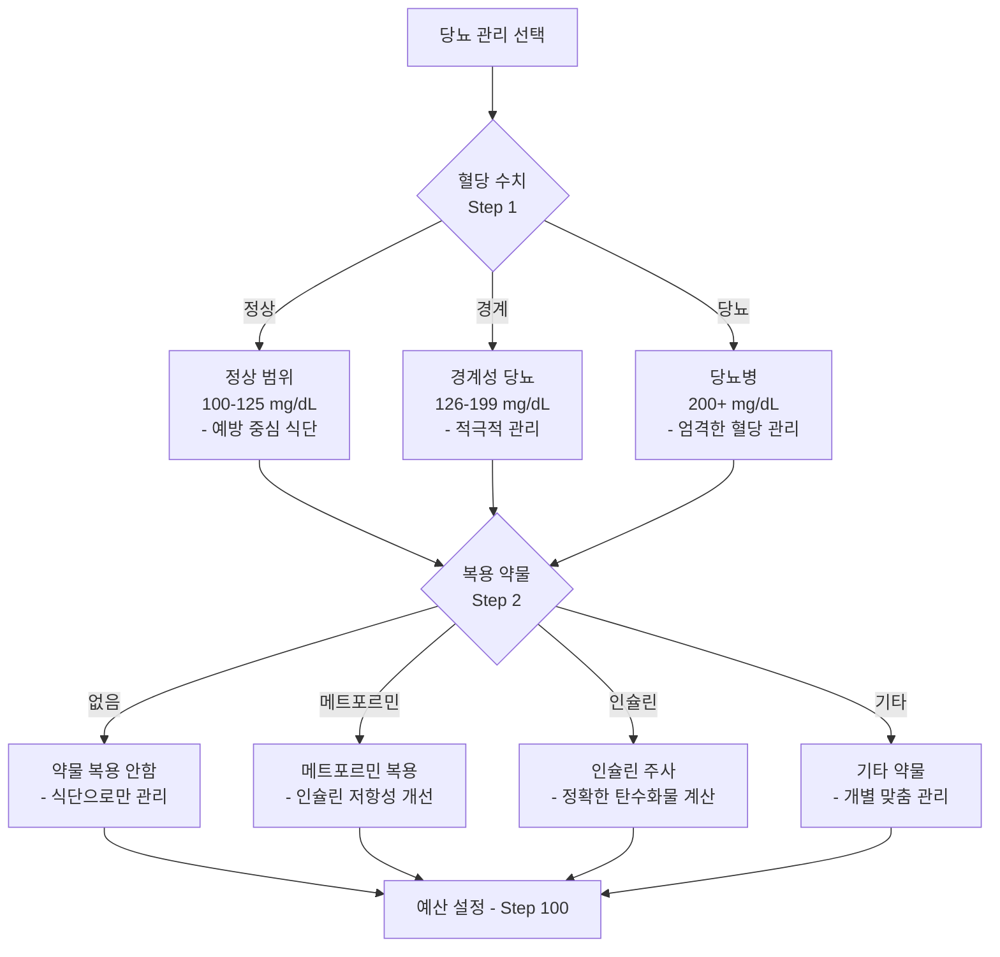
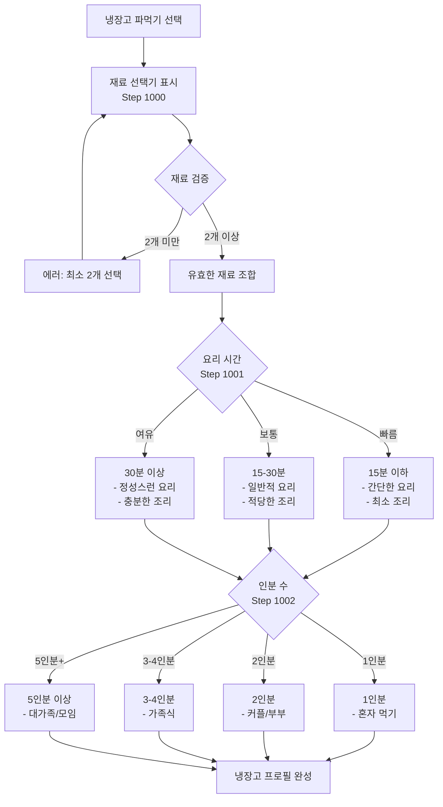
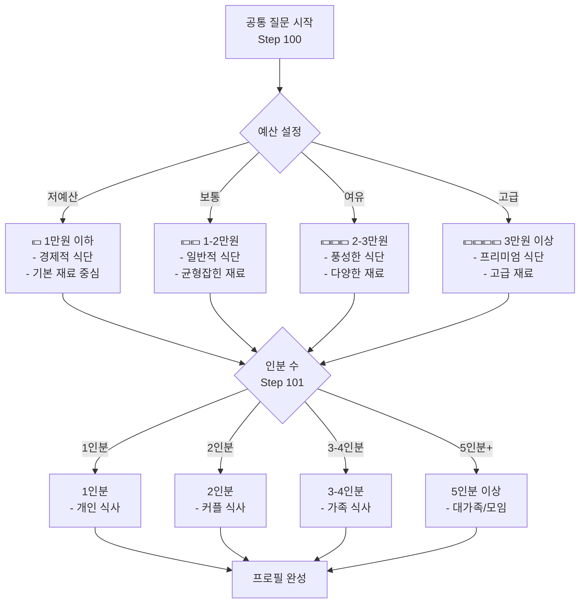
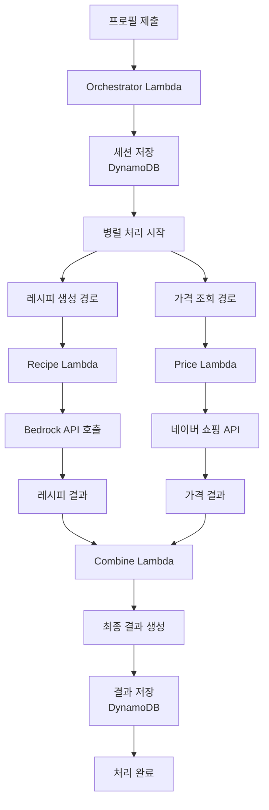
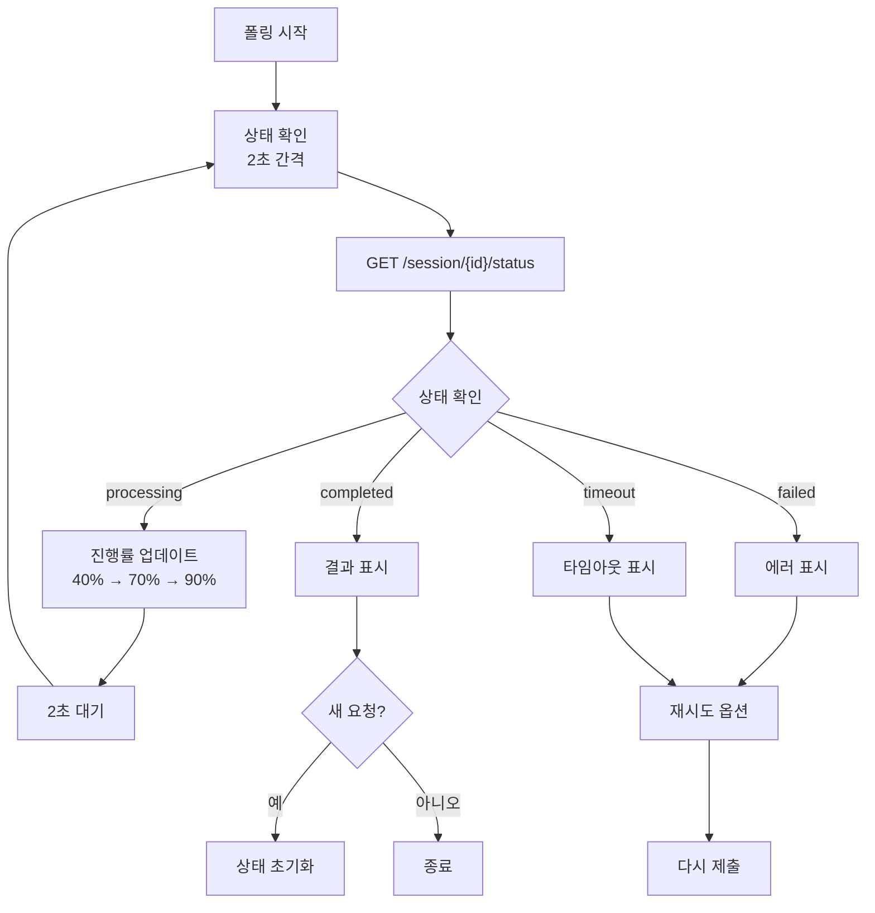

# 대화 플로우 명세서

## 개요
AI 셰프 프로젝트의 사용자 대화 흐름 및 프로필 수집 명세서입니다. 5가지 타겟별 특화 레시피(케토, 이유식, 당뇨, 일반 다이어트, 냉장고 털기)를 제공하는 대화형 UX를 구현합니다.

## 메인 플로우 상세 다이어그램

### 전체 시스템 플로우


### 상세 대화 플로우


## 타겟별 상세 질문 플로우

### 1. 케토 다이어트 플로우


### 2. 육아/이유식 플로우


### 3. 당뇨 관리 플로우


### 4. 냉장고 파먹기 플로우


### 5. 공통 질문 플로우


## 비동기 처리 플로우

### Step Functions 워크플로우


### 폴링 및 상태 관리


## Step 번호 체계 및 데이터 구조

### Step 분류
- **0번**: 타겟 선택
- **1-99번**: 타겟별 질문
- **100-199번**: 공통 질문  
- **1000-1099번**: 냉장고 파먹기 전용

### 타겟별 질문 구조
```typescript
interface QuestionFlow {
  keto: {
    1: 'phase',     // 1-2주 적응기, 3-4주 안정기, 1개월+ 유지기
    2: 'carbLimit'  // 20g 이하 엄격, 20-50g 표준, 50g+ 유연
  },
  baby: {
    1: 'months',    // 4-6개월 초기, 7-9개월 중기, 10-12개월 후기, 12개월+ 완료기
    2: 'allergies'  // 알레르기 없음, 특정 알레르기, 알레르기 미확인
  },
  diabetes: {
    1: 'bloodSugar', // 정상(100-125), 경계성(126-199), 당뇨병(200+)
    2: 'medication'  // 없음, 메트포르민, 인슐린, 기타
  },
  common: {
    100: 'budget',   // 💵 1만원 이하, 💵💵 1-2만원, 💵💵💵 2-3만원, 💵💵💵💵 3만원+
    101: 'servings'  // 1인분, 2인분, 3-4인분, 5인분 이상
  },
  fridge: {
    1000: 'ingredients', // 재료 선택 (최소 2개)
    1001: 'cookingTime', // 15분 이하, 15-30분, 30분 이상
    1002: 'servings'     // 1인분, 2인분, 3-4인분, 5인분 이상
  }
}

// 사용자 프로필 데이터 구조
interface UserProfile {
  sessionId: string;
  target: 'keto' | 'baby' | 'diabetes' | 'general' | 'fridge';
  
  // 케토 다이어트 전용
  phase?: '1-2주 적응기' | '3-4주 안정기' | '1개월+ 유지기';
  carbLimit?: '20g 이하 엄격' | '20-50g 표준' | '50g+ 유연';
  
  // 육아/이유식 전용
  months?: '4-6개월 초기' | '7-9개월 중기' | '10-12개월 후기' | '12개월+ 완료기';
  allergies?: '알레르기 없음' | '특정 알레르기' | '알레르기 미확인';
  allergyList?: string[]; // 특정 알레르기가 있는 경우
  
  // 당뇨 관리 전용
  bloodSugar?: '정상(100-125)' | '경계성(126-199)' | '당뇨병(200+)';
  medication?: '없음' | '메트포르민' | '인슐린' | '기타';
  medicationDetails?: string; // 기타 약물 상세
  
  // 냉장고 파먹기 전용
  ingredients?: string[]; // 선택된 재료 목록
  cookingTime?: '15분 이하' | '15-30분' | '30분 이상';
  
  // 공통 필드
  budget: '1만원 이하' | '1-2만원' | '2-3만원' | '3만원 이상';
  servings: '1인분' | '2인분' | '3-4인분' | '5인분 이상';
  
  // 메타데이터
  createdAt: string;
  updatedAt: string;
  completedAt?: string;
}
```

### 재료 선택기 데이터
```typescript
interface IngredientCategory {
  name: string;
  items: IngredientItem[];
}

interface IngredientItem {
  id: string;
  name: string;
  category: string;
  icon?: string;
  commonPrice?: number; // 대략적인 가격 (원)
}

// 냉장고 재료 카테고리
const INGREDIENT_CATEGORIES: IngredientCategory[] = [
  {
    name: '육류/단백질',
    items: [
      { id: 'beef', name: '소고기', category: '육류', icon: '🥩' },
      { id: 'pork', name: '돼지고기', category: '육류', icon: '🥓' },
      { id: 'chicken', name: '닭고기', category: '육류', icon: '🍗' },
      { id: 'egg', name: '계란', category: '단백질', icon: '🥚' },
      { id: 'tofu', name: '두부', category: '단백질', icon: '🧈' }
    ]
  },
  {
    name: '채소류',
    items: [
      { id: 'onion', name: '양파', category: '채소', icon: '🧅' },
      { id: 'carrot', name: '당근', category: '채소', icon: '🥕' },
      { id: 'potato', name: '감자', category: '채소', icon: '🥔' },
      { id: 'kimchi', name: '김치', category: '채소', icon: '🥬' },
      { id: 'spinach', name: '시금치', category: '채소', icon: '🥬' }
    ]
  },
  {
    name: '곡류/면류',
    items: [
      { id: 'rice', name: '밥', category: '곡류', icon: '🍚' },
      { id: 'noodle', name: '면', category: '면류', icon: '🍜' },
      { id: 'bread', name: '빵', category: '곡류', icon: '🍞' }
    ]
  }
];
```

## 핵심 로직 구현

### 메인 대화 처리 함수
```typescript
async function handleAnswer(userInput: string, selectedOption: string | null = null) {
  // 1. 사용자 메시지 추가
  const userMessage: Message = {
    id: Date.now(),
    text: userInput,
    sender: 'user',
    timestamp: new Date().toISOString()
  };
  setMessages(prev => [...prev, userMessage]);
  
  // 2. 타이핑 상태 설정 (자연스러운 UX)
  setIsTyping(true);
  
  // 3. 1초 지연으로 자연스러운 대화 연출
  setTimeout(async () => {
    try {
      // Step 번호에 따른 분기 처리
      if (currentStep === 0) {
        await handleTargetSelection(selectedOption);
      } else if (currentStep >= 1 && currentStep <= 99) {
        await handleTargetSpecificQuestion(userInput, selectedOption);
      } else if (currentStep >= 100 && currentStep <= 199) {
        await handleCommonQuestion(userInput, selectedOption);
      } else if (currentStep >= 1000 && currentStep <= 1099) {
        await handleFridgeQuestion(userInput, selectedOption);
      }
    } catch (error) {
      console.error('답변 처리 오류:', error);
      showErrorMessage('답변 처리 중 오류가 발생했습니다. 다시 시도해주세요.');
    } finally {
      setIsTyping(false);
    }
  }, 1000);
}

// 타겟 선택 처리
async function handleTargetSelection(target: string) {
  setUserProfile(prev => ({ ...prev, target }));
  
  switch (target) {
    case 'keto':
      setCurrentStep(1);
      addAIMessage('케토 다이어트를 선택하셨네요! 현재 어느 단계에 계신가요?', [
        '1-2주 적응기 (케토시스 유도 중)',
        '3-4주 안정기 (케토시스 적응)',
        '1개월+ 유지기 (장기 케토 라이프)'
      ]);
      break;
      
    case 'baby':
      setCurrentStep(1);
      addAIMessage('이유식 레시피를 찾고 계시는군요! 아기가 몇 개월인가요?', [
        '4-6개월 초기 (첫 이유식)',
        '7-9개월 중기 (혼합 재료)',
        '10-12개월 후기 (다양한 식감)',
        '12개월+ 완료기 (일반식 적응)'
      ]);
      break;
      
    case 'diabetes':
      setCurrentStep(1);
      addAIMessage('당뇨 관리 식단을 도와드릴게요. 현재 혈당 수치는 어떤 범위인가요?', [
        '정상 범위 (100-125 mg/dL)',
        '경계성 당뇨 (126-199 mg/dL)',
        '당뇨병 (200+ mg/dL)'
      ]);
      break;
      
    case 'general':
      setCurrentStep(100); // 바로 공통 질문으로
      addAIMessage('일반 다이어트 식단을 준비해드릴게요! 예산은 어느 정도로 생각하고 계신가요?', [
        '💵 1만원 이하 (경제적 식단)',
        '💵💵 1-2만원 (일반적 식단)',
        '💵💵💵 2-3만원 (풍성한 식단)',
        '💵💵💵💵 3만원 이상 (프리미엄 식단)'
      ]);
      break;
      
    case 'fridge':
      setIsFridgeMode(true);
      setShowIngredientSelector(true);
      setCurrentStep(1000);
      addAIMessage('냉장고 파먹기 모드입니다! 현재 가지고 있는 재료를 선택해주세요. (최소 2개 이상)');
      break;
  }
}

// 타겟별 질문 처리
async function handleTargetSpecificQuestion(userInput: string, selectedOption: string) {
  const { target } = userProfile;
  
  if (target === 'keto') {
    if (currentStep === 1) {
      // 케토 단계 설정
      setUserProfile(prev => ({ ...prev, phase: selectedOption }));
      setCurrentStep(2);
      addAIMessage('탄수화물 제한은 어느 정도로 하고 계신가요?', [
        '20g 이하 엄격 (순수 케토)',
        '20-50g 표준 (일반적 케토)',
        '50g+ 유연 (저탄고지)'
      ]);
    } else if (currentStep === 2) {
      // 탄수화물 제한 설정
      setUserProfile(prev => ({ ...prev, carbLimit: selectedOption }));
      setCurrentStep(100); // 공통 질문으로
      addAIMessage('예산은 어느 정도로 생각하고 계신가요?', getBudgetOptions());
    }
  } else if (target === 'baby') {
    if (currentStep === 1) {
      // 월령 설정
      setUserProfile(prev => ({ ...prev, months: selectedOption }));
      setCurrentStep(2);
      addAIMessage('아기에게 알레르기가 있나요?', [
        '알레르기 없음',
        '특정 알레르기 있음',
        '알레르기 미확인 (안전하게)'
      ]);
    } else if (currentStep === 2) {
      // 알레르기 설정
      setUserProfile(prev => ({ ...prev, allergies: selectedOption }));
      setCurrentStep(100); // 공통 질문으로
      addAIMessage('예산은 어느 정도로 생각하고 계신가요?', getBudgetOptions());
    }
  } else if (target === 'diabetes') {
    if (currentStep === 1) {
      // 혈당 수치 설정
      setUserProfile(prev => ({ ...prev, bloodSugar: selectedOption }));
      setCurrentStep(2);
      addAIMessage('현재 복용 중인 당뇨 약물이 있나요?', [
        '복용 안함',
        '메트포르민',
        '인슐린 주사',
        '기타 약물'
      ]);
    } else if (currentStep === 2) {
      // 약물 설정
      setUserProfile(prev => ({ ...prev, medication: selectedOption }));
      setCurrentStep(100); // 공통 질문으로
      addAIMessage('예산은 어느 정도로 생각하고 계신가요?', getBudgetOptions());
    }
  }
}

// 공통 질문 처리
async function handleCommonQuestion(userInput: string, selectedOption: string) {
  if (currentStep === 100) {
    // 예산 설정
    setUserProfile(prev => ({ ...prev, budget: selectedOption }));
    setCurrentStep(101);
    addAIMessage('몇 인분으로 만들어드릴까요?', [
      '1인분 (개인 식사)',
      '2인분 (커플 식사)',
      '3-4인분 (가족 식사)',
      '5인분 이상 (대가족/모임)'
    ]);
  } else if (currentStep === 101) {
    // 인분 수 설정 (마지막 질문)
    setUserProfile(prev => ({ ...prev, servings: selectedOption }));
    await handleCompletion();
  }
}

// 냉장고 모드 질문 처리
async function handleFridgeQuestion(userInput: string, selectedOption: string) {
  if (currentStep === 1001) {
    // 요리 시간 설정
    setUserProfile(prev => ({ ...prev, cookingTime: selectedOption }));
    setCurrentStep(1002);
    addAIMessage('몇 인분으로 만들어드릴까요?', [
      '1인분 (혼자 먹기)',
      '2인분 (커플/부부)',
      '3-4인분 (가족식)',
      '5인분 이상 (대가족/모임)'
    ]);
  } else if (currentStep === 1002) {
    // 인분 수 설정 (냉장고 모드 마지막)
    setUserProfile(prev => ({ ...prev, servings: selectedOption }));
    await handleCompletion();
  }
}

// 재료 선택 처리 (냉장고 모드)
function handleIngredientSelection(selectedIngredients: string[]) {
  // 최소 2개 재료 검증
  if (selectedIngredients.length < 2) {
    showErrorMessage('냉장고 파먹기는 최소 2개 이상의 재료를 선택해주세요.');
    return;
  }
  
  setUserProfile(prev => ({ ...prev, ingredients: selectedIngredients }));
  setShowIngredientSelector(false);
  setCurrentStep(1001);
  
  const ingredientText = selectedIngredients.join(', ');
  addAIMessage(`${ingredientText}로 요리하시는군요! 요리 시간은 얼마나 걸려도 될까요?`, [
    '15분 이하 (간단한 요리)',
    '15-30분 (일반적 요리)',
    '30분 이상 (정성스런 요리)'
  ]);
}

// 프로필 완성 처리
async function handleCompletion() {
  setIsCompleted(true);
  
  // 완성된 프로필 요약 메시지
  const summaryMessage = generateProfileSummary(userProfile);
  addAIMessage(summaryMessage);
  
  // 처리 시작 메시지
  setTimeout(() => {
    addAIMessage('맞춤 레시피를 생성하고 최저가 정보를 찾고 있어요... 잠시만 기다려주세요! 🍳');
    submitProfile(userProfile);
  }, 1500);
}

// 프로필 요약 생성
function generateProfileSummary(profile: UserProfile): string {
  let summary = '프로필이 완성되었습니다!\n\n';
  
  switch (profile.target) {
    case 'keto':
      summary += `🥑 케토 다이어트 (${profile.phase})\n`;
      summary += `📊 탄수화물: ${profile.carbLimit}\n`;
      break;
    case 'baby':
      summary += `👶 이유식 (${profile.months})\n`;
      summary += `🛡️ 알레르기: ${profile.allergies}\n`;
      break;
    case 'diabetes':
      summary += `🩺 당뇨 관리 (${profile.bloodSugar})\n`;
      summary += `💊 약물: ${profile.medication}\n`;
      break;
    case 'fridge':
      summary += `🥘 냉장고 파먹기\n`;
      summary += `🥬 재료: ${profile.ingredients?.join(', ')}\n`;
      summary += `⏰ 시간: ${profile.cookingTime}\n`;
      break;
    case 'general':
      summary += `🍽️ 일반 다이어트\n`;
      break;
  }
  
  summary += `💰 예산: ${profile.budget}\n`;
  summary += `👥 인분: ${profile.servings}`;
  
  return summary;
}

// 유틸리티 함수들
function getBudgetOptions(): string[] {
  return [
    '💵 1만원 이하 (경제적 식단)',
    '💵💵 1-2만원 (일반적 식단)',
    '💵💵💵 2-3만원 (풍성한 식단)',
    '💵💵💵💵 3만원 이상 (프리미엄 식단)'
  ];
}

function addAIMessage(text: string, options?: string[]) {
  const aiMessage: Message = {
    id: Date.now(),
    text,
    sender: 'ai',
    timestamp: new Date().toISOString(),
    options,
    type: options ? 'options' : 'text'
  };
  setMessages(prev => [...prev, aiMessage]);
}

function showErrorMessage(message: string) {
  setError(message);
  setTimeout(() => setError(null), 3000);
}
```

### 비동기 처리 및 폴링
```typescript
// 프로필 제출
async function submitProfile(profile: UserProfile) {
  if (isProcessing) return; // 중복 제출 방지
  
  setIsProcessing(true);
  setProcessingStatus('submitting');
  
  try {
    const response = await fetch(`/api/session/${sessionId}/process`, {
      method: 'POST',
      headers: {
        'Content-Type': 'application/json'
      },
      body: JSON.stringify({ profile })
    });

    if (!response.ok) {
      throw new Error(`HTTP ${response.status}: ${response.statusText}`);
    }

    const result = await response.json();
    setExecutionId(result.executionId);
    setProcessingStatus('processing');
    
    // 폴링 시작
    startPolling();
    
  } catch (error) {
    console.error('프로필 제출 실패:', error);
    setProcessingStatus('failed');
    showErrorMessage('프로필 제출 중 오류가 발생했습니다. 다시 시도해주세요.');
  } finally {
    setIsProcessing(false);
  }
}

// 상태 폴링
function startPolling() {
  let attempts = 0;
  const maxAttempts = 30; // 최대 1분 (2초 * 30회)
  
  const pollInterval = setInterval(async () => {
    attempts++;
    
    try {
      const response = await fetch(`/api/session/${sessionId}/status`);
      
      if (!response.ok) {
        throw new Error(`HTTP ${response.status}`);
      }
      
      const data = await response.json();
      
      // 진행률 업데이트 (Step Functions 단계별)
      const progressMap: Record<string, number> = {
        'session_created': 10,
        'recipe_generation': 40,
        'price_fetching': 70,
        'combining': 90,
        'completed': 100
      };
      
      const progress = progressMap[data.phase] || 0;
      setPollingProgress(progress);
      
      // 상태별 처리
      if (data.status === 'completed') {
        clearInterval(pollInterval);
        setProcessingStatus('completed');
        setProcessingResult(data.result);
        
        // 결과 표시
        addAIMessage('완성되었습니다! 맞춤 레시피와 최저가 정보를 확인해보세요. 🎉');
        onShowResult(data.result);
        
      } else if (data.status === 'failed') {
        clearInterval(pollInterval);
        setProcessingStatus('failed');
        const errorMsg = data.error || '처리 중 오류가 발생했습니다.';
        showErrorMessage(errorMsg);
        addAIMessage('죄송합니다. 처리 중 문제가 발생했어요. 다시 시도해주세요.');
        
      } else if (attempts >= maxAttempts) {
        clearInterval(pollInterval);
        setProcessingStatus('timeout');
        showErrorMessage('처리 시간이 초과되었습니다. 다시 시도해주세요.');
        addAIMessage('처리 시간이 오래 걸리고 있어요. 다시 시도해주시겠어요?');
      }
      
    } catch (error) {
      console.error('폴링 오류:', error);
      
      if (attempts >= maxAttempts) {
        clearInterval(pollInterval);
        setProcessingStatus('failed');
        showErrorMessage('네트워크 오류가 발생했습니다. 연결을 확인해주세요.');
      }
    }
  }, 2000); // 2초 간격
}

// 상태 초기화 (새로운 대화 시작)
function handleReset() {
  // 대화 상태 초기화
  setMessages([{
    id: 1,
    text: '안녕하세요! AI 셰프입니다. 🍳\n\n어떤 도움이 필요하신가요?',
    sender: 'ai',
    timestamp: new Date().toISOString()
  }]);
  
  // 프로필 및 단계 초기화
  setCurrentStep(0);
  setUserProfile({ sessionId });
  setIsCompleted(false);
  
  // 냉장고 모드 초기화
  setShowIngredientSelector(false);
  setIsFridgeMode(false);
  
  // 비동기 처리 상태 초기화
  setExecutionId(null);
  setProcessingStatus('idle');
  setPollingProgress(0);
  setProcessingResult(null);
  setIsProcessing(false);
  
  // UI 상태 초기화
  setIsTyping(false);
  setError(null);
  
  // 첫 질문 표시
  setTimeout(() => {
    addAIMessage('어떤 종류의 레시피를 찾고 계신가요?', [
      '🥑 케토 다이어트',
      '👶 육아/이유식',
      '🩺 당뇨 관리',
      '🍽️ 일반 다이어트',
      '🥘 냉장고 파먹기'
    ]);
  }, 500);
}
```

## 테스트 시나리오

### 시나리오 1: 케토 다이어트 완전 플로우
```typescript
const ketoScenario: TestScenario = {
  name: '케토 다이어트 적응기 사용자',
  target: 'keto',
  steps: [
    {
      step: 0,
      userAction: '🥑 케토 다이어트 선택',
      expectedResponse: '케토 단계 질문',
      expectedOptions: ['1-2주 적응기', '3-4주 안정기', '1개월+ 유지기']
    },
    {
      step: 1,
      userAction: '1-2주 적응기 선택',
      expectedResponse: '탄수화물 제한 질문',
      expectedOptions: ['20g 이하 엄격', '20-50g 표준', '50g+ 유연']
    },
    {
      step: 2,
      userAction: '20g 이하 엄격 선택',
      expectedResponse: '예산 질문',
      expectedOptions: ['💵 1만원 이하', '💵💵 1-2만원', '💵💵💵 2-3만원', '💵💵💵💵 3만원 이상']
    },
    {
      step: 100,
      userAction: '💵💵 1-2만원 선택',
      expectedResponse: '인분 수 질문',
      expectedOptions: ['1인분', '2인분', '3-4인분', '5인분 이상']
    },
    {
      step: 101,
      userAction: '2인분 선택',
      expectedResponse: '프로필 완성 및 처리 시작',
      expectedProfile: {
        target: 'keto',
        phase: '1-2주 적응기',
        carbLimit: '20g 이하 엄격',
        budget: '💵💵 1-2만원',
        servings: '2인분'
      }
    }
  ]
};
```

### 시나리오 2: 냉장고 파먹기 플로우
```typescript
const fridgeScenario: TestScenario = {
  name: '냉장고 파먹기 - 김치볶음밥',
  target: 'fridge',
  steps: [
    {
      step: 0,
      userAction: '🥘 냉장고 파먹기 선택',
      expectedResponse: '재료 선택기 표시',
      expectedUI: 'ingredient-selector'
    },
    {
      step: 1000,
      userAction: ['계란', '김치', '밥', '대파'] 선택,
      expectedResponse: '요리 시간 질문',
      expectedOptions: ['15분 이하', '15-30분', '30분 이상'],
      validation: '최소 2개 재료 선택 확인'
    },
    {
      step: 1001,
      userAction: '15분 이하 선택',
      expectedResponse: '인분 수 질문',
      expectedOptions: ['1인분', '2인분', '3-4인분', '5인분 이상']
    },
    {
      step: 1002,
      userAction: '1인분 선택',
      expectedResponse: '프로필 완성 및 처리 시작',
      expectedProfile: {
        target: 'fridge',
        ingredients: ['계란', '김치', '밥', '대파'],
        cookingTime: '15분 이하',
        servings: '1인분'
      }
    }
  ]
};
```

### 시나리오 3: 이유식 플로우
```typescript
const babyScenario: TestScenario = {
  name: '이유식 중기 - 알레르기 있음',
  target: 'baby',
  steps: [
    {
      step: 0,
      userAction: '👶 육아/이유식 선택',
      expectedResponse: '월령 질문',
      expectedOptions: ['4-6개월 초기', '7-9개월 중기', '10-12개월 후기', '12개월+ 완료기']
    },
    {
      step: 1,
      userAction: '7-9개월 중기 선택',
      expectedResponse: '알레르기 확인 질문',
      expectedOptions: ['알레르기 없음', '특정 알레르기 있음', '알레르기 미확인']
    },
    {
      step: 2,
      userAction: '특정 알레르기 있음 선택',
      expectedResponse: '예산 질문',
      expectedOptions: ['💵 1만원 이하', '💵💵 1-2만원', '💵💵💵 2-3만원', '💵💵💵💵 3만원 이상']
    },
    {
      step: 100,
      userAction: '💵 1만원 이하 선택',
      expectedResponse: '인분 수 질문',
      expectedOptions: ['1인분', '2인분', '3-4인분', '5인분 이상']
    },
    {
      step: 101,
      userAction: '1인분 선택',
      expectedResponse: '프로필 완성 및 처리 시작',
      expectedProfile: {
        target: 'baby',
        months: '7-9개월 중기',
        allergies: '특정 알레르기 있음',
        budget: '💵 1만원 이하',
        servings: '1인분'
      }
    }
  ]
};
```

### 시나리오 4: 당뇨 관리 플로우
```typescript
const diabetesScenario: TestScenario = {
  name: '당뇨 관리 - 인슐린 복용자',
  target: 'diabetes',
  steps: [
    {
      step: 0,
      userAction: '🩺 당뇨 관리 선택',
      expectedResponse: '혈당 수치 질문',
      expectedOptions: ['정상 범위 (100-125)', '경계성 당뇨 (126-199)', '당뇨병 (200+)']
    },
    {
      step: 1,
      userAction: '당뇨병 (200+) 선택',
      expectedResponse: '복용 약물 질문',
      expectedOptions: ['복용 안함', '메트포르민', '인슐린 주사', '기타 약물']
    },
    {
      step: 2,
      userAction: '인슐린 주사 선택',
      expectedResponse: '예산 질문',
      expectedOptions: ['💵 1만원 이하', '💵💵 1-2만원', '💵💵💵 2-3만원', '💵💵💵💵 3만원 이상']
    },
    {
      step: 100,
      userAction: '💵💵💵 2-3만원 선택',
      expectedResponse: '인분 수 질문',
      expectedOptions: ['1인분', '2인분', '3-4인분', '5인분 이상']
    },
    {
      step: 101,
      userAction: '2인분 선택',
      expectedResponse: '프로필 완성 및 처리 시작',
      expectedProfile: {
        target: 'diabetes',
        bloodSugar: '당뇨병 (200+)',
        medication: '인슐린 주사',
        budget: '💵💵💵 2-3만원',
        servings: '2인분'
      }
    }
  ]
};
```

### 시나리오 5: 일반 다이어트 (최단 플로우)
```typescript
const generalScenario: TestScenario = {
  name: '일반 다이어트 - 빠른 완료',
  target: 'general',
  steps: [
    {
      step: 0,
      userAction: '🍽️ 일반 다이어트 선택',
      expectedResponse: '예산 질문 (바로 Step 100)',
      expectedOptions: ['💵 1만원 이하', '💵💵 1-2만원', '💵💵💵 2-3만원', '💵💵💵💵 3만원 이상'],
      note: '타겟별 질문 없이 바로 공통 질문으로'
    },
    {
      step: 100,
      userAction: '💵💵💵💵 3만원 이상 선택',
      expectedResponse: '인분 수 질문',
      expectedOptions: ['1인분', '2인분', '3-4인분', '5인분 이상']
    },
    {
      step: 101,
      userAction: '3-4인분 선택',
      expectedResponse: '프로필 완성 및 처리 시작',
      expectedProfile: {
        target: 'general',
        budget: '💵💵💵💵 3만원 이상',
        servings: '3-4인분'
      }
    }
  ]
};
```

### 에러 처리 시나리오
```typescript
const errorScenarios: ErrorTestScenario[] = [
  {
    name: '냉장고 모드 - 재료 부족 에러',
    step: 1000,
    userAction: ['계란'] 선택, // 1개만 선택
    expectedError: '냉장고 파먹기는 최소 2개 이상의 재료를 선택해주세요.',
    expectedBehavior: '재료 선택기 유지, 에러 메시지 3초 표시'
  },
  {
    name: 'API 제출 실패',
    step: 'completion',
    mockError: 'Network Error',
    expectedError: '프로필 제출 중 오류가 발생했습니다. 다시 시도해주세요.',
    expectedBehavior: '재시도 버튼 표시'
  },
  {
    name: '폴링 타임아웃',
    step: 'polling',
    mockTimeout: true,
    expectedError: '처리 시간이 초과되었습니다. 다시 시도해주세요.',
    expectedBehavior: '새로운 대화 시작 옵션 제공'
  }
];
```

### 성능 테스트 시나리오
```typescript
const performanceScenarios: PerformanceTestScenario[] = [
  {
    name: '빠른 연속 클릭 테스트',
    description: '사용자가 빠르게 연속으로 옵션을 클릭하는 경우',
    expectedBehavior: '중복 처리 방지, 첫 번째 클릭만 처리'
  },
  {
    name: '네트워크 지연 테스트',
    description: '느린 네트워크 환경에서의 사용자 경험',
    expectedBehavior: '로딩 상태 표시, 타임아웃 처리'
  },
  {
    name: '대용량 재료 선택 테스트',
    description: '냉장고 모드에서 많은 재료를 선택하는 경우',
    maxIngredients: 20,
    expectedBehavior: 'UI 성능 유지, 스크롤 처리'
  }
];
```

## 구현 체크리스트

### 프론트엔드 구현 항목
- [ ] **기본 대화 시스템**
  - [ ] 메시지 표시 컴포넌트
  - [ ] 타이핑 인디케이터
  - [ ] 옵션 선택 버튼
  - [ ] 자동 스크롤 기능

- [ ] **타겟별 플로우**
  - [ ] 케토 다이어트 질문 플로우
  - [ ] 육아/이유식 질문 플로우  
  - [ ] 당뇨 관리 질문 플로우
  - [ ] 일반 다이어트 플로우
  - [ ] 냉장고 파먹기 플로우

- [ ] **냉장고 모드 전용**
  - [ ] 재료 선택기 UI
  - [ ] 카테고리별 재료 분류
  - [ ] 최소 2개 재료 검증
  - [ ] 선택된 재료 표시

- [ ] **비동기 처리**
  - [ ] 프로필 제출 API 연동
  - [ ] 폴링 시스템 구현
  - [ ] 진행률 표시
  - [ ] 타임아웃 처리

- [ ] **에러 처리**
  - [ ] 입력 검증 시스템
  - [ ] 네트워크 에러 처리
  - [ ] 사용자 친화적 에러 메시지
  - [ ] 재시도 기능

- [ ] **UX 최적화**
  - [ ] 자연스러운 대화 지연
  - [ ] 부드러운 애니메이션
  - [ ] 반응형 디자인
  - [ ] 접근성 고려

### 백엔드 구현 항목
- [ ] **API 엔드포인트**
  - [ ] POST /session/{id}/process
  - [ ] GET /session/{id}/status
  - [ ] 세션 생성/관리 API

- [ ] **Step Functions 워크플로우**
  - [ ] Orchestrator Lambda
  - [ ] Recipe Generation Lambda
  - [ ] Price Fetching Lambda
  - [ ] Result Combination Lambda

- [ ] **외부 API 연동**
  - [ ] AWS Bedrock (Claude 3) 연동
  - [ ] 네이버 쇼핑 API 연동
  - [ ] 에러 처리 및 재시도 로직

- [ ] **데이터 저장**
  - [ ] DynamoDB 테이블 설계
  - [ ] 세션 데이터 관리
  - [ ] 결과 캐싱 시스템

### 테스트 항목
- [ ] **단위 테스트**
  - [ ] 입력 검증 함수
  - [ ] 상태 관리 로직
  - [ ] API 클라이언트

- [ ] **통합 테스트**
  - [ ] 전체 대화 플로우
  - [ ] API 연동 테스트
  - [ ] 에러 시나리오 테스트

- [ ] **E2E 테스트**
  - [ ] 5가지 타겟별 완전 플로우
  - [ ] 냉장고 모드 전체 플로우
  - [ ] 에러 복구 시나리오

### 배포 및 모니터링
- [ ] **인프라 구성**
  - [ ] CloudFormation 템플릿
  - [ ] 환경별 설정 분리
  - [ ] 보안 설정

- [ ] **모니터링**
  - [ ] CloudWatch 로그 설정
  - [ ] 성능 메트릭 수집
  - [ ] 에러 알림 설정

- [ ] **문서화**
  - [ ] API 문서 작성
  - [ ] 배포 가이드 작성
  - [ ] 사용자 매뉴얼 작성
