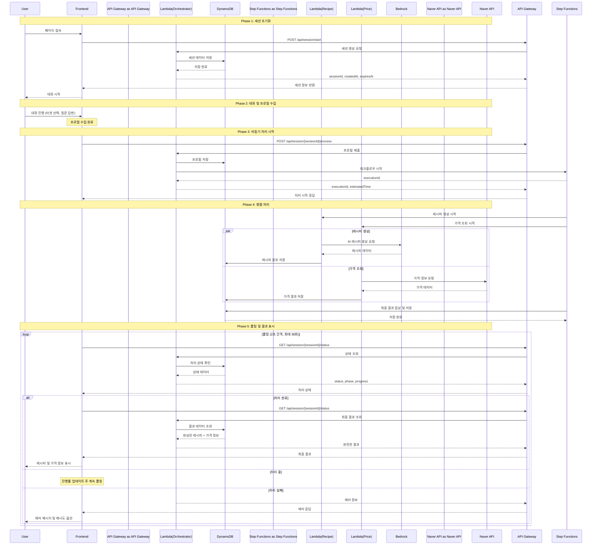

# 통합 시퀀스 명세서

## 개요
AI 셰프 프로젝트의 Phase별 통합 시퀀스 다이어그램 및 상호작용 명세서

## 전체 시퀀스 다이어그램

## Phase별 상세 설명

### Phase 1: 세션 초기화
- 사용자가 페이지에 접속하면 자동으로 세션 생성
- sessionId는 2시간 동안 유효
- localStorage에 세션 정보 저장

### Phase 2: 대화 및 프로필 수집  
- 타겟별 질문 플로우 진행
- 프론트엔드에서 프로필 완성까지 처리
- 서버 통신 없이 클라이언트 사이드에서 진행

### Phase 3: 비동기 처리 시작
- 완성된 프로필을 서버로 제출
- Step Functions 워크플로우 시작
- executionId로 처리 추적 시작

### Phase 4: 병렬 처리
- Recipe Lambda: Bedrock을 통한 AI 레시피 생성
- Price Lambda: 네이버 쇼핑 API를 통한 가격 조회
- 두 작업이 병렬로 실행되어 처리 시간 단축

### Phase 5: 폴링 및 결과 표시
- 2초 간격으로 처리 상태 확인
- 진행률 표시 (recipe_generation: 40%, price_fetching: 70%, combining: 90%)
- 완료 시 결과 표시, 실패 시 재시도 옵션 제공

## 목차
- [Phase 1: 세션 초기화](#phase-1-세션-초기화)
- [Phase 2: 대화 및 프로필 수집](#phase-2-대화-및-프로필-수집)
- [Phase 3: 비동기 처리](#phase-3-비동기-처리)
- [Phase 4: 결과 표시](#phase-4-결과-표시)
