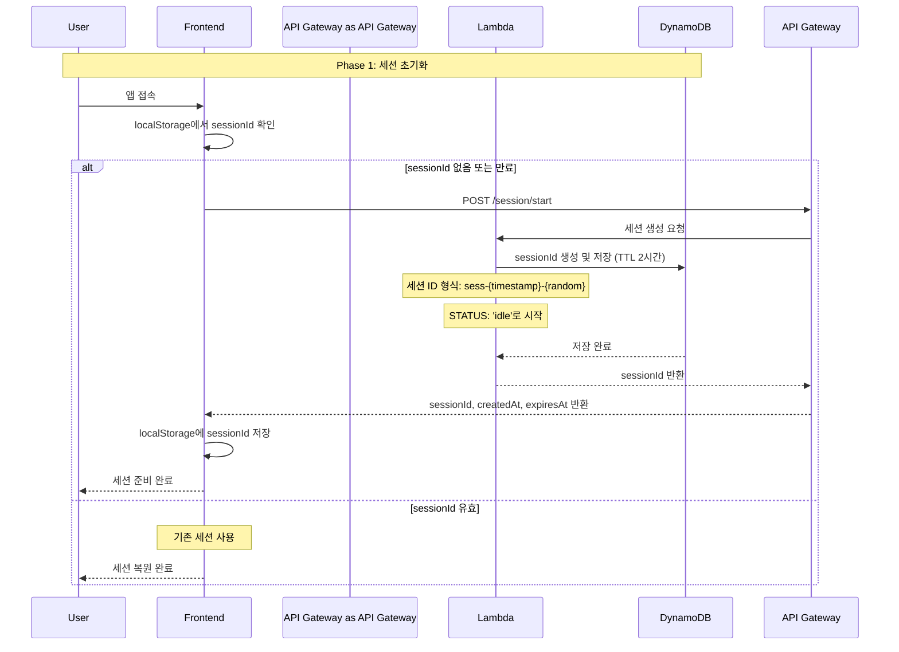

# Phase 1: 세션 초기화 시퀀스

## 개요
사용자가 앱에 접속하여 세션을 생성하는 초기화 과정

## 시퀀스 다이어그램



## 상세 플로우

### 1. 앱 접속
- 사용자가 웹 애플리케이션에 접속
- Frontend 컴포넌트 마운트 시 세션 초기화 시작

### 2. 기존 세션 확인
```javascript
// localStorage에서 기존 세션 확인
const savedSessionId = localStorage.getItem('sessionId');
const sessionExpiry = localStorage.getItem('sessionExpiry');

if (savedSessionId && sessionExpiry && new Date(sessionExpiry) > new Date()) {
    // 유효한 세션 존재
    return savedSessionId;
}
```

### 3. 새 세션 생성 요청
- **Endpoint**: `POST /session/start`
- **Request Body**: 빈 객체 `{}`
- **Headers**: `Content-Type: application/json`

### 4. Lambda 세션 생성 로직
```javascript
// 세션 ID 생성
const timestamp = Date.now();
const random = Math.random().toString(36).substring(2, 8);
const sessionId = `sess-${timestamp}-${random}`;

// DynamoDB 저장 데이터
const sessionData = {
    sessionId,
    status: 'idle',
    createdAt: new Date().toISOString(),
    expiresAt: new Date(Date.now() + 2 * 60 * 60 * 1000).toISOString(), // 2시간 후
    TTL: Math.floor(Date.now() / 1000) + 7200 // DynamoDB TTL (2시간)
};
```

### 5. DynamoDB 저장
- **Table**: `ai-chef-sessions`
- **Partition Key**: `sessionId`
- **TTL Attribute**: `TTL` (2시간 자동 삭제)

### 6. 응답 데이터
```json
{
    "sessionId": "sess-1725512345678-abc123",
    "createdAt": "2024-09-05T11:30:00.000Z",
    "expiresAt": "2024-09-05T13:30:00.000Z"
}
```

### 7. Frontend 저장
```javascript
// localStorage에 세션 정보 저장
localStorage.setItem('sessionId', sessionData.sessionId);
localStorage.setItem('sessionExpiry', sessionData.expiresAt);
```

## 에러 처리

### 세션 생성 실패
- **HTTP 500**: Lambda 실행 오류
- **HTTP 503**: DynamoDB 연결 실패
- **Retry Logic**: 2초 후 자동 재시도

### 네트워크 오류
- **Connection Timeout**: 10초 타임아웃
- **Retry Logic**: 최대 3회 재시도

## 성능 고려사항

### Cold Start 최적화
- Lambda 함수 Provisioned Concurrency 설정
- 최소 메모리 128MB로 빠른 시작

### DynamoDB 최적화
- On-Demand 빌링 모드
- TTL 자동 삭제로 스토리지 비용 절약

## 보안 고려사항

### 세션 ID 보안
- 충분한 엔트로피 (timestamp + random)
- 예측 불가능한 형태
- 2시간 자동 만료

### CORS 설정
```javascript
// API Gateway CORS 헤더
{
    "Access-Control-Allow-Origin": "https://your-domain.com",
    "Access-Control-Allow-Methods": "POST, GET, OPTIONS",
    "Access-Control-Allow-Headers": "Content-Type"
}
```
