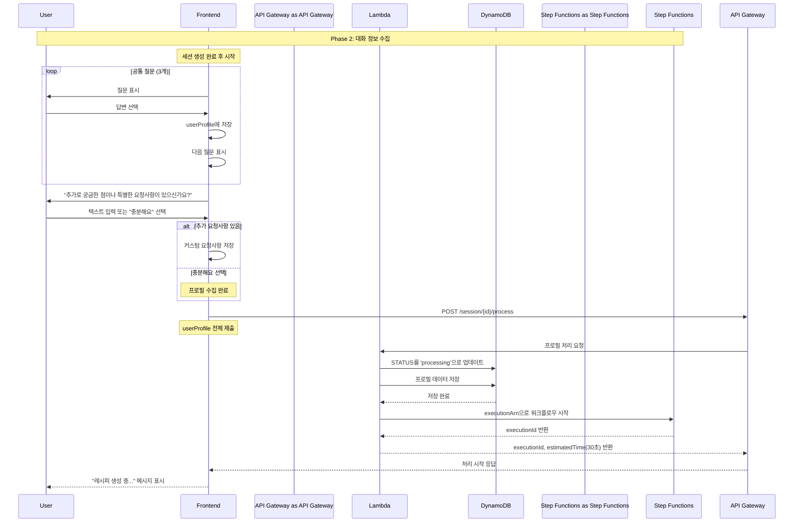

# Phase 2: 대화 정보 수집 시퀀스

## 개요
사용자와의 대화를 통해 프로필 정보를 수집하고 비동기 처리를 시작하는 과정

## 시퀀스 다이어그램



## 상세 플로우

### 1. 공통 질문 (3개)
```javascript
// 공통 질문 - 모든 사용자에게 동일하게 제공
const commonQuestions = [
    {
        text: "어떤 종류의 요리를 원하시나요?",
        options: ["한식", "양식", "중식", "일식", "기타"]
    },
    {
        text: "식재료 예산은 어느 정도인가요?",
        options: ["💵 1만원 이하", "💵💵 1-2만원", "💵💵💵 2-3만원", "💵💵💵💵 3만원 이상"]
    },
    {
        text: "몇 인분으로 만드시겠어요?",
        options: ["1인분", "2인분", "3-4인분", "5인분 이상"]
    }
];
```

### 2. 커스텀 질문
```javascript
// 추가 요청사항 질문
const customQuestion = {
    text: "추가로 궁금한 점이나 특별한 요청사항이 있으신가요?",
    type: "text_input",
    placeholder: "예: 매운 음식 싫어해요, 견과류 알레르기 있어요, 간단한 요리 원해요...",
    options: ["충분해요"]  // 스킵 옵션
};

// 처리 로직
function handleCustomQuestion(input) {
    if (input === "충분해요") {
        // 추가 요청사항 없음
        setUserProfile(prev => ({ ...prev, customRequest: null }));
    } else {
        // 사용자 입력 저장
        setUserProfile(prev => ({ ...prev, customRequest: input }));
    }
    // 프로필 제출로 진행
    submitProfile();
}
```

### 3. 프로필 제출 요청
```javascript
// POST /session/{sessionId}/process
const requestBody = {
    profile: {
        cuisine: "한식",
        budget: "1-2만원",
        servings: "2인분",
        customRequest: "매운 음식 싫어해요",  // 또는 null
        timestamp: new Date().toISOString()
    }
};
```

### 4. Lambda 처리 로직
```javascript
// DynamoDB 업데이트
const updateParams = {
    TableName: 'ai-chef-sessions',
    Key: { sessionId },
    UpdateExpression: 'SET #status = :status, #profile = :profile, #updatedAt = :updatedAt',
    ExpressionAttributeNames: {
        '#status': 'status',
        '#profile': 'profile',
        '#updatedAt': 'updatedAt'
    },
    ExpressionAttributeValues: {
        ':status': 'processing',
        ':profile': profile,
        ':updatedAt': new Date().toISOString()
    }
};

// Step Functions 시작
const stepFunctionParams = {
    stateMachineArn: process.env.RECIPE_WORKFLOW_ARN,
    input: JSON.stringify({
        sessionId,
        profile,
        timestamp: new Date().toISOString()
    })
};
```

### 5. 응답 데이터
```json
{
    "executionId": "arn:aws:states:region:account:execution:RecipeWorkflow:exec-abc123",
    "estimatedTime": 30
}
```

## 상태 전이

### 세션 상태 변화
- `idle` → `collecting` (첫 번째 질문 시작)
- `collecting` → `processing` (프로필 제출 완료)

### 프로필 데이터 구조
```typescript
interface UserProfile {
    // 공통 필드 (필수)
    cuisine: string;          // 요리 종류
    budget: string;           // 예산
    servings: string;         // 인분
    customRequest?: string;   // 추가 요청사항 (선택)
    timestamp: string;        // 제출 시간
}
```

## 에러 처리

### 프로필 검증 실패
- **HTTP 400**: 필수 필드 누락
- **Response**: `{ error: "PROFILE_INVALID", message: "필수 정보가 누락되었습니다" }`

### Step Functions 시작 실패
- **HTTP 500**: 워크플로우 시작 오류
- **Retry Logic**: 자동 재시도 없음, 사용자에게 재시도 옵션 제공

## 성능 최적화

### 클라이언트 사이드 처리
- 질문-답변은 모두 프론트엔드에서 처리
- 서버 통신은 최종 제출 시에만 발생
- 네트워크 지연 최소화

### 프로필 검증
```javascript
function validateProfile(profile) {
    const required = ['cuisine', 'budget', 'servings'];
    
    // 필수 필드 검증
    for (const field of required) {
        if (!profile[field]) return false;
    }
    
    return true;
}
```
