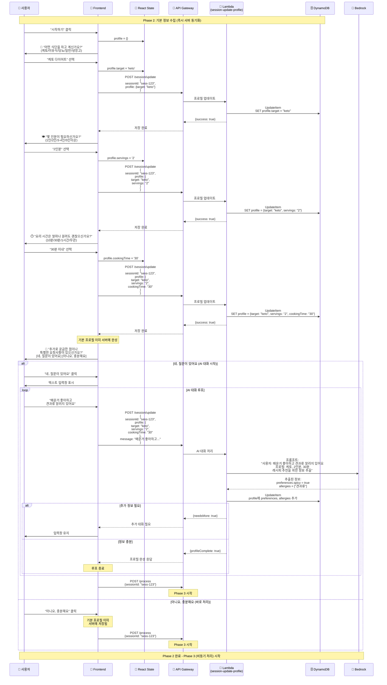

# Phase 2: 대화 정보 수집 시퀀스

## 개요
사용자와의 대화를 통해 프로필 정보를 수집하는 과정. 각 단계마다 즉시 서버 동기화하여 데이터 무결성 보장. 필요시 AI와 추가 대화를 통해 상세 정보 수집

## 시퀀스 다이어그램



## 상세 플로우

### 1. 타겟 선택
```javascript
// 타겟 옵션 (TargetSelector 컴포넌트)
const targetInfos = [
    { id: 'keto', name: '케톤 다이어트', icon: '🥑' },
    { id: 'baby', name: '육아/이유식', icon: '👶' },
    { id: 'diabetes', name: '당뇨 관리', icon: '💉' },
    { id: 'general', name: '일반 식단', icon: '🍽️' },
    { id: 'fridge', name: '냉장고 파먹기', icon: '🧊' }
];

// 타겟 선택 처리 (즉시 서버 동기화)
async function handleTargetSelection(target) {
    setSelectedTarget(target);
    
    // 서버에 즉시 저장
    await fetch('/session/update', {
        method: 'POST',
        body: JSON.stringify({
            sessionId: currentSession.id,
            profile: { target }
        })
    });
    
    // 다음 질문(인분)으로 진행
    setCurrentStep(1);
}
```

### 2. 인분 선택
```javascript
// 인분 질문 (ChatScreen에서 동적 생성)
const servingQuestion = {
    content: '몇 인분이 필요하신가요?',
    messageType: 'choice',
    options: ['1인분', '2인분', '3-4인분', '5인분 이상']
};

// 인분 선택 처리 (즉시 서버 동기화)
async function handleServingSelection(serving) {
    setSelectedServing(serving);
    
    // 서버에 누적 데이터 저장
    await fetch('/session/update', {
        method: 'POST',
        body: JSON.stringify({
            sessionId: currentSession.id,
            profile: {
                target: selectedTarget,
                servings: serving
            }
        })
    });
    
    // 다음 질문(요리 시간)으로 진행
    setCurrentStep(2);
}
```

### 3. 요리 시간
```javascript
// 요리 시간 질문 (getNextQuestion 함수)
const timeQuestion = {
    question: '요리 시간은 얼마나 걸려도 괜찮으신가요?',
    options: ['10분 이내', '30분 이내', '1시간 이내', '시간 상관없음']
};

// 요리 시간 선택 처리 (즉시 서버 동기화)
async function handleTimeSelection(time) {
    setCookingTime(time);
    
    // 서버에 전체 기본 프로필 저장
    await fetch('/session/update', {
        method: 'POST',
        body: JSON.stringify({
            sessionId: currentSession.id,
            profile: {
                target: selectedTarget,
                servings: selectedServing,
                cookingTime: time
            }
        })
    });
    
    // 다음 질문(추가 요청사항)으로 진행
    setCurrentStep(3);
}
```

### 4. 추가 요청사항 확인
```javascript
// 추가 요청사항 질문
const customQuestion = {
    question: '추가로 궁금한 점이나 특별한 요청사항이 있으신가요?',
    options: ['네, 질문이 있어요', '아니요, 충분해요']
};

// 처리 로직
async function handleCustomQuestion(selection) {
    const currentProfile = {
        target: selectedTarget,
        servings: selectedServing,
        cookingTime: selectedTime
    };
    
    if (selection === '네, 질문이 있어요') {
        // 텍스트 입력 모드 활성화
        setShowTextInput(true);
        
        // AI 대화 루프
        let isComplete = false;
        while (!isComplete) {
            const userInput = await getUserInput();
            
            const response = await fetch('/session/update', {
                method: 'POST',
                body: JSON.stringify({
                    sessionId: currentSession.id,
                    profile: currentProfile,
                    message: userInput
                })
            });
            
            const result = await response.json();
            
            if (result.profileComplete) {
                isComplete = true;
            } else {
                // 추가 대화 필요 - 입력창 유지
                setShowTextInput(true);
            }
        }
        
        // 프로필 완성 후 바로 처리 시작
        await startProcessing();
    } else {
        // "아니요, 충분해요" - 이미 서버에 저장된 프로필로 바로 처리
        // 추가 update 불필요 - 바로 레시피 생성 시작
        await startProcessing();
    }
}

// 레시피 생성 시작 (Phase 3로 이동)
async function startProcessing() {
    const response = await fetch('/process', {
        method: 'POST',
        body: JSON.stringify({
            sessionId: currentSession.id
        })
    });
    
    // Phase 3 (비동기 처리) 시작
    handleProcessingPhase(response);
}
```

## 수집된 프로필 데이터 구조

```typescript
interface UserProfile {
    // 기본 정보 (Frontend에서 수집)
    target: string;              // 타겟 선택 (필수)
    servings: string;            // 인분 (필수)
    cookingTime: string;         // 요리 시간 (필수)
    
    // AI 대화로 추출된 정보 (선택)
    preferences?: {
        spicy?: boolean;         // 매운맛 선호
        seafood?: boolean;       // 해산물 선호
        meat?: string;           // 육류 선호도
        vegetables?: string[];   // 선호 채소
    };
    allergies?: string[];        // 알러지 목록
    restrictions?: string[];     // 식이 제한사항
    
    // 메타 정보
    isComplete: boolean;         // 프로필 완성 여부
    conversations?: {            // AI 대화 기록
        timestamp: string;
        userMessage: string;
        aiResponse: string;
    }[];
    timestamp: string;           // 수집 완료 시간
}
```

## Backend API 상세

### POST /session/update
프로필 업데이트 및 AI 대화 처리 엔드포인트

**Request (기본 정보 저장):**
```json
{
    "sessionId": "sess-123",
    "profile": {
        "target": "keto",
        "servings": "2",
        "cookingTime": "30"
    }
}
```

**Request (AI 대화):**
```json
{
    "sessionId": "sess-123",
    "profile": {
        "target": "keto",
        "servings": "2",
        "cookingTime": "30"
    },
    "message": "매운거 좋아하고 견과류 알러지 있어요"
}
```


**Response (추가 대화 필요):**
```json
{
    "needsMore": true
}
```

**Response (프로필 완성):**
```json
{
    "profileComplete": true,
    "profile": {
        "target": "keto",
        "servings": "2",
        "cookingTime": "30",
        "preferences": {
            "spicy": true
        },
        "allergies": ["견과류"],
        "isComplete": true
    }
}
```

## 상태 전이

### 세션 상태 변화
- `idle` → `collecting` (첫 번째 질문 시작)
- `collecting` → `ai_conversation` (AI 대화 시작, 선택적)
- `ai_conversation` → `profile_complete` (프로필 수집 완료)
- `profile_complete` → `ready_to_process` (레시피 생성 버튼 활성화)

### DynamoDB 데이터 저장 구조
```
PK: SESSION#sess-123
SK: METADATA
{
    status: "profile_complete",
    profile: {
        target: "keto",
        servings: "2",
        cookingTime: "30",
        preferences: {
            spicy: true
        },
        allergies: ["견과류"],
        isComplete: true
    },
    conversations: [
        {
            timestamp: "2024-09-05T10:30:00Z",
            userMessage: "매운거 좋아하고 견과류 알러지 있어요",
            extractedInfo: {
                "preferences.spicy": true,
                "allergies": ["곬과류"]
            }
        }
    ],
    updatedAt: "2024-09-05T10:35:00Z"
}
```

## 성능 최적화

### 즉시 동기화 전략
- **기본 정보 (1-3단계)**: 각 단계마다 서버 즉시 저장
- **추가 정보 (4단계)**: AI 대화로 추가 정보 추출
- **데이터 무결성**: 서버가 항상 진실의 원천 (Single Source of Truth)

### 프로필 검증
```javascript
// Frontend 검증 (서버 호출 전 기본 체크)
function validateBasicProfile(profile) {
    const required = ['target', 'servings', 'cookingTime'];
    return required.every(field => profile[field]);
}

// Backend 검증 (Lambda)
def validate_complete_profile(profile):
    # 기본 필드 검증
    if not all(k in profile for k in ['target', 'servings', 'cookingTime']):
        return False
    
    # 타겟별 추가 검증
    if profile['target'] == 'baby' and 'babyAge' not in profile:
        return False
    
    # 프로필 완성 확인
    return profile.get('isComplete', False)
```

## Phase 3 연결점

Phase 2 완료 시 자동으로 Phase 3로 전환:

### "네, 질문이 있어요" 선택 시
1. AI와 추가 대화 진행 (루프)
2. Bedrock이 사용자 메시지에서 정보 추출
3. 프로필 정보 보완 (allergies, preferences 등)
4. 프로필 완성 후 자동으로 `POST /process` 호출
5. Phase 3 비동기 처리 시작

### "아니요, 충분해요" 선택 시
1. 기본 프로필 이미 서버에 저장 완료 (1-3단계에서 즉시 동기화)
2. 추가 업데이트 없이 바로 `POST /process` 호출
3. Phase 3 비동기 처리 시작

두 경우 모두 사용자의 추가 액션 없이 자동으로 레시피 생성이 시작됩니다.
