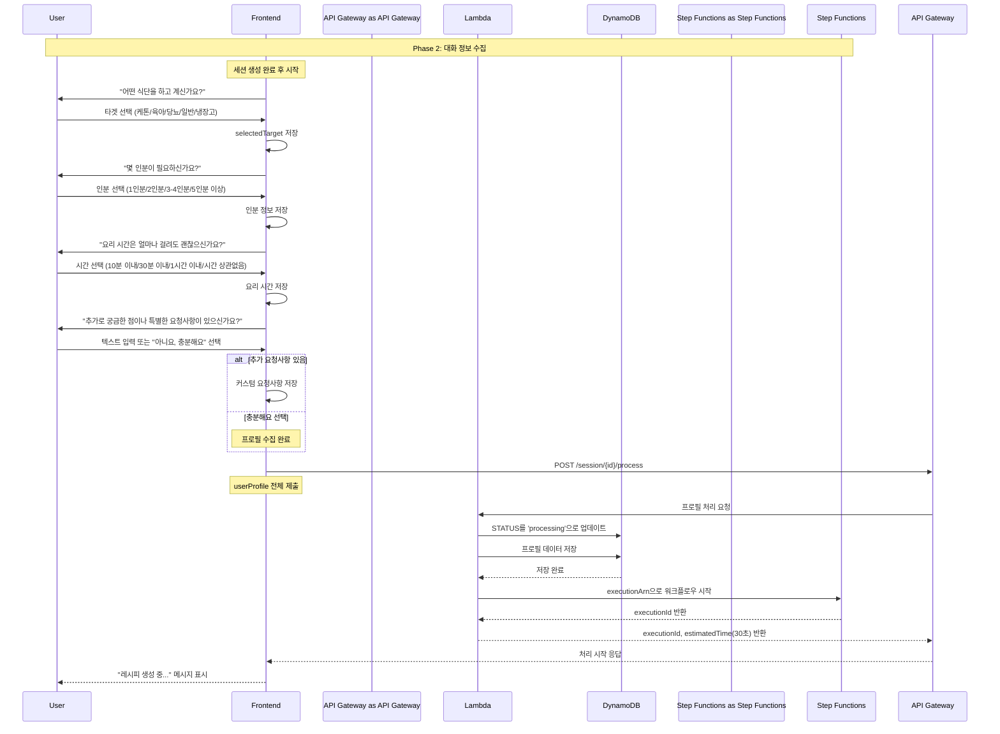

# Phase 2: 대화 정보 수집 시퀀스

## 개요
사용자와의 대화를 통해 프로필 정보를 수집하고 비동기 처리를 시작하는 과정

## 시퀀스 다이어그램



## 상세 플로우

### 1. 타겟 선택
```javascript
// 타겟 옵션 (TargetSelector 컴포넌트)
const targetInfos = [
    { id: 'keto', name: '케톤 다이어트', icon: '🥑' },
    { id: 'baby', name: '육아/이유식', icon: '👶' },
    { id: 'diabetes', name: '당뇨 관리', icon: '💉' },
    { id: 'general', name: '일반 식단', icon: '🍽️' },
    { id: 'fridge', name: '냉장고 파먹기', icon: '🧊' }
];

// 타겟 선택 처리
function handleTargetSelection(target) {
    setSelectedTarget(target);
    // 타겟별 응답 메시지 표시
    const responseMessage = getTargetResponseMessage(target);
    // 다음 질문(인분)으로 진행
}
```

### 2. 인분 선택
```javascript
// 인분 질문 (ChatScreen에서 동적 생성)
const servingQuestion = {
    content: '몇 인분이 필요하신가요?',
    messageType: 'choice',
    options: ['1인분', '2인분', '3-4인분', '5인분 이상']
};

// 인분 선택 처리
function handleServingSelection(serving) {
    // 사용자 응답 저장
    // 다음 질문(요리 시간)으로 진행
    setCurrentStep(1);
}
```

### 3. 요리 시간
```javascript
// 요리 시간 질문 (getNextQuestion 함수)
const timeQuestion = {
    question: '요리 시간은 얼마나 걸려도 괜찮으신가요?',
    options: ['10분 이내', '30분 이내', '1시간 이내', '시간 상관없음']
};

// 요리 시간 선택 처리
function handleTimeSelection(time) {
    // 요리 시간 저장
    // 다음 질문(추가 요청사항)으로 진행
    setCurrentStep(2);
}
```

### 4. 추가 요청사항 (커스텀 질문)
```javascript
// 추가 요청사항 질문
const customQuestion = {
    question: '추가로 궁금한 점이나 특별한 요청사항이 있으신가요?',
    options: ['네, 질문이 있어요', '아니요, 충분해요']
};

// 처리 로직
function handleCustomQuestion(input) {
    if (input === "아니요, 충분해요") {
        // 추가 요청사항 없음
        setUserProfile(prev => ({ ...prev, customRequest: null }));
    } else {
        // 텍스트 입력 모드로 전환
        setShowTextInput(true);
    }
    // 프로필 제출로 진행
    submitProfile();
}
```

### 5. 프로필 제출 요청
```javascript
// POST /session/{sessionId}/process
const requestBody = {
    profile: {
        target: "keto",              // 타겟 선택
        servings: "2인분",           // 인분 선택
        cookingTime: "30분 이내",    // 요리 시간
        customRequest: "매운 음식 싫어해요",  // 추가 요청사항 (또는 null)
        timestamp: new Date().toISOString()
    }
};
```

### 6. Lambda 처리 로직
```javascript
// DynamoDB 업데이트
const updateParams = {
    TableName: 'ai-chef-sessions',
    Key: { sessionId },
    UpdateExpression: 'SET #status = :status, #profile = :profile, #updatedAt = :updatedAt',
    ExpressionAttributeNames: {
        '#status': 'status',
        '#profile': 'profile',
        '#updatedAt': 'updatedAt'
    },
    ExpressionAttributeValues: {
        ':status': 'processing',
        ':profile': profile,
        ':updatedAt': new Date().toISOString()
    }
};

// Step Functions 시작
const stepFunctionParams = {
    stateMachineArn: process.env.RECIPE_WORKFLOW_ARN,
    input: JSON.stringify({
        sessionId,
        profile,
        timestamp: new Date().toISOString()
    })
};
```

### 7. 응답 데이터
```json
{
    "executionId": "arn:aws:states:region:account:execution:RecipeWorkflow:exec-abc123",
    "estimatedTime": 30
}
```

## 상태 전이

### 세션 상태 변화
- `idle` → `collecting` (첫 번째 질문 시작)
- `collecting` → `processing` (프로필 제출 완료)

### 프로필 데이터 구조
```typescript
interface UserProfile {
    // 4단계 질문 결과
    target: string;           // 타겟 선택 (필수)
    servings: string;         // 인분 (필수)
    cookingTime: string;      // 요리 시간 (필수)
    customRequest?: string;   // 추가 요청사항 (선택)
    timestamp: string;        // 제출 시간
}
```

## 에러 처리

### 프로필 검증 실패
- **HTTP 400**: 필수 필드 누락
- **Response**: `{ error: "PROFILE_INVALID", message: "필수 정보가 누락되었습니다" }`

### Step Functions 시작 실패
- **HTTP 500**: 워크플로우 시작 오류
- **Retry Logic**: 자동 재시도 없음, 사용자에게 재시도 옵션 제공

## 성능 최적화

### 클라이언트 사이드 처리
- 4단계 질문-답변은 모두 프론트엔드에서 처리
- 서버 통신은 최종 제출 시에만 발생
- 네트워크 지연 최소화

### 프로필 검증
```javascript
function validateProfile(profile) {
    const required = ['target', 'servings', 'cookingTime'];
    
    // 필수 필드 검증
    for (const field of required) {
        if (!profile[field]) return false;
    }
    
    return true;
}
```
