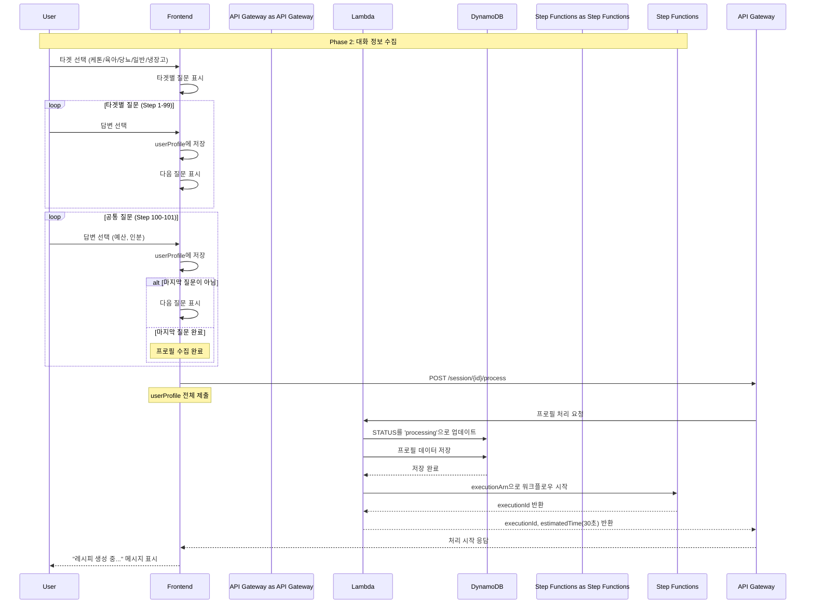

# Phase 2: 대화 정보 수집 시퀀스

## 개요
사용자와의 대화를 통해 프로필 정보를 수집하고 비동기 처리를 시작하는 과정

## 시퀀스 다이어그램



## 상세 플로우

### 1. 타겟 선택
```javascript
// 타겟 옵션
const targets = [
    { id: 'keto', name: '케톤 다이어트', icon: '🥑' },
    { id: 'baby', name: '육아/이유식', icon: '👶' },
    { id: 'diabetes', name: '당뇨 관리', icon: '🩺' },
    { id: 'general', name: '일반 식단', icon: '🍽️' },
    { id: 'fridge', name: '냉장고 파먹기', icon: '🧊' }
];

// 타겟 선택 처리
function handleTargetSelection(target) {
    setUserProfile(prev => ({ ...prev, target }));
    setCurrentStep(target === 'general' ? 100 : 1);
}
```

### 2. 타겟별 질문 플로우

#### 케톤 다이어트 (Step 1-2)
```javascript
const ketoQuestions = {
    1: {
        text: "케톤 다이어트 경험이 어느 정도인가요?",
        options: ["1-2주 적응기", "3-4주", "1개월 이상 유지기"]
    },
    2: {
        text: "하루 탄수화물 섭취량은 어느 정도로 하시나요?",
        options: ["20g 이하 엄격", "20-50g 표준", "50g 이상 유연"]
    }
};
```

#### 육아/이유식 (Step 1-2)
```javascript
const babyQuestions = {
    1: {
        text: "아기의 월령은 어떻게 되나요?",
        options: ["4-6개월 초기", "7-9개월 중기", "10-12개월 후기", "12개월 이상 완료기"]
    },
    2: {
        text: "알레르기가 있는 식재료가 있나요?",
        options: ["없음", "견과류", "유제품", "계란", "기타"]
    }
};
```

#### 당뇨 관리 (Step 1-2)
```javascript
const diabetesQuestions = {
    1: {
        text: "평소 혈당 수치는 어떤가요?",
        options: ["정상 (100mg/dL 이하)", "경계 (100-125mg/dL)", "당뇨 (126mg/dL 이상)"]
    },
    2: {
        text: "현재 복용 중인 당뇨 약물이 있나요?",
        options: ["없음", "메트포르민", "인슐린", "기타"]
    }
};
```

### 3. 공통 질문 (Step 100-101)
```javascript
const commonQuestions = {
    100: {
        text: "식재료 예산은 어느 정도인가요?",
        options: ["💵 1만원 이하", "💵💵 1-2만원", "💵💵💵 2-3만원", "💵💵💵💵 3만원 이상"]
    },
    101: {
        text: "몇 인분으로 만드시겠어요?",
        options: ["1인분", "2인분", "3-4인분", "5인분 이상"]
    }
};
```

### 4. 냉장고 파먹기 특별 플로우 (Step 1000-1002)
```javascript
const fridgeQuestions = {
    1000: {
        text: "냉장고에 있는 재료를 선택해주세요",
        type: "ingredient-selector",
        minSelection: 2
    },
    1001: {
        text: "요리 시간은 얼마나 걸려도 될까요?",
        options: ["15분 이하", "15-30분", "30분-1시간", "1시간 이상"]
    },
    1002: {
        text: "몇 인분으로 만드시겠어요?",
        options: ["1인분", "2인분", "3-4인분", "5인분 이상"]
    }
};
```

### 5. 프로필 제출 요청
```javascript
// POST /session/{sessionId}/process
const requestBody = {
    profile: {
        target: "keto",
        phase: "1-2주 적응기",
        carbLimit: "20g 이하",
        budget: "1-2만원",
        servings: "2인분",
        timestamp: new Date().toISOString()
    }
};
```

### 6. Lambda 처리 로직
```javascript
// DynamoDB 업데이트
const updateParams = {
    TableName: 'ai-chef-sessions',
    Key: { sessionId },
    UpdateExpression: 'SET #status = :status, #profile = :profile, #updatedAt = :updatedAt',
    ExpressionAttributeNames: {
        '#status': 'status',
        '#profile': 'profile',
        '#updatedAt': 'updatedAt'
    },
    ExpressionAttributeValues: {
        ':status': 'processing',
        ':profile': profile,
        ':updatedAt': new Date().toISOString()
    }
};

// Step Functions 시작
const stepFunctionParams = {
    stateMachineArn: process.env.RECIPE_WORKFLOW_ARN,
    input: JSON.stringify({
        sessionId,
        profile,
        timestamp: new Date().toISOString()
    })
};
```

### 7. 응답 데이터
```json
{
    "executionId": "arn:aws:states:region:account:execution:RecipeWorkflow:exec-abc123",
    "estimatedTime": 30
}
```

## 상태 전이

### 세션 상태 변화
- `idle` → `collecting` (첫 번째 질문 시작)
- `collecting` → `processing` (프로필 제출 완료)

### 프로필 데이터 구조
```typescript
interface UserProfile {
    target: string;
    // 타겟별 필드
    phase?: string;           // 케톤
    carbLimit?: string;       // 케톤
    months?: string;          // 육아
    allergies?: string[];     // 육아
    bloodSugar?: string;      // 당뇨
    medication?: string[];    // 당뇨
    ingredients?: string[];   // 냉장고
    cookingTime?: string;     // 냉장고
    // 공통 필드
    budget: string;
    servings: string;
    timestamp: string;
}
```

## 에러 처리

### 프로필 검증 실패
- **HTTP 400**: 필수 필드 누락
- **Response**: `{ error: "PROFILE_INVALID", message: "필수 정보가 누락되었습니다" }`

### Step Functions 시작 실패
- **HTTP 500**: 워크플로우 시작 오류
- **Retry Logic**: 자동 재시도 없음, 사용자에게 재시도 옵션 제공

## 성능 최적화

### 클라이언트 사이드 처리
- 질문-답변은 모두 프론트엔드에서 처리
- 서버 통신은 최종 제출 시에만 발생
- 네트워크 지연 최소화

### 프로필 검증
```javascript
function validateProfile(profile) {
    const required = ['target', 'budget', 'servings'];
    const targetSpecific = {
        keto: ['phase', 'carbLimit'],
        baby: ['months', 'allergies'],
        diabetes: ['bloodSugar', 'medication'],
        fridge: ['ingredients', 'cookingTime']
    };
    
    // 기본 필드 검증
    for (const field of required) {
        if (!profile[field]) return false;
    }
    
    // 타겟별 필드 검증
    const specificFields = targetSpecific[profile.target] || [];
    for (const field of specificFields) {
        if (!profile[field]) return false;
    }
    
    return true;
}
```
