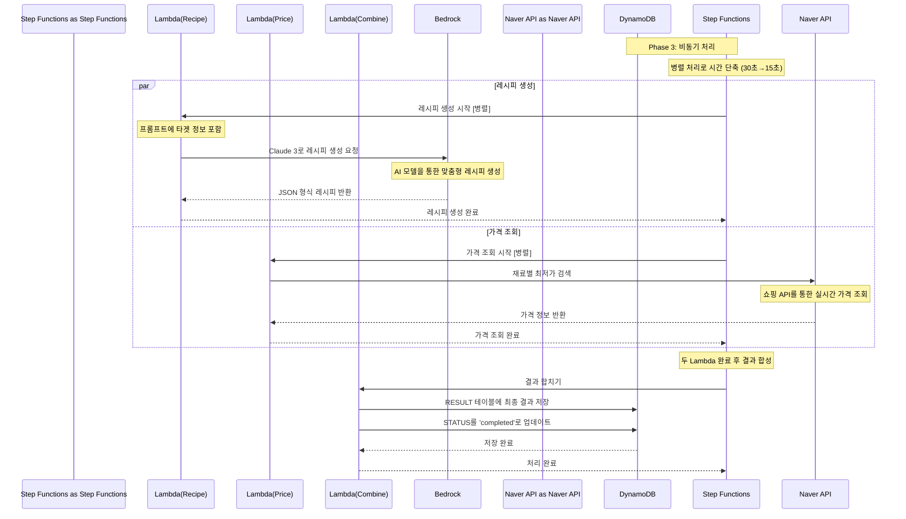

# Phase 3: 비동기 처리 시퀀스

## 개요
Step Functions를 통한 레시피 생성과 가격 조회의 병렬 처리 과정

## 시퀀스 다이어그램



## 상세 플로우

### 1. Step Functions 워크플로우 정의
```json
{
  "Comment": "AI Chef Recipe Generation Workflow",
  "StartAt": "ParallelProcessing",
  "States": {
    "ParallelProcessing": {
      "Type": "Parallel",
      "Branches": [
        {
          "StartAt": "GenerateRecipe",
          "States": {
            "GenerateRecipe": {
              "Type": "Task",
              "Resource": "arn:aws:lambda:region:account:function:RecipeGenerator",
              "End": true
            }
          }
        },
        {
          "StartAt": "FetchPrices",
          "States": {
            "FetchPrices": {
              "Type": "Task", 
              "Resource": "arn:aws:lambda:region:account:function:PriceFetcher",
              "End": true
            }
          }
        }
      ],
      "Next": "CombineResults"
    },
    "CombineResults": {
      "Type": "Task",
      "Resource": "arn:aws:lambda:region:account:function:ResultCombiner",
      "End": true
    }
  }
}
```

### 2. Lambda(Recipe) - 레시피 생성

#### Bedrock 요청 구조
```javascript
const generateRecipe = async (profile) => {
    const prompt = buildPrompt(profile);
    
    const bedrockParams = {
        modelId: "anthropic.claude-3-sonnet-20240229-v1:0",
        contentType: "application/json",
        accept: "application/json",
        body: JSON.stringify({
            anthropic_version: "bedrock-2023-05-31",
            max_tokens: 2000,
            messages: [{
                role: "user",
                content: prompt
            }]
        })
    };
    
    const response = await bedrock.invokeModel(bedrockParams).promise();
    return JSON.parse(response.body);
};

function buildPrompt(profile) {
    const targetPrompts = {
        keto: `케톤 다이어트용 레시피를 생성해주세요. 
               단계: ${profile.phase}, 탄수화물 제한: ${profile.carbLimit}`,
        baby: `이유식 레시피를 생성해주세요. 
               월령: ${profile.months}, 알레르기: ${profile.allergies?.join(', ')}`,
        diabetes: `당뇨 관리용 레시피를 생성해주세요. 
                   혈당: ${profile.bloodSugar}, 복용약물: ${profile.medication?.join(', ')}`,
        fridge: `냉장고 재료로 만드는 레시피를 생성해주세요. 
                 재료: ${profile.ingredients?.join(', ')}, 시간: ${profile.cookingTime}`,
        general: `일반 가정식 레시피를 생성해주세요.`
    };
    
    return `${targetPrompts[profile.target]}
            예산: ${profile.budget}, 인분: ${profile.servings}
            
            다음 JSON 형식으로 응답해주세요:
            {
                "name": "레시피명",
                "image": "이미지URL",
                "nutrition": {"calories": 0, "protein": 0, "carbs": 0, "fat": 0},
                "ingredients": [{"name": "재료명", "amount": "양", "unit": "단위"}],
                "steps": ["조리순서1", "조리순서2"],
                "targetSpecificInfo": { /* 타겟별 특화 정보 */ }
            }`;
}
```

#### 응답 데이터 구조
```json
{
    "name": "버터 새우 아보카도 샐러드",
    "image": "https://example.com/recipe-image.jpg",
    "nutrition": {
        "calories": 420,
        "protein": 25,
        "carbs": 8,
        "fat": 35
    },
    "ingredients": [
        {"name": "새우", "amount": "200", "unit": "g"},
        {"name": "아보카도", "amount": "1", "unit": "개"},
        {"name": "버터", "amount": "2", "unit": "큰술"}
    ],
    "steps": [
        "새우는 껍질을 벗기고 내장을 제거한다",
        "팬에 버터를 녹이고 새우를 볶는다",
        "아보카도와 함께 플레이팅한다"
    ],
    "targetSpecificInfo": {
        "ketoInfo": {
            "netCarbs": 5,
            "ketoScore": "완벽",
            "tip": "적응기에는 전해질 보충이 중요해요!"
        }
    }
}
```

### 3. Lambda(Price) - 가격 조회

#### Naver API 요청
```javascript
const fetchPrices = async (ingredients) => {
    const priceResults = [];
    
    for (const ingredient of ingredients) {
        const searchParams = {
            query: ingredient.name,
            display: 10,
            start: 1,
            sort: 'sim' // 정확도순
        };
        
        const response = await axios.get('https://openapi.naver.com/v1/search/shop.json', {
            params: searchParams,
            headers: {
                'X-Naver-Client-Id': process.env.NAVER_CLIENT_ID,
                'X-Naver-Client-Secret': process.env.NAVER_CLIENT_SECRET
            }
        });
        
        const items = response.data.items;
        const prices = items.map(item => ({
            vendor: item.mallName,
            price: parseInt(item.lprice),
            productName: item.title.replace(/<[^>]*>/g, ''), // HTML 태그 제거
            link: item.link
        }));
        
        priceResults.push({
            ingredient: ingredient.name,
            amount: ingredient.amount,
            unit: ingredient.unit,
            prices: prices.sort((a, b) => a.price - b.price) // 가격순 정렬
        });
    }
    
    return calculateOptimalPricing(priceResults);
};

function calculateOptimalPricing(priceResults) {
    const vendors = {};
    let totalPrice = 0;
    
    // 각 재료의 최저가 찾기
    priceResults.forEach(result => {
        const cheapest = result.prices[0];
        totalPrice += cheapest.price;
        
        if (!vendors[cheapest.vendor]) {
            vendors[cheapest.vendor] = [];
        }
        vendors[cheapest.vendor].push({
            name: result.ingredient,
            price: cheapest.price,
            quantity: `${result.amount}${result.unit}`
        });
    });
    
    // 최적 조합 계산 (같은 업체에서 많이 살 수 있는 조합)
    const optimalVendor = Object.keys(vendors).reduce((a, b) => 
        vendors[a].length > vendors[b].length ? a : b
    );
    
    return {
        total: totalPrice,
        optimal: {
            vendor: optimalVendor,
            items: vendors[optimalVendor]
        },
        alternatives: Object.keys(vendors)
            .filter(v => v !== optimalVendor)
            .map(vendor => ({
                vendor,
                total: vendors[vendor].reduce((sum, item) => sum + item.price, 0),
                items: vendors[vendor]
            }))
    };
}
```

### 4. Lambda(Combine) - 결과 합성

#### 최종 결과 생성
```javascript
const combineResults = async (recipeResult, priceResult, sessionId) => {
    const finalResult = {
        recipe: recipeResult,
        pricing: priceResult,
        generatedAt: new Date().toISOString()
    };
    
    // RESULT 테이블에 저장
    await dynamodb.put({
        TableName: 'ai-chef-results',
        Item: {
            sessionId,
            result: finalResult,
            createdAt: new Date().toISOString(),
            TTL: Math.floor(Date.now() / 1000) + 86400 // 24시간 TTL
        }
    }).promise();
    
    // 세션 상태 업데이트
    await dynamodb.update({
        TableName: 'ai-chef-sessions',
        Key: { sessionId },
        UpdateExpression: 'SET #status = :status, #result = :result, #completedAt = :completedAt',
        ExpressionAttributeNames: {
            '#status': 'status',
            '#result': 'result',
            '#completedAt': 'completedAt'
        },
        ExpressionAttributeValues: {
            ':status': 'completed',
            ':result': finalResult,
            ':completedAt': new Date().toISOString()
        }
    }).promise();
    
    return finalResult;
};
```

## 성능 최적화

### 병렬 처리 효과
- **순차 처리**: 레시피 생성(15초) + 가격 조회(15초) = 30초
- **병렬 처리**: max(레시피 생성(15초), 가격 조회(15초)) = 15초
- **시간 단축**: 50% 성능 향상

### Lambda 최적화
```javascript
// 레시피 생성 Lambda 설정
{
    "timeout": 30,
    "memorySize": 1024,
    "environment": {
        "BEDROCK_REGION": "us-east-1"
    }
}

// 가격 조회 Lambda 설정  
{
    "timeout": 20,
    "memorySize": 512,
    "environment": {
        "NAVER_CLIENT_ID": "${ssm:naver-client-id}",
        "NAVER_CLIENT_SECRET": "${ssm:naver-client-secret}"
    }
}
```

## 에러 처리

### Bedrock 호출 실패
```javascript
try {
    const response = await bedrock.invokeModel(params).promise();
    return JSON.parse(response.body);
} catch (error) {
    if (error.code === 'ThrottlingException') {
        // 재시도 로직
        await new Promise(resolve => setTimeout(resolve, 1000));
        return await bedrock.invokeModel(params).promise();
    }
    throw new Error(`RECIPE_GENERATION_FAILED: ${error.message}`);
}
```

### Naver API 호출 실패
```javascript
try {
    const response = await axios.get(naverApiUrl, config);
    return response.data;
} catch (error) {
    if (error.response?.status === 429) {
        throw new Error('RATE_LIMIT_EXCEEDED');
    }
    throw new Error(`PRICE_FETCH_FAILED: ${error.message}`);
}
```

### Step Functions 실패 처리
```json
{
    "CombineResults": {
        "Type": "Task",
        "Resource": "arn:aws:lambda:region:account:function:ResultCombiner",
        "Retry": [
            {
                "ErrorEquals": ["States.TaskFailed"],
                "IntervalSeconds": 2,
                "MaxAttempts": 3,
                "BackoffRate": 2.0
            }
        ],
        "Catch": [
            {
                "ErrorEquals": ["States.ALL"],
                "Next": "HandleFailure"
            }
        ],
        "End": true
    }
}
```

## 모니터링

### CloudWatch 메트릭
- Step Functions 실행 시간
- Lambda 함수별 성공/실패율
- Bedrock API 호출 지연시간
- Naver API 응답 시간

### 알람 설정
- Step Functions 실행 실패 시 SNS 알림
- Lambda 함수 타임아웃 시 알림
- API 호출 실패율 5% 초과 시 알림
