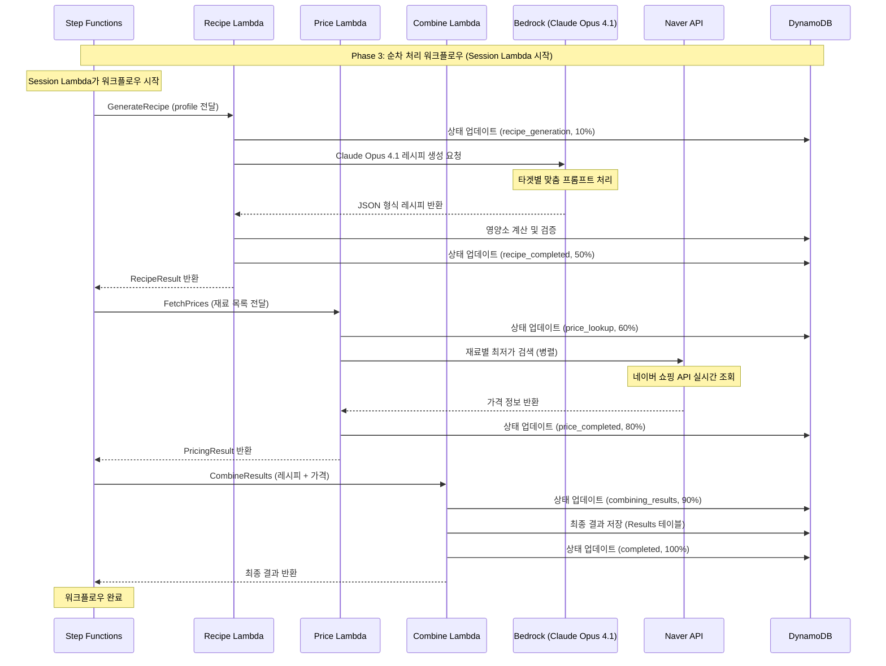

# Phase 3: 비동기 처리 시퀀스 (업데이트됨)

## 개요
Step Functions를 통한 순차적 레시피 생성 및 가격 조회 처리 과정
**Lambda 기반 DynamoDB 상태 관리 Best Practice 적용**

## 시퀀스 다이어그램 (현재 구현)



## 실제 Step Functions 정의 (배포됨)

### 현재 워크플로우 구조 (Session Lambda 시작)
```json
{
  "Comment": "AI Chef Simplified Workflow - Session Lambda starts workflow",
  "StartAt": "GenerateRecipe",
  "States": {
    "GenerateRecipe": {
      "Type": "Task",
      "Resource": "arn:aws:states:::lambda:invoke",
      "Parameters": {
        "FunctionName": "ai-chef-recipe-dev",
        "Payload.$": "$"
      },
      "ResultSelector": {
        "recipe.$": "$.Payload.body"
      },
      "ResultPath": "$.recipeResult",
      "Retry": [
        {
          "ErrorEquals": ["Lambda.ServiceException", "Lambda.AWSLambdaException"],
          "IntervalSeconds": 2,
          "MaxAttempts": 3,
          "BackoffRate": 2.0
        }
      ],
      "Next": "FetchPrices"
    },
    "FetchPrices": {
      "Type": "Task",
      "Resource": "arn:aws:states:::lambda:invoke",
      "Parameters": {
        "FunctionName": "ai-chef-price-dev",
        "Payload": {
          "sessionId.$": "$.sessionId",
          "profile.$": "$.profile",
          "ingredients.$": "$.recipeResult.recipe.ingredients"
        }
      },
      "ResultSelector": {
        "pricing.$": "$.Payload.body"
      },
      "ResultPath": "$.pricingResult",
      "Retry": [
        {
          "ErrorEquals": ["Lambda.ServiceException", "Lambda.AWSLambdaException"],
          "IntervalSeconds": 2,
          "MaxAttempts": 3,
          "BackoffRate": 2.0
        }
      ],
      "Next": "CombineResults"
    },
    "CombineResults": {
      "Type": "Task",
      "Resource": "arn:aws:states:::lambda:invoke",
      "Parameters": {
        "FunctionName": "ai-chef-combine-dev",
        "Payload": {
          "sessionId.$": "$.sessionId",
          "profile.$": "$.profile",
          "recipeResult.$": "$.recipeResult.recipe",
          "pricingResult.$": "$.pricingResult.pricing"
        }
      },
      "End": true
    }
  }
}
```

## Lambda별 상세 구현

### 1. Recipe Lambda (Python 3.11)

#### Claude Opus 4.1 연동
```python
def generate_recipe_with_bedrock(profile: Dict[str, Any]) -> Dict[str, Any]:
    """Claude Opus 4.1을 사용한 레시피 생성"""
    target = profile.get('target', 'general')
    prompt = build_target_specific_prompt(profile)
    
    try:
        response = bedrock.invoke_model(
            modelId='anthropic.claude-opus-4-1-20250805-v1:0',
            body=json.dumps({
                'anthropic_version': 'bedrock-2023-05-31',
                'max_tokens': 4000,
                'temperature': 0.7,
                'messages': [{'role': 'user', 'content': prompt}]
            })
        )
        
        result = json.loads(response['body'].read())
        recipe_text = result['content'][0]['text']
        return extract_json_from_text(recipe_text)
        
    except Exception as e:
        logger.error(f'Bedrock API error: {str(e)}')
        return get_default_recipe(target)

def update_session_status(session_id: str, status: str, phase: str, progress: int):
    """DynamoDB 세션 상태 업데이트"""
    try:
        sessions_table.update_item(
            Key={'sessionId': session_id},
            UpdateExpression="SET #status = :status, #phase = :phase, #progress = :progress, #updatedAt = :updatedAt",
            ExpressionAttributeNames={
                '#status': 'status',
                '#phase': 'phase', 
                '#progress': 'progress',
                '#updatedAt': 'updatedAt'
            },
            ExpressionAttributeValues={
                ':status': status,
                ':phase': phase,
                ':progress': progress,
                ':updatedAt': datetime.now().isoformat()
            }
        )
    except Exception as e:
        logger.error(f"Failed to update session status: {e}")
```

#### 타겟별 프롬프트 엔지니어링
```python
def build_keto_prompt(profile: Dict[str, Any]) -> str:
    """케토제닉 다이어트 전문 프롬프트"""
    health_conditions = ', '.join(profile.get('healthConditions', [])) or '없음'
    allergies = ', '.join(profile.get('allergies', [])) or '없음'
    cooking_level = profile.get('cookingLevel', '초급')
    budget = profile.get('budget', 30000)
    
    return f"""당신은 케토제닉 다이어트 전문 영양사입니다. 다음 조건에 맞는 레시피를 생성해주세요:

사용자 프로필:
- 건강 상태: {health_conditions}
- 알레르기: {allergies}
- 요리 실력: {cooking_level}
- 예산: {budget}원

케토 다이어트 요구사항:
- 탄수화물: 5g 이하
- 지방: 70% 이상
- 단백질: 25% 내외

JSON 형식으로 응답:
{{
  "recipeName": "케토 아보카도 샐러드",
  "description": "고지방 저탄수화물 케토 다이어트 샐러드",
  "cookingTime": 15,
  "difficulty": "easy",
  "servings": 2,
  "ingredients": [
    {{"name": "아보카도", "amount": "2", "unit": "개"}},
    {{"name": "올리브오일", "amount": "3", "unit": "큰술"}}
  ],
  "instructions": [
    "1. 아보카도를 깍둑썰기 합니다.",
    "2. 올리브오일과 레몬즙을 섞어 드레싱을 만듭니다."
  ],
  "ketoNotes": "완벽한 케토 매크로 비율입니다."
}}"""
```

### 2. Price Lambda (네이버 쇼핑 API)

#### 실시간 가격 조회
```python
def fetch_ingredient_prices(ingredients: List[Dict[str, Any]]) -> List[Dict[str, Any]]:
    """네이버 쇼핑 API를 통한 재료별 가격 조회"""
    price_results = []
    
    for ingredient in ingredients:
        try:
            # 네이버 쇼핑 API 호출
            search_query = clean_ingredient_name(ingredient['name'])
            
            headers = {
                'X-Naver-Client-Id': os.environ['NAVER_CLIENT_ID'],
                'X-Naver-Client-Secret': os.environ['NAVER_CLIENT_SECRET']
            }
            
            params = {
                'query': search_query,
                'display': 10,
                'start': 1,
                'sort': 'sim'  # 정확도순
            }
            
            response = requests.get(
                'https://openapi.naver.com/v1/search/shop.json',
                headers=headers,
                params=params
            )
            
            if response.status_code == 200:
                items = response.json().get('items', [])
                prices = parse_price_items(items, ingredient)
                price_results.append({
                    'ingredient': ingredient['name'],
                    'amount': ingredient['amount'],
                    'unit': ingredient['unit'],
                    'prices': prices,
                    'lowestPrice': min(prices, key=lambda x: x['price']) if prices else None
                })
            else:
                # API 호출 실패 시 기본 가격 사용
                price_results.append(get_default_price_info(ingredient))
                
        except Exception as e:
            logger.error(f"Price fetch error for {ingredient['name']}: {e}")
            price_results.append(get_default_price_info(ingredient))
    
    return price_results

def calculate_optimal_shopping(price_results: List[Dict[str, Any]]) -> Dict[str, Any]:
    """최적 쇼핑 조합 계산"""
    vendors = {}
    total_cost = 0
    
    # 각 재료의 최저가 수집
    for result in price_results:
        if result['lowestPrice']:
            vendor = result['lowestPrice']['vendor']
            price = result['lowestPrice']['price']
            
            if vendor not in vendors:
                vendors[vendor] = []
            
            vendors[vendor].append({
                'name': result['ingredient'],
                'price': price,
                'quantity': f"{result['amount']}{result['unit']}"
            })
            total_cost += price
    
    # 최적 업체 선택 (가장 많은 재료를 파는 업체)
    optimal_vendor = max(vendors.keys(), key=lambda v: len(vendors[v])) if vendors else None
    
    return {
        'totalEstimatedCost': total_cost,
        'optimalVendor': optimal_vendor,
        'vendorBreakdown': vendors,
        'recommendations': {
            'sameVendorSavings': calculate_shipping_savings(vendors),
            'alternativeOptions': get_alternative_combinations(vendors)
        }
    }
```

### 3. Combine Lambda (결과 합성)

#### 최종 결과 생성 및 저장
```python
def combine_results(session_id: str, recipe_result: Dict, pricing_result: Dict) -> Dict[str, Any]:
    """레시피와 가격 정보 결합"""
    try:
        # 세션 상태 업데이트: 결합 시작
        update_session_status(session_id, 'processing', 'combining_results', 90)
        
        # 최종 결과 구성
        combined_result = {
            'sessionId': session_id,
            'recipe': recipe_result,
            'pricing': pricing_result,
            'summary': {
                'totalCost': pricing_result.get('totalEstimatedCost', 0),
                'costPerServing': pricing_result.get('totalEstimatedCost', 0) / recipe_result.get('servings', 1),
                'estimatedCookingTime': recipe_result.get('cookingTime', 30),
                'difficultyLevel': recipe_result.get('difficulty', 'medium')
            },
            'generatedAt': datetime.now().isoformat(),
            'version': '1.0'
        }
        
        # Results 테이블에 최종 결과 저장
        save_final_results(session_id, combined_result)
        
        # 세션 상태 업데이트: 완료
        update_session_status(session_id, 'completed', 'finished', 100)
        
        return combined_result
        
    except Exception as e:
        logger.error(f"Combine results error: {e}")
        update_session_status(session_id, 'failed', 'combine_failed', 90, str(e))
        raise

def save_final_results(session_id: str, combined_result: Dict[str, Any]):
    """최종 결과를 Results 테이블에 저장"""
    try:
        results_table.put_item(
            Item={
                'sessionId': session_id,
                'result': combined_result,
                'createdAt': datetime.now().isoformat(),
                'ttl': int(datetime.now().timestamp()) + (7 * 24 * 60 * 60)  # 7일 TTL
            }
        )
    except Exception as e:
        logger.error(f"Failed to save final results: {e}")
        raise
```

## 성능 최적화 및 Best Practice

### 1. Lambda 기반 상태 관리
- **장점**: 관심사 분리, 에러 처리 개선, 유지보수성 향상
- **구현**: 각 Lambda가 DynamoDB 상태를 직접 관리
- **결과**: Step Functions 워크플로우 단순화

### 2. 순차 처리의 이유
- **Recipe → Price**: Price Lambda가 Recipe의 재료 목록 필요
- **Price → Combine**: 모든 데이터가 준비된 후 결합
- **예상 시간**: 총 25-35초 (타겟별 차이)

### 3. Lambda 설정 최적화
```yaml
# Recipe Lambda
RecipeLambda:
  Runtime: python3.11
  MemorySize: 512MB
  Timeout: 120초
  Environment:
    BEDROCK_REGION: us-east-1

# Price Lambda  
PriceLambda:
  Runtime: python3.11
  MemorySize: 256MB
  Timeout: 60초
  Environment:
    NAVER_CLIENT_ID: ${ssm:naver-client-id}
    NAVER_CLIENT_SECRET: ${ssm:naver-client-secret}

# Combine Lambda
CombineLambda:
  Runtime: python3.11
  MemorySize: 256MB
  Timeout: 30초
```

## 에러 처리 및 복구

### 1. Bedrock API 에러 처리
```python
def generate_recipe_with_retry(profile: Dict[str, Any], max_retries: int = 3) -> Dict[str, Any]:
    """재시도 로직이 포함된 레시피 생성"""
    for attempt in range(max_retries):
        try:
            return generate_recipe_with_bedrock(profile)
        except Exception as e:
            if 'ThrottlingException' in str(e) and attempt < max_retries - 1:
                time.sleep(2 ** attempt)  # 지수 백오프
                continue
            elif 'ValidationException' in str(e):
                return get_default_recipe(profile.get('target'))
            raise e
```

### 2. 네이버 API 에러 처리
```python
def handle_naver_api_error(error: Exception, ingredient: Dict[str, Any]) -> Dict[str, Any]:
    """네이버 API 에러 처리"""
    if 'rate limit' in str(error).lower():
        # Rate limit 초과 시 기본 가격 사용
        return get_default_price_info(ingredient)
    elif 'timeout' in str(error).lower():
        # 타임아웃 시 재시도 또는 기본값
        return get_default_price_info(ingredient)
    else:
        # 기타 에러 시 기본 가격 정보 반환
        return get_default_price_info(ingredient)
```

### 3. Step Functions 재시도 정책
```json
{
  "Retry": [
    {
      "ErrorEquals": ["Lambda.ServiceException", "Lambda.AWSLambdaException"],
      "IntervalSeconds": 2,
      "MaxAttempts": 3,
      "BackoffRate": 2.0
    },
    {
      "ErrorEquals": ["States.TaskFailed"],
      "IntervalSeconds": 1,
      "MaxAttempts": 2,
      "BackoffRate": 1.5
    }
  ]
}
```

## 실제 배포 정보

### 배포된 리소스
- **Step Functions**: `arn:aws:states:us-east-1:491085385364:stateMachine:ai-chef-workflow-dev`
- **Recipe Lambda**: `arn:aws:lambda:us-east-1:491085385364:function:ai-chef-recipe-dev`
- **Price Lambda**: `arn:aws:lambda:us-east-1:491085385364:function:ai-chef-price-dev` (예정)
- **Combine Lambda**: `arn:aws:lambda:us-east-1:491085385364:function:ai-chef-combine-dev` (예정)
- **Sessions Table**: `ai-chef-sessions-dev`
- **Results Table**: `ai-chef-results-dev` (예정)

### 모니터링 및 로깅
```bash
# Step Functions 실행 로그
aws logs tail /aws/stepfunctions/ai-chef-workflow-dev --follow

# Recipe Lambda 로그
aws logs tail /aws/lambda/ai-chef-recipe-dev --follow

# 실행 상태 확인
aws stepfunctions describe-execution \
  --execution-arn arn:aws:states:us-east-1:491085385364:execution:ai-chef-workflow-dev:execution-1757064394
```

### 테스트 실행
```bash
# Step Functions 워크플로우 시작
aws stepfunctions start-execution \
  --state-machine-arn arn:aws:states:us-east-1:491085385364:stateMachine:ai-chef-workflow-dev \
  --input '{
    "sessionId": "sess_test_789",
    "profile": {
      "target": "keto",
      "healthConditions": ["diabetes"],
      "budget": 30000,
      "servings": 2
    }
  }' \
  --name execution-$(date +%s)
```

## 성능 메트릭

### 예상 처리 시간 (타겟별)
- **케토 다이어트**: 25초
- **이유식**: 30초  
- **당뇨 관리**: 35초
- **일반 다이어트**: 20초
- **냉장고 털기**: 40초

### CloudWatch 메트릭
- Step Functions 실행 성공률: 목표 95% 이상
- Lambda 함수별 평균 실행 시간
- Bedrock API 응답 시간: 목표 10초 이하
- 네이버 API 응답 시간: 목표 5초 이하

---
**작성일**: 2025-09-05  
**작성자**: Team21 AWS Hackathon  
**최종 업데이트**: 실제 구현된 Step Functions 워크플로우 반영
