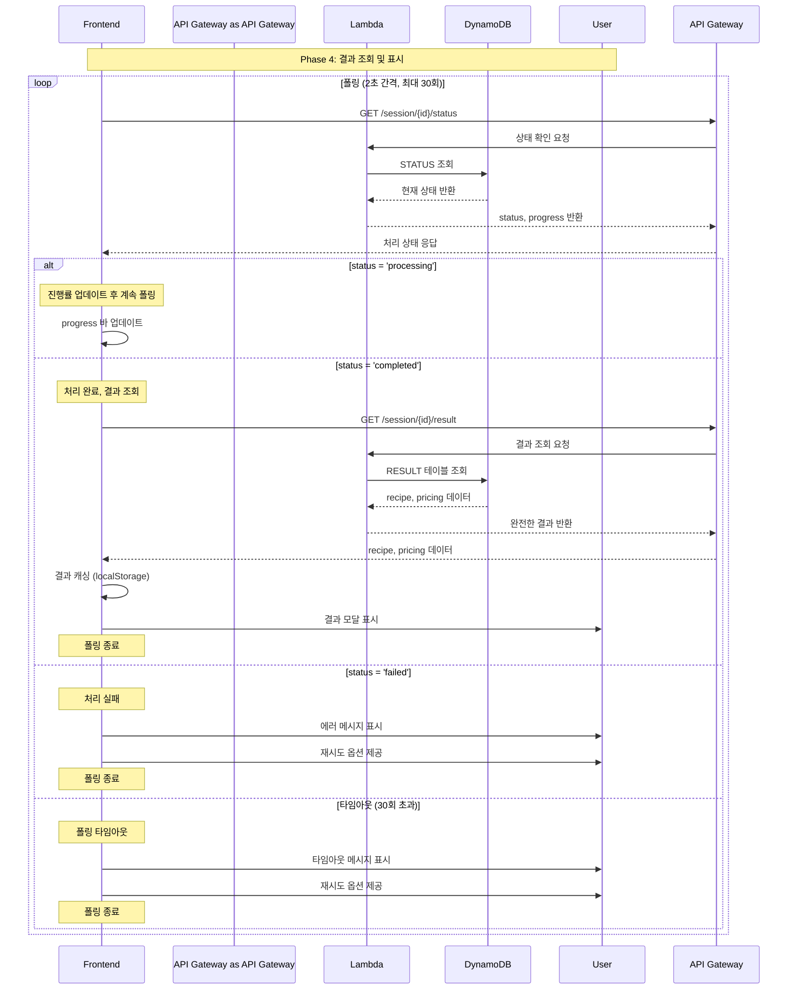

# Phase 4: 결과 조회 시퀀스

## 개요
폴링을 통한 처리 상태 확인 및 최종 결과 표시 과정

## 시퀀스 다이어그램



## 상세 플로우

### 1. 폴링 시작
```javascript
function startPolling(sessionId) {
    let attempts = 0;
    const maxAttempts = 30;
    const interval = 2000; // 2초

    const pollInterval = setInterval(async () => {
        attempts++;
        
        try {
            const statusResponse = await checkProcessingStatus(sessionId);
            
            // 진행률 업데이트
            updateProgressBar(statusResponse.phase, statusResponse.progress);
            
            if (statusResponse.status === 'completed') {
                clearInterval(pollInterval);
                await handleCompletion(sessionId);
            } else if (statusResponse.status === 'failed') {
                clearInterval(pollInterval);
                handleFailure(statusResponse.error);
            } else if (attempts >= maxAttempts) {
                clearInterval(pollInterval);
                handleTimeout();
            }
            
        } catch (error) {
            console.error('폴링 오류:', error);
            
            if (attempts >= maxAttempts) {
                clearInterval(pollInterval);
                handleNetworkError();
            }
        }
    }, interval);
    
    return pollInterval;
}
```

### 2. 상태 확인 API
```javascript
// GET /session/{sessionId}/status
async function checkProcessingStatus(sessionId) {
    const response = await fetch(`/api/session/${sessionId}/status`);
    
    if (!response.ok) {
        throw new Error(`HTTP ${response.status}`);
    }
    
    return await response.json();
}

// Lambda 상태 확인 로직
const checkStatus = async (sessionId) => {
    const params = {
        TableName: 'ai-chef-sessions',
        Key: { sessionId }
    };
    
    const result = await dynamodb.get(params).promise();
    
    if (!result.Item) {
        throw new Error('SESSION_NOT_FOUND');
    }
    
    const session = result.Item;
    
    // Step Functions 실행 상태 확인
    if (session.status === 'processing' && session.executionId) {
        const executionStatus = await getStepFunctionStatus(session.executionId);
        
        return {
            status: executionStatus.status,
            phase: executionStatus.phase,
            progress: getProgressByPhase(executionStatus.phase),
            error: executionStatus.error
        };
    }
    
    return {
        status: session.status,
        phase: session.phase || 'idle',
        progress: session.status === 'completed' ? 100 : 0,
        error: session.error
    };
};

function getProgressByPhase(phase) {
    const progressMap = {
        'recipe_generation': 40,
        'price_fetching': 70,
        'combining': 90,
        'completed': 100
    };
    
    return progressMap[phase] || 0;
}
```

### 3. 결과 조회 API
```javascript
// GET /session/{sessionId}/result
async function getProcessingResult(sessionId) {
    const response = await fetch(`/api/session/${sessionId}/result`);
    
    if (!response.ok) {
        throw new Error(`HTTP ${response.status}`);
    }
    
    return await response.json();
}

// Lambda 결과 조회 로직
const getResult = async (sessionId) => {
    // RESULT 테이블에서 조회
    const resultParams = {
        TableName: 'ai-chef-results',
        Key: { sessionId }
    };
    
    const resultData = await dynamodb.get(resultParams).promise();
    
    if (!resultData.Item) {
        // 세션 테이블에서 조회 (fallback)
        const sessionParams = {
            TableName: 'ai-chef-sessions',
            Key: { sessionId }
        };
        
        const sessionData = await dynamodb.get(sessionParams).promise();
        
        if (!sessionData.Item || !sessionData.Item.result) {
            throw new Error('RESULT_NOT_FOUND');
        }
        
        return sessionData.Item.result;
    }
    
    return resultData.Item.result;
};
```

### 4. 진행률 업데이트
```javascript
function updateProgressBar(phase, progress) {
    const phaseMessages = {
        'recipe_generation': '🤖 AI가 맞춤 레시피를 생성하고 있어요...',
        'price_fetching': '💰 최저가 정보를 찾고 있어요...',
        'combining': '📋 결과를 정리하고 있어요...',
        'completed': '✅ 완성되었습니다!'
    };
    
    // UI 업데이트
    const progressBar = document.getElementById('progress-bar');
    const progressText = document.getElementById('progress-text');
    const progressPercent = document.getElementById('progress-percent');
    
    if (progressBar) {
        progressBar.style.width = `${progress}%`;
        progressBar.setAttribute('aria-valuenow', progress);
    }
    
    if (progressText) {
        progressText.textContent = phaseMessages[phase] || '처리 중...';
    }
    
    if (progressPercent) {
        progressPercent.textContent = `${progress}%`;
    }
    
    // 상태 변경 이벤트 발생
    window.dispatchEvent(new CustomEvent('progressUpdate', {
        detail: { phase, progress }
    }));
}
```

### 5. 완료 처리
```javascript
async function handleCompletion(sessionId) {
    try {
        // 결과 조회
        const result = await getProcessingResult(sessionId);
        
        // 결과 캐싱
        cacheResult(sessionId, result);
        
        // 결과 모달 표시
        showResultModal(result);
        
        // 성공 이벤트 발생
        window.dispatchEvent(new CustomEvent('processingComplete', {
            detail: { sessionId, result }
        }));
        
    } catch (error) {
        console.error('결과 조회 실패:', error);
        handleFailure('결과를 불러오는 중 오류가 발생했습니다.');
    }
}

function cacheResult(sessionId, result) {
    const cacheData = {
        result,
        timestamp: Date.now(),
        ttl: 3600000 // 1시간
    };
    
    localStorage.setItem(`result_${sessionId}`, JSON.stringify(cacheData));
    
    // 최근 결과 목록 업데이트
    updateRecentResults(sessionId);
}

function showResultModal(result) {
    const modal = document.getElementById('result-modal');
    const recipeContainer = document.getElementById('recipe-container');
    const pricingContainer = document.getElementById('pricing-container');
    
    // 레시피 정보 표시
    renderRecipe(recipeContainer, result.recipe);
    
    // 가격 정보 표시
    renderPricing(pricingContainer, result.pricing);
    
    // 모달 표시
    modal.classList.add('show');
    modal.setAttribute('aria-hidden', 'false');
    
    // 접근성: 포커스 이동
    const closeButton = modal.querySelector('.close-button');
    if (closeButton) closeButton.focus();
}
```

### 6. 실패 처리
```javascript
function handleFailure(errorMessage) {
    const errorModal = document.getElementById('error-modal');
    const errorText = document.getElementById('error-text');
    const retryButton = document.getElementById('retry-button');
    
    // 에러 메시지 표시
    if (errorText) {
        errorText.textContent = errorMessage || '처리 중 오류가 발생했습니다.';
    }
    
    // 재시도 버튼 이벤트
    if (retryButton) {
        retryButton.onclick = () => {
            errorModal.classList.remove('show');
            retryProcessing();
        };
    }
    
    // 에러 모달 표시
    errorModal.classList.add('show');
    errorModal.setAttribute('aria-hidden', 'false');
    
    // 실패 이벤트 발생
    window.dispatchEvent(new CustomEvent('processingFailed', {
        detail: { error: errorMessage }
    }));
}

async function retryProcessing() {
    try {
        // 기존 프로필로 재시도
        const sessionId = localStorage.getItem('sessionId');
        const profile = JSON.parse(localStorage.getItem(`profile_${sessionId}`) || '{}');
        
        await submitProfile(profile);
        
    } catch (error) {
        console.error('재시도 실패:', error);
        handleFailure('재시도 중 오류가 발생했습니다.');
    }
}
```

### 7. 타임아웃 처리
```javascript
function handleTimeout() {
    const timeoutModal = document.getElementById('timeout-modal');
    const checkAgainButton = document.getElementById('check-again-button');
    const startOverButton = document.getElementById('start-over-button');
    
    // 다시 확인 버튼
    if (checkAgainButton) {
        checkAgainButton.onclick = () => {
            timeoutModal.classList.remove('show');
            const sessionId = localStorage.getItem('sessionId');
            startPolling(sessionId); // 폴링 재시작
        };
    }
    
    // 처음부터 시작 버튼
    if (startOverButton) {
        startOverButton.onclick = () => {
            timeoutModal.classList.remove('show');
            resetConversation(); // 대화 리셋
        };
    }
    
    // 타임아웃 모달 표시
    timeoutModal.classList.add('show');
    timeoutModal.setAttribute('aria-hidden', 'false');
    
    // 타임아웃 이벤트 발생
    window.dispatchEvent(new CustomEvent('processingTimeout'));
}
```

## 응답 데이터 구조

### 상태 확인 응답
```json
{
    "status": "processing",
    "phase": "recipe_generation",
    "progress": 40,
    "error": null
}
```

### 완료 시 결과 응답
```json
{
    "recipe": {
        "name": "버터 새우 아보카도 샐러드",
        "image": "https://example.com/recipe.jpg",
        "nutrition": {
            "calories": 420,
            "protein": 25,
            "carbs": 8,
            "fat": 35
        },
        "ingredients": [
            {"name": "새우", "amount": "200", "unit": "g"}
        ],
        "steps": ["조리 순서"],
        "targetSpecificInfo": {
            "ketoInfo": {
                "netCarbs": 5,
                "ketoScore": "완벽",
                "tip": "적응기에는 전해질 보충이 중요해요!"
            }
        }
    },
    "pricing": {
        "total": 18300,
        "optimal": {
            "vendor": "쿠팡",
            "items": [
                {"name": "냉동새우 500g", "price": 8900, "quantity": "1팩"}
            ]
        },
        "alternatives": [
            {
                "vendor": "이마트몰",
                "total": 19500,
                "items": []
            }
        ]
    },
    "generatedAt": "2024-09-05T11:30:00Z"
}
```

## 에러 처리

### HTTP 상태 코드
- **404**: 세션을 찾을 수 없음
- **410**: 세션이 만료됨
- **500**: 서버 내부 오류
- **504**: 처리 시간 초과

### 클라이언트 에러 처리
```javascript
async function handleApiError(response, sessionId) {
    switch (response.status) {
        case 404:
        case 410:
            // 세션 만료 처리
            localStorage.removeItem('sessionId');
            localStorage.removeItem('sessionExpiry');
            showSessionExpiredModal();
            break;
            
        case 500:
            // 서버 오류
            handleFailure('서버 오류가 발생했습니다. 잠시 후 다시 시도해주세요.');
            break;
            
        case 504:
            // 타임아웃
            handleTimeout();
            break;
            
        default:
            handleFailure('알 수 없는 오류가 발생했습니다.');
    }
}
```

## 성능 최적화

### 폴링 최적화
- 2초 간격으로 적절한 실시간성 제공
- 최대 30회 제한으로 무한 루프 방지
- 완료/실패 시 즉시 폴링 중단

### 캐싱 전략
- 결과를 localStorage에 1시간 캐싱
- 중복 API 호출 방지
- 최근 결과 5개 관리

### UI 최적화
```javascript
// 디바운싱으로 UI 업데이트 최적화
const debouncedProgressUpdate = debounce((phase, progress) => {
    updateProgressBar(phase, progress);
}, 100);

function debounce(func, wait) {
    let timeout;
    return function executedFunction(...args) {
        const later = () => {
            clearTimeout(timeout);
            func(...args);
        };
        clearTimeout(timeout);
        timeout = setTimeout(later, wait);
    };
}
```
